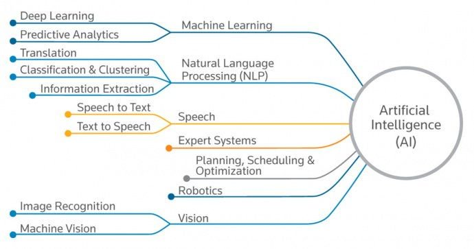

# Künstliche Intelligenz
Author: Kevin Schima

Künstliche Intelligenz (engl. Artificial Intelligence) ist ein breites Forschungsfeld, welches sich mit der künstlichen Nachahmung intelligenter Entscheidungsprozesse befasst. 

Entsprechend dem Anwendungfeld kann das Thema in weitere Bereiche unterteilt werden: 

### Machinelles Lernen (machine learning)
Algorithmen, welche die Fähigkeit haben, durch Erfahrung (vorangegangene Entscheidungen) immer genauere Ergebnisse zu erzielen.

### Natural Language Processing (NLP)
Ein Forschungsfeld, das sich mit der Analyse von Syntax und Semantik menschlicher Sprache befasst, um daraus Daten zu gewinnen.

### Spracherkennung (Speech)
Die Umwandlung von menschlicher Sprache in geschriebenen Text und zurück.

### Robotik
Die Entwicklung von Maschinen, die mit der physischen Welt interagieren.

### Bilderkennung (Vision)
Die Extraktion und Erkennung von Daten aus Bild und Videoaufnahmen.

---------------------
Ungeachtet der themenspezifischen Unterteilung werden die Methodiken die aus dem Bereich _Maschinelles Lernen_ hervorgegangen sind, erfolgreich in den anderen Themenkomplexen angewendet. 

In den folgenden Kapiteln wird genauer auf die Teilgebiete der _Künstlichen Intelligenz_ eingegangen, die schließlich zu aktuellen Entwicklungen wie Deep Learning / Neuralen Netzwerken führen. Diese sind themenspezifisch Teilmengen von _machine learning_, welches wiederum eine Teilmenge des ganzen Themenkomplexes _Künstliche Intelligenz_ ist.

## Literaturverzeichnis
<a>[[RUSS16]](#ref_russ16)</a>

<a name="ref_russ16">[RUSS16]</a>:Russell, Stuart J., and Peter Norvig. Artificial intelligence: a modern approach. Malaysia; Pearson Education Limited,, 2016.
