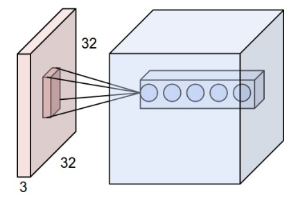
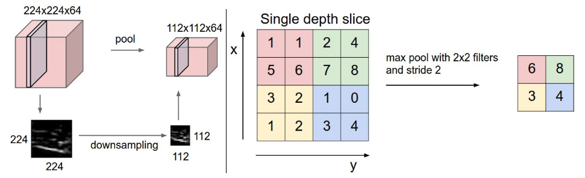

# Deep Learning
Der Begriff _deep learning_ wird verwendet, sobald mindestens zwei Schichten (hidden layer) zwischen Ein- und Ausgabeschicht eines neuronalen Netzwerkes vorhanden sind.

Die explizite Nutzung des Begriffs _deep learning_ bzw. _deep neural networks_ hat sich etabliert, da Netzwerke mit vielen verdeckten Schichten, auf bedeutend komplexere Problemstellungen angewandt werden können. Um diese Möglichkeiten optimal auszuschöpfen, haben sie allerdings hohe Hardware-Anforderungen bezüglich Speicher und Rechenleistung.

Für verschiedene Anwendungsfälle eignen sich unterschiedliche _neural network_ Architekturen, folgend werden die bekanntesten beschrieben:

## Convolutional Neural Network (CNN / ConvNet)
CNNs wurden explizit für Bildverarbeitung und Mustererkennung entwickelt, was einige Optimierungen der Architektur für eine möglichst effiziente Berechnung erfordert.

Vereinfachte Darstellung, Quelle: Fjodor van Veen, Asimov Institute 

Da Bilddaten eine hohe Anzahl an Eingabeneuronen erfordern (Breite x Höhe x Anzahl Farbkanäle) kommt ein vollverbundenes (_fully-connected_) neurales Netzwerk, bei dem jeder _layer_ die gleiche Anzahl an Neuronen besitzt, nicht in Frage. Die enorme Anzahl an Neuronen würde entweder extreme Rechenkapazitäten erfordern oder die Auflösung der Ausgangsbilder stark beschränken. Daher ist allen Ansätzen für ein CNN gemein, dass versucht wird die Anzahl Neuronen nach der initialen Input-Schicht durch Faltung (_convolution_) zu verringern. Nach einigen _convolution_ Schichten, die definierte Muster in den Bilddaten erkennen und verstärken, folgen einige _fully connected_ Schichten, welche die extrahierten Muster besser interpretieren können.  

###  Convolution layer
Die _convolution layer_, in denen auf verschiedene Muster optimierte _Filter_ auf die Bilddaten angewendet werden, sind die wichtigsten Bausteine von CNNs. 

Quelle: <a>[[CS231N]](#ref_cs231n)</a>

Wie in obigem Bild zu sehen wird eine Reihe von Filtern, die typischerweise eine größe von z.B. 5x5x3 (Höhe x Breite x Anzahl Farbkanäle) haben, auf die Bilddaten angewendet. Durch die Anwendung auf alle Bilddaten (der Filter wird über das Bild verschoben), entsteht ein zweidimensionaler Ergebnisvektor, der üblicherweise die Ursprungsgröße der Eingabe bezüglich Höhe/Breite beibehält. Durch die Anwendung mehrerer Filter wird insgesamt ein dreidimensionaler Ergebnisvektor erzeugt. Um die Datenmenge wieder zu reduzieren werden in regelmäßigen Abständen _pooling layer_ eingefügt.

### Pooling layer
_Pooling layer_ werden vorallem benötigt um die Größe der Ergebnisvektoren, die nach mehreren _convolution_ Schichten deutlich gewachsen sind, zu verkleinern und somit die Berechnungskomplexität wieder zu verringern.

Quelle: <a>[[CS231N]](#ref_cs231n)</a>

Wie in der Abbildung ersichtlich, handelt es sich bei _pooling_ meistens um ein einfaches _downsampling_, also lediglich einer Reduzierung der Auflösung. Da die prägnanten Bestandteile eines Bilder, z.B. Kanten, Formen bereits durch die _convolution_ Schichten verstärkt wurden, ist für eine weitere Verarbeitung nicht unbedingt die volle Auflösung erforderlich. 

Im folgenden ist die Architektur eines kompletten CNNs für Gesichtserkennung ersichtlich, auffallend sind die _pooling layer_ nach jedem _convolution layer_, sowie der eindimensionale Vektor auf der rechten Seite als Berechnungsergebnis. 

Quelle: <a>[[SUN14]](#ref_sun14)</a>

## Recurrent Neural Network (RNN)

Quelle: Fjodor van Veen, Asimov Institute 

Im Gegensatz zu _feed-forward_ Netzen, sind RNNs in der Lage, Gewichte in vorhergehenden Schichten zu beeinflussen und sich somit selber zu regulieren. Somit muss für eine Veränderung der Gewichte nicht das komplette neurale Netzwerk bis zum Ausgangsneuron durchschritten werden, was eine Art Abkürzung darstellt.

# Quellen:

<a name="ref_cs231n">[CS231N]</a>:Stanford University Course CS231n: Convolutional Neural Networks for Visual Recognition. URL: http://cs231n.github.io/convolutional-networks/

<a name="ref_sun14">[SUN14]</a>: Sun, Y., Wang, X., & Tang, X. (2014). Deep learning face representation from predicting 10,000 classes. URL: http://mmlab.ie.cuhk.edu.hk/pdf/YiSun_CVPR14.pdf