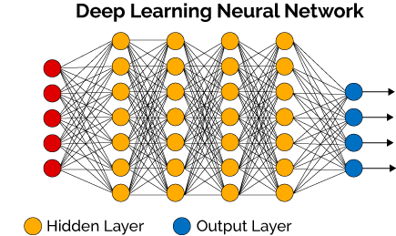
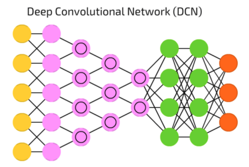
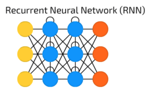

# Deep Learning
Der Begriff _deep learning_ wird verwendet, sobald mindestens zwei Schichten (hidden layer) zwischen Ein- und Ausgabeschicht eines neuronalen Netzwerkes vorhanden sind.

Die explizite Nutzung des Begriffs _deep learning_ bzw. _deep neural networks_ hat sich etabliert, da Netzwerke mit vielen verdeckten Schichten, auf bedeutend komplexere Problemstellungen angewandt werden können. Um diese Möglichkeiten optimal auszuschöpfen, haben sie allerdings hohe Hardware-Anforderungen bezüglich Speicher und Rechenleistung.

Für verschiedene Anwendungsfälle eignen sich unterschiedliche _neural network_ Architekturen, folgend werden die bekanntesten beschrieben:

## Convolutional Neural Network (CNN / ConvNet)
Die Architektur von CNNs ist explizit für Bildverarbeiung und Erkennung entwickelt worden, was einige Optimierungen in der Architektur, für eine möglichst effiziente Berechnung erfordert.

Ein vollverbundenes (_fully-connected_) neurales Netzwerk, bei dem die Anzahl der Input-Neuronen Breite x Höhe x 3 Farbkanäle entspricht und bei dem jeder _hidden layer_ die gleiche Anzahl an Neuronen besitzt, würde entweder in der Summe eine enorme Anzahl, und somit entweder extreme Rechenkapazitäten erfordern oder die Auflösung der Ausgangsbilder stark beschränken. Daher ist allen Ansätzen für ein CNN gemein, dass versucht wird die Anzahl Neuronen geschickt zu verringern.

## Recurrent Neural Network (RNN)

Im Gegensatz zu _feed-forward_ Netzen, sind RNNs in der Lage, Gewichte in vorhergehenden Schichten zu beeinflussen und sich somit selber zu regulieren. Somit muss für eine Veränderung der Gewichte nicht das komplette neurale Netzwerk bis zum Ausgangsneuron durchschritten werden, was eine Art Abkürzung darstellt.
