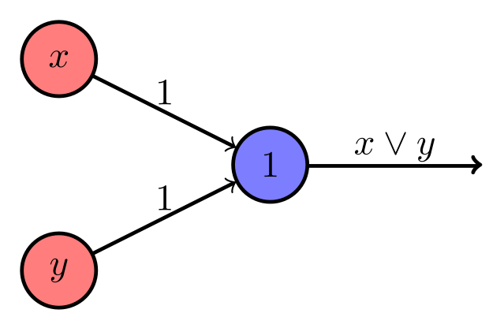
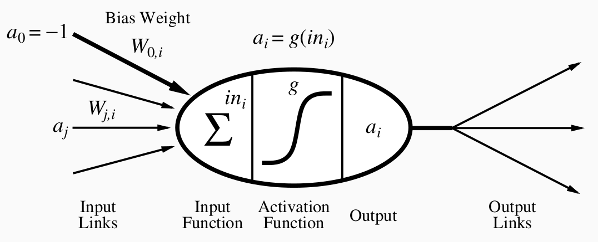
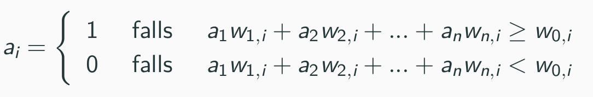
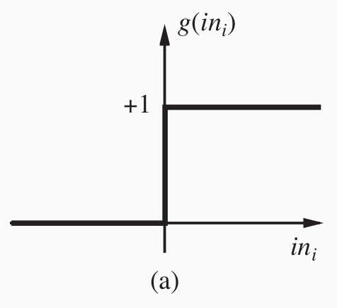
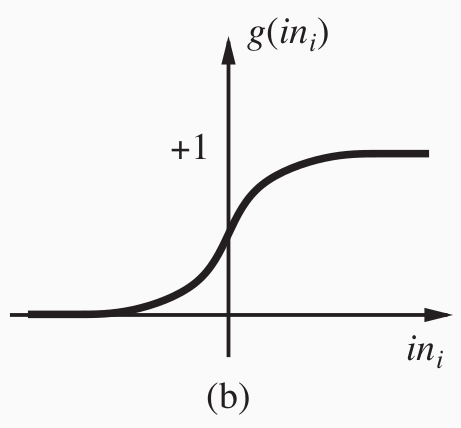
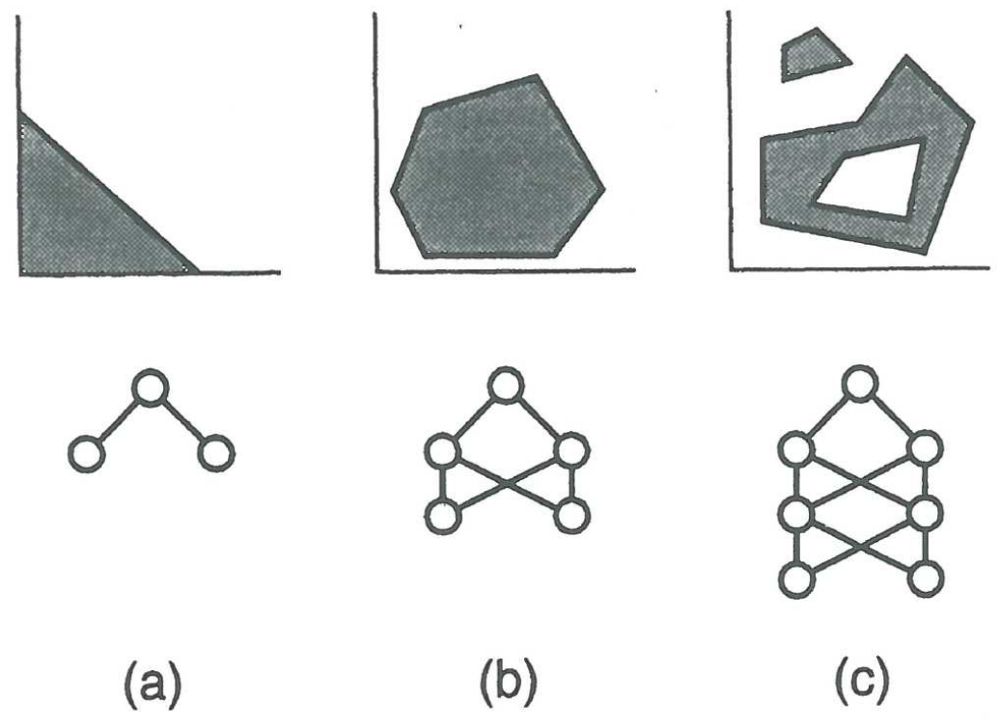
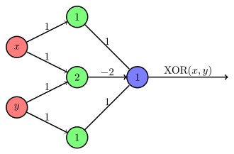

# Neural networks
Neuronale Netze (neural networks) sind in der Informatik, Netzwerke aus künstlichen Neuronen. Sie sind als Nachbildung der Neuronenstruktur von menschlichen Gehirnen entwickelt worden.

Grundbaustein aller neuronalen Netzwerke ist das Perzeptron.

## Perzeptron
In seiner einfachsten Ausführung ist ein Perzeptron vergleichbar mit einem Logikschalter. Es kann boolesche Werte (1 - wahr, 0 - falsch) als Eingabe aufnehmen und gibt selbst wieder einen booleschen Wert als Ergebnis aus. In der Grafik kann das Perzeptron die logische Und-Verknüpfung zweier Werte ausführen. X und Y sind jeweils Eingaben, das Perzeptron gibt als Ausgabe entweder 1 aus, wenn beide Eingaben 1 sind, andernfalls 0.

Genauer betrachtet, verfügt ein Perzeptron über Eingabegewichtungen (w), eine Eingabe Funktion (input function), sowie eine Aktivierungsfunktion g() (activation function).
Die Eingabegewichtungen sorgen dafür, dass die einzelnen Eingabewerte unterschiedlich stark in die Ausgabe einfließen können. Dazu wird über die Eingabefunktion eine Summe über alle Eingabewerte mit ihren jeweiligen Gewichtungsfaktoren (w) gebildet. Der errechnete Wert wird der Aktivierungsfunktion übergeben, die beeinflusst, ob das Perzeptron eine Aktivierung weiterleitet.

Quelle: <a>[[RUSS16]](#ref_russ16)</a>

Die Ausgabe der _input function_ an die _activation function_ lässt sich folgendermaßen berechnen:

Wie in der Formel ersichtlich, erfolgt eine Weiterleitung von 1 an die _activation function_ wenn die Summe über die Produkte, zwischen Eingabevektorwert mit dem jeweiligen Gewicht (w), größer bzw. gleich dem Bias Gewicht (w 0,i) ist, andernfalls wird 0 weitergegeben.

## Aktivierungsfunktionen
Zuletzt entscheidet die Aktivierungsfunktion über eine Aktivierung des Perzeptrons. Verschiedene Aktivierungsfunktionen eignen sich für unterschiedliche Problemstellungen.  

Die Sprungfunktion wurde bei der ursprünglichen Definition des Perzeptrons eingeführt und leitet eine Aktivierung des Perzeptrons (Ausgabe: 1) ein, sobald die Ausgabe der _input function_ größer 0 ist. In neuronalen Netzen die nicht nur einfache Logikfunktionen berechnen, wird die Sprungfunktion aufgrund ihres extrem kleinen Ergebnisbereiches ( 0 oder 1) praktisch nicht mehr verwendet.

Im weiteren Verlauf wird genauer auf neuronale Netze eingegangen, die sich von der ursprünglichen Definition des Perzeptrons unterscheiden. Diese neuronalen Netze benötigen fein-granulare Aktivierungsfunktionen, damit einzelne Neuronen (Perzeptrons) auch geringe Aktivierungen weiterleiten können. Die Anwendung der Sprungfunktion würde deaktivierte (tote) Bereiche innerhalb des neuronalen Netzes begünstigen. Die meistgenutzen Aktivierungsfunktionen in modernen neuronalen Netzen sind die sigmoide Funktion (links) sowie die ReLU Funktion (rechts).

## Limitierung
Ein einzelnes Perzeptron ist fähig die logischen Funktionen AND, OR und NOT abzubilden. Minsky und Papert wiesen 1969 nach, dass die XOR Funktion damit nicht abgebildet werden kann. Auch können nur linear separable Problemstellungen gelöst werden. Für komplexere Klassifizierungen ist ein mehrlagiges Perzeptron nötig, dieses kann erstmals als neuronales Netz bezeichnet werden.

## Mehrlagiges Perzeptron

Mit einem mehrlagigem Perzeptron sind komplexere Funktionen berechenbar, in oben stehendem Beispiel die logische XOR Funktion welche mit einem 2-lagigem Perzeptron berechnet werden kann. Es kann hierbei auch von _feed-forward neural network_ gesprochen werden, _feed-forward_ deshalb, weil Aktivierungen nur Richtung Ausgabe weitergereicht werden und diese keine Veränderungen in vorherigen Schichten (_layer_) des neuronalen Netzes bewirken. Bei neuralen Netzwerken, die mehr als eine verdeckte Schicht (_hidden layer_) zwischen Eingabe- und Ausgabe-Neuron besitzen, wird die Bezeichnung _deep neural network_ bzw. _deep feed-forward network_ verwendet.

Quelle: Fjodor van Veen, Asimov Institute 

## Literaturverzeichnis

<a name="ref_russ16">[RUSS16]</a>:Russell, Stuart J., and Peter Norvig. Artificial intelligence: a modern approach. Malaysia; Pearson Education Limited,, 2016.