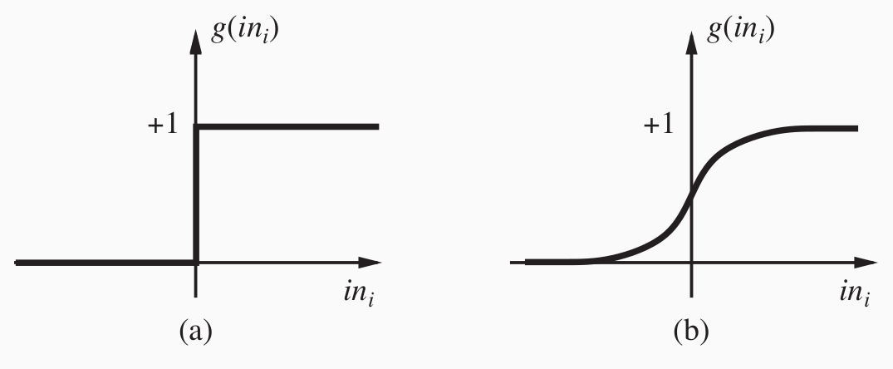

# Neural networks
Neuronale Netze (neural networks) sind in der Informatik, Netzwerke aus künstlichen Neuronen. Sie sind als Nachbildung der Neuronenstruktur von menschlichen Gehirnen entwickelt worden.

Grundbaustein aller neuronalen Netzwerke ist das Perzeptron.

## Perzeptron
In seiner einfachsten Ausführung ist ein Perzeptron vergleichbar mit einem Logikschalter. Es kann boolesche Werte (1 - wahr, 0 - falsch) als Eingabe aufnehmen und gibt selbst wieder einen booleschen Wert als Ergebnis aus. In der Grafik kann das Perzeptron die logische Und-Verknüpfung zweier Werte ausführen. X und Y sind jeweils Eingaben, das Perzeptron gibt als Ausgabe entweder 1 aus, wenn beide Eingaben 1 sind, andernfalls 0.

Genauer betrachtet, verfügt ein Perzeptron über Eingabegewichtungen (w), eine Eingabe Funktion (input function), sowie eine Aktivierungsfunktion g() (activation function).
Die Eingabegewichtungen sorgen dafür, dass die einzelnen Eingabewerte unterschiedlich stark in die Ausgabe einfließen können. Dazu wird über die Eingabefunktion eine Summe über alle Eingabewerte mit ihren jeweiligen Gewichtungsfaktoren (w) gebildet. Der errechnete Wert wird der Aktivierungsfunktion übergeben, die beeinflusst, ob das Perzeptron eine Aktivierung weiterleitet.

Quelle: <a>[[RUSS16]](#ref_russ16)</a>

Die Ausgabe der _input function_ an die _activation function_ lässt sich folgendermaßen berechnen:

Wie in der Formel ersichtlich, erfolgt eine Weiterleitung von 1 an die _activation function_ wenn die Summe über die Produkte, zwischen Eingabevektorwert mit dem jeweiligen Gewicht (w), größer bzw. gleich dem Bias Gewicht (w 0,i) ist, andernfalls wird 0 weitergegeben.

## Aktivierungsfunktionen
Zuletzt entscheidet die Aktivierungsfunktion über eine Aktivierung des Perzeptrons. Verschiedene Altivierungsfunktionen eignen sich für unterschiedliche Problemstellungen. In der Grafik ist auf der linken Seite eine Sprungfunktion und auf der rechten Seite eine sigmoide Funktion zu sehen. Die Sprungfunktion leitet eine Aktivierung des Perzeptrons ein sobald die Ausgabe der _input function_ größer 0 ist. Eine sigmoide Funktion würde in einem anderem Beispiel feinere Abstufungen erlauben, wenn die Ausgabe einer _input function_ nicht nur 0 oder 1 annehmen können und wird in neueren neuronalen Netzen überwiegend verwendet. 

## Limitierung
Ein einzelnes Perzeptron ist fähig die logischen Funktionen AND, OR und NOT abzubilden. Minsky und Papert wiesen 1969 nach, dass die XOR Funktion nicht abgebildet werden kann. linear separable Funktionen zu lösen.

## Mehrlagiges Perzeptron

## Literaturverzeichnis

<a name="ref_russ16">[RUSS16]</a>:Russell, Stuart J., and Peter Norvig. Artificial intelligence: a modern approach. Malaysia; Pearson Education Limited,, 2016.