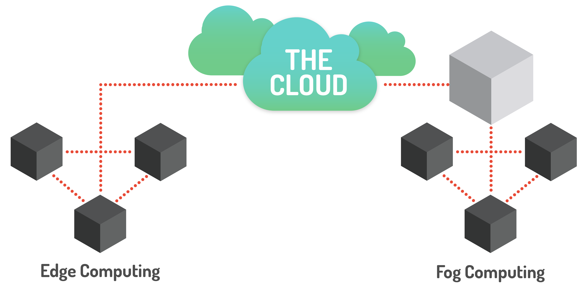
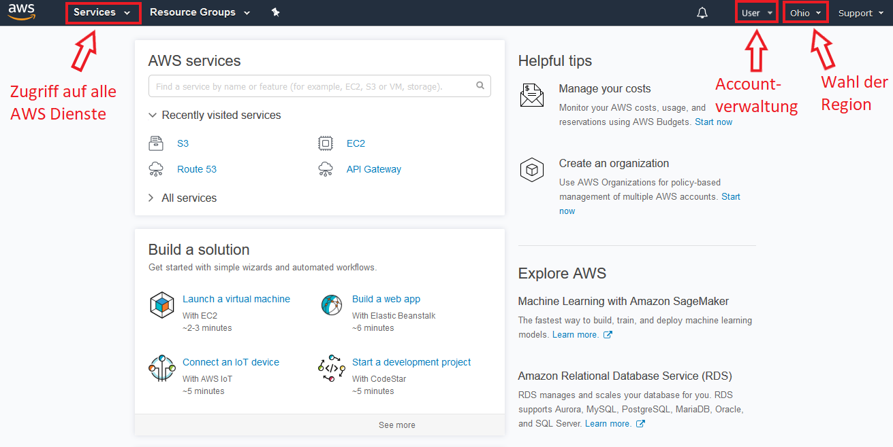
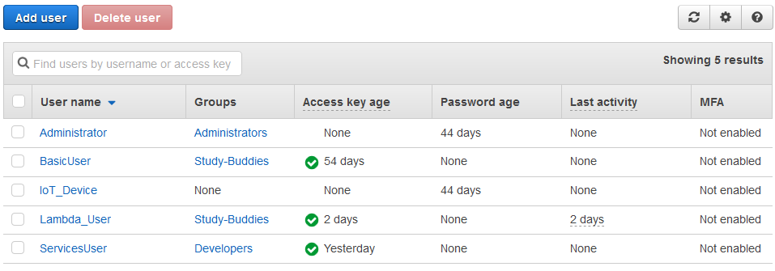
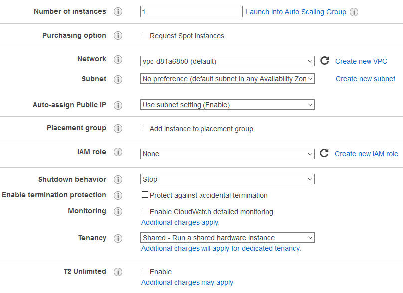
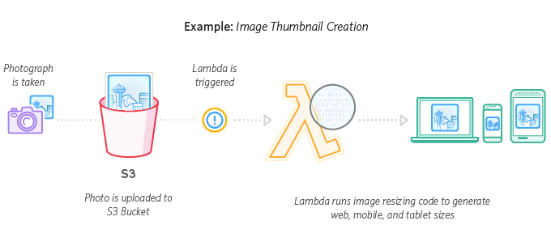
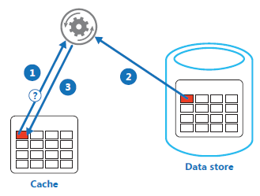

# Cloud computing

Autor: Björn Böing

## Inhaltsverzeichnis

- [Abkürzungsverzeichnis](#abkürzungen)
- [Einleitung](#einleitung)
    - [Definition](#definition)
    - [Geschichtliches](#geschichtliches)
- [Architektur](#architektur)
    - [Charakteristika](#charakteristika)
    - [Service Modelle](#service-modelle)
        - [Infrastructure as a Service (IaaS)](#iaas)
        - [Platform as a Service (PaaS)](#paas)
        - [Software as a Service (SaaS)](#saas)
        - [Function as a Service (FaaS)](#faas)
        - [Everything as a Service (XaaS)](#xaas)
    - [Bereitstellungsmodelle](#bereitstellungsmodelle)
        - [Public](#public)
        - [Private](#private)
        - [Community](#community)
        - [Hybrid](#hybrid)
    - [Vergleich zu anderen Modellen](#vergleich-zu-anderen-modellen)
    - [Edge Computing](#edge-computing)
    - [Fog Computing](#fog-computing)
    - [Nachteile & Begrenzungen](#nachteile-begrenzungen)
        - [Distributed-Denial-of-Service (DDoS) Angriffe](#ddos)
        - [Layer 8 Fehler](#layer-8-fehler)
        - [Mangelhafte Backups](#mangelhafte-backups)
        - [Systemfehler](#systemfehler)
        - [Privatsphäre](#privatsphäre)
        - [Inflexibilität & geringere Kontrolle](#inflexibilität)
- [Amazon Web Service (AWS)](#aws)
    - [Grundlagen](#grundlagen)
    - [Identity and Access Management (IAM)](#iam)
    - [Elastic Compute Cloud (EC2)](#ec2)
    - [Simple Storage Service (S3)](#s3)
    - [AWS Lambda](#aws-lambda)
- [Cloud Design Patterns](#cloud-design-pattern)
    - [Cache-aside](#cache-aside)
    - [Compensating Transaction](#compensating-transaction)
    - [Federated Identity](#federated-identity)
    - [Sharding](#sharding)
- [Zusammenfassung](#zusammenfassung)
    - [Aktuelle Trends](#aktuelle-trends)


## Abkürzungsverzeichnis

- TODO


## Einleitung

- Ursprung in Semesterarbeit

### Definition

Für den Begriff "Cloud Computing" gibt es keine Definition, die sich zu diesem Zeitpunkt allgemeingültig durchsetzen konnte, jedoch ähneln sich die meisten häufig in den Kernpunkten. Die Definition der US-amerikanischen Standardisierungsstelle NIST (National Institute of Standards and Technology) wird in vielen Publikationen und Vorträgen verwendet und lautet:

_"Cloud computing is a model for enabling ubiquitous, convenient, on-demand network access to a shared pool of configurable computing resources (e.g., networks, servers, storage, applications, and services) that can be rapidly provisioned and released with minimal management effort or service provider interaction."_ [[NIST11]](#ref_nist11)

Neben dem Kernpunkt aller Definitionen, dass Rechnerressourcen über ein Netzwerk bereitgestellt und genutzt werden können, stellt das NIST mit dieser Definition eine schnelle und einfache Verwendung in den Fokus. Das Bundesamt für Sicherheit in der Informationstechnik (BSI) geht noch einen Schritt weiter und sagt, dass Angebote und Nutzung der Cloud Dienstleistungen ausschließlich über definierte technische Schnittstellen und Protokolle abläuft. Die direkte Interaktion mit den Anbietern ist nicht vorgesehen. [[BSI18]](#ref_bsi18)


### Geschichtliches

Die Bedeutung von "Cloud Computing" wie sie heute existiert und was damit verbunden wird, hat sich seit der ersten Verwendung nicht viel verändert. Die Compaq, Weltmarktführer für PC-Systeme der 1990er, verwendete den Begriff 1996 in einem internen Dokument. Schon davor wurde der Begriff "Cloud" und die dazugehörige Abbildung verwendet, um unter anderem das Internet, Telekommunikation und verteilte Anwendungen darzustellen. [[REGA11]](#ref_rega18)

Populär wurde der Begriff "Cloud Computing", als Amazon 2006 ihre [Elastic Compute Cloud](#ec2) (EC2) auf den Markt brachte. In den anschließenden Jahren brachten auch Unternehmen wie Google, Microsoft, IBM und auch Oracle vergleichbare Produkte auf den Markt, um den neu erzeugten Bedarf nach externer und mietbarer Rechenleistung zu bedienen. Das erste open-source Projekt, welches das Erstellen von [privaten](#private) und [hybrid](#hybrid) Clouds ermöglichte, war das OpenNebula Projekt der NASA und wurde 2008 veröffentlicht. [[FOOT17]](#ref_foot17) [[IBMJ09]](#ref_ibmj09)


## ?? Architektur / Konzept


### Charakteristika

NIST Charakteristika:

- __On-demand self-service__: Ein Nutzer kann ohne menschliche Interaktion (also eigenständig) die zugänglichen Ressourcen, wie Serverinstanzen und Speicher, verwalten.
- __Broad network access__: Die angebotenen Funktionen sind über das Netzwerk und mittels standardisierter Mechanismen zu erreichen und darauf ausgerichtet Client-Plattformen wie Smartphones, Tablets oder Laptops zu unterstützen.
- __Resource pooling__: Die Ressourcen des Anbieters sind darauf ausgelegt von mehreren Kunden parallel genutzt zu werden. Dies wird erreicht, indem sowohl die physischen als auch die virtuellen Ressourcen einem Kunden automatisiert zugewiesen und entzogen werden.
- __Rapid elasticity__: Funktionen können elastisch bereitgestellt und freigegeben werden, um eine Skalierung zu ermöglichen, die sich (manchmal auch automatisiert) den Umständen entsprechenden anpasst. Dem Nutzer erscheinen die Ressourcen häufig als unbegrenzt und können dadurch zu beliebigen Zeitpunkten in beliebigen Mengen angefordert werden.
- __Measured service__: Die Nutzung von Cloud Systemen wird automatisiert überwacht, um beispielsweise den genutzten Speicher, die genutzte Bandbreite oder die Anzahl der aktiven Benutzer zu messen. Diese können sowohl von Seiten des Nutzers, als auch vom Anbieter aus transparent überwacht, kontrolliert und bekanntgegeben werden.

[[NIST11]](#ref_nist11)

- https://nvlpubs.nist.gov/nistpubs/Legacy/SP/nistspecialpublication800-145.pdf

Weitere Charakteristika:

- https://en.wikipedia.org/wiki/Cloud_computing

- https://www.bsi.bund.de/DE/Themen/DigitaleGesellschaft/CloudComputing/Grundlagen/Grundlagen_node.html


### Service Modelle

Auf Basis von Cloud Computing Technologien sind in den vergangenen Jahren eine Vielzahl verschiedener Projekte und Produkte entstanden, die vor allem darauf abzielen dem Nutzer Funktionalitäten flexibel und skalierbar zur Verfügung zu stellen. Da Nutzer in der Regel keine Funktionalitäten wirklich kaufen, sondern eher mieten, wird in diesem Zusammenhang von "Services" gesprochen. In diesem Zusammenhang ist auch die Begrifflichkeit "as a Service" entstanden, mit denen Cloud Computing Produkte häufig betitelt werden. Die finanzielle Abrechnung läuft bei Cloud Services in der Regel über das _"Pay as you go"_ Prinzip ab, welches in Verbindung mit genauen Messungen zur tatsächlichen Nutzung der Funktionalitäten und anbieterabhängigen Schwerpunkten die Kosten kalkuliert.

Die [Abbildung 1](#img_service_models) zeigt den Zusammenhang der drei verbreitetsten Service Modelle _"[Infrastructure as a Service](#iaas)" (IaaS)_, _"[Plattform as a Service](#paas)" (PaaS)_ und _"[Software as a Service](#saas)" (SaaS)_ in Form eines Mengendiagramms. In den nächsten Abschnitten sollen diese drei Modelle und weitere vorgestellt und deren Anwendungsfälle betrachtet werden.

<a name="img_service_models"></a>
<div style="text-align:center">
    
    <br>

Abb. 1: IaaS vs PaaS vs SaaS - Quelle: [[GASS16]](#ref_gass16)

</div>


<a name="iaas"></a>

#### Infrastructure as a Service (IaaS)

Mit IaaS wird das Bereitstellen von IT-Infrastrukturen mittels high-level APIs beschrieben, welche Details und Funktionen auf eine höhere Abstraktionsebene anheben, um deren Benutzung zu vereinfachen. Typische Infrastrukturen, die als Service bereitgestellt werden sind Rechenleistung und Speicherplatz.

Über sogenannte "Hypervisor" oder "Virtual Machine Monitor" (VMM) werden auf einem Computer eine oder mehrere virtuelle Maschinen (VMs) gestartet und verwaltet. Der Computer, auf dem die VMs laufen wird "Host" genannt, während die laufenden VMs als "Guest" bezeichnet werden. Anzumerken ist, dass das Betriebssystem des Host-Systems nicht einschränkt, welche Betriebssysteme auf den VMs genutzt werden können. Im Bereich von Cloud Computing werden Orchestrierungs Technologien genutzt, um unter anderem die Entscheidung auf welchem Host eine VM laufen soll und auch das Verknüpfen von neuen VMs und freiem Speicher zu automatisieren. Dadurch wird ermöglicht, dass eine Vielzahl von Nutzer neue VMs eigenständig aufsetzen und nutzen können, ohne dass Interaktionen mit einem Dritten notwendig sind. In der Regel stellen Anbieter von IaaS ein Webportal zur Verfügung, über das neue Maschinen mit ein paar Klicks erzeugt werden können und dabei sowohl das Betriebssystem als auch die Rechen- und Speicherleistung festgelegt werden. [[SHAW17]](#ref_shaw17) [[ROUS17a]](#ref_rous17a)

Die NIST hat bereits 2011 standardisierte Definitionen zu den weitverbreitesten Service Modellen veröffentlicht. Das IaaS Modell wird wie folgt definiert:

<span style="display:block;text-align:center">_"The capability provided to the consumer is to provision processing, storage, networks, and other fundamental computing resources where the consumer is able to deploy and run arbitrary software, which can include operating systems and applications. The consumer does not manage or control the underlying cloud infrastructure but has control over operating systems, storage, and deployed applications; and possibly limited control of select networking components (e.g., host firewalls)."_ [[NIST11]](#ref_nist11)</span>

Auch diese Definition beinhaltet, dass die grundlegende Infrastruktur vom Anbieter verwaltet und bereitgestellt wird und der Nutzer trotzdem die Kontrolle über das Betriebssystem, den Speicher und installierte Software hat. Die NIST merkt allerdings an, dass häufig die Kontrolle über Netzwerkkomponenten beschränkt sind und nennt dazu Einstellungen an der Firewall als Beispiel.

Im späteren Verlauf dieses Kapitels wird auf AWS EC2 eingegangen, was eine IaaS Lösung von Amazon darstellt.


<a name="paas"></a>

#### Platform as a Service (PaaS)

Das PaaS Modell erweitert das vorhergehend beschriebene IaaS Modell mit vorinstallierter Software (häufig speziell Middleware), die für die Entwicklung und den Betrieb von Anwendungen notwendig sind und nimmt übernimmt weitere Aufgaben, wie das Konfigurieren des Betriebssystems, von Datenbanken und von technischen Bibliotheken. Das bedeutet, dass beispielsweise Server aufgesetzt werden können, die die JavaScript Laufzeitumgebung Node.JS schon installiert haben und der Server somit lediglich die auszuführende Software erhalten muss. [[GASS16]](#ref_gass16) [[WATT17]](#ref_watt17)

Vorrangiges Ziel von PaaS ist es die Entwicklung von Softwareanwendungen zu vereinfachen und zu beschleunigen. Dies wird erreicht, indem Entwickler sich nicht detailliert mit dem Erzeugen und Konfigurieren von Testumgebungen befassen müssen, sondern auf fertige Lösungen zurückgreifen beziehungsweise auf einfache Weise diese Lösungen individuell anpassen können. Diese Kernpunkte sind auch von der NIST in ihrer Definition von PaaS zu finden:

<span style="display:block;text-align:center">_"The capability provided to the consumer is to deploy onto the cloud infrastructure consumer-created or acquired applications created using programming languages, libraries, services, and tools supported by the provider. The consumer does not manage or control the underlying cloud infrastructure including network, servers, operating systems, or storage, but has control over the deployed applications and possibly configuration settings for the application-hosting environment."_ [[NIST11]](#ref_nist11)</span>

Fotango, eine Tochterfirma von Canon Europe, brachte 2006 als weltweit erster Anbieter einen Dienst online, der das umsetzte, was später als PaaS bekannt wurde. Mit _"Zimki"_ wurde damals eine Plattform angeboten, die alle Nebenaufgaben für die Entwicklung von JavaScript automatisiert umsetzte und dabei das _"Pay as you go"_ Prinzip für die finanzielle Abrechnungen nutze. Obwohl Zimki Profit einspielte und sich einer wachsenden Nutzerzahl erfreuen konnte, entschied sich Canon den Dienst am 24.12.07 einzustellen. [[FORR06]](#ref_forr06) [[MARK07]](#ref_mark07)


<a name="saas"></a>

#### Software as a Service (SaaS)

Mit SaaS stellt ein Anbieter das volle Paket, bestehend aus Infrastruktur, Plattform und auch Anwendungssoftware, für die direkte Nutzung bereit. Dabei steht die Anwendersoftware im Vordergrund und wird häufig über einen Thin-Client, wie einen Internetbrowser, bedient. Durch diesen Ansatz muss ein Anwender keinerlei produktspezifische Software installieren, sondern kann die volle Funktionalität jederzeit auf Abruf nutzen. Aus diesem Grund wird SaaS auch als _"On Demand Software"_ bezeichnet und gilt als das komplette Gegenteil zur klassischen _"On Premises Software"_, bei der ein Produkt auf dem Nutzerrechner vollständig installiert werden muss, bevor es genutzt werden kann. [[GASS16]](#ref_gass16) [[WATT17]](#ref_watt17)

Im Vergleich zu IaaS, was sich eher an IT-Administratoren richtet und zu PaaS, was vorrangig von Software-Entwicklern genutzt wird, findet bei SaaS die Interaktion direkt mit dem Nutzer statt. Als Beispiel sind die Google Apps wie Docs, Spreadsheets und Presentation zu nennen, deren Funktionalität vollständig über den Browser zu nutzen sind und keinerlei Zusatzinstallationen benötigen. [[GASS16]](#ref_gass16)

Die NIST definierte 2011 SaaS wie folgt:

<span style="display:block;text-align:center">_"The capability provided to the consumer is to use the provider’s applications running on a cloud infrastructure. The applications are accessible from various client devices through either a thin client interface, such as a web browser (e.g., web-based email), or a program interface.The consumer does not manage or control the underlying cloud infrastructure including network, servers, operating systems, storage, or even individual application capabilities, with the possible exception of limited user-specific application configuration settings."_ [[NIST11]](#ref_nist11)</span>

Die Grundidee, dass einem Kunden die Aufgaben zur Wartung und Bezahlung von IT-Infrastrukturen und Plattformen abgenommen werden, ist nicht erst mit SaaS entstanden. Bereits in den 1990ern sind sogenannte _"Application Service Providers" (ASP)_ entstanden, die Softwareanwendungen über Netzwerke bereitstellten. Auch ASPs sahen ein Geschäftsmodell darin, dem Kunden die Arbeit abzunehmen, die abseits von der eigentliche Bedienung und Verwendung einer Softwarelösung notwendig ist. Stattdessen war es nur notwendig Client-Software zu installieren, was gerade für kleine und mittelständische Unternehmen eine enorme Kostenersparnis darstellte. [[BIAN20]](#ref_bian20)

Im Vergleich zu ASPs stellen SaaS Anbieter in der Regel ihre eigene Software über die Cloud bereit, anstatt Software von Dritten anzubieten. Darüber hinaus wird für SaaS-Lösungen in den meisten Fällen einzig ein Browser benötigt und keine separat installierte Clientanwendung. Was den Unterschied in Wartung und Betrieb betrifft, so stellten ASPs für jeden ihrer Kunden eine eigene Instanz der gewünschten Anwendung zur Verfügung, während modere SaaS Lösungen, mit einem multimandantenfähiges System, mehrere Kunden über eine einzige Instanz versorgen können. Sowohl ASP als auch SaaS unterstützen, durch die Zentralisierung der laufenden Softwareanwendungen, das Prinzip von Continuous Delivery. Dies bedeutet, dass die Anwendungen, die über das Netzwerk bereitgestellt werden, in deutlich höherer Frequenz Updates erhalten können, ohne dabei den Endnutzer mit einbeziehen zu müssen. Anzumerken ist, dass SaaS Continuous Delivery stärker unterstützt, da dort die Client-Software in der Regel keine Updates benötigt. [[BIAN20]](#ref_bian20)


<a name="faas"></a>

#### Function as a Service (FaaS)

Der Begriff FaaS ist aus dem Bereich der _"serverless"_ Architekturen entstanden. Initial wurde mit serverless beschrieben, was heute mit PaaS gemeint ist. Also, dass eine Anwendung und die dazugehörigen Server, von Dritten bereitgestellt und gewartet werden, statt diese Aufgaben selbst zu erledigen.

Das heutige Verständnis einer serverless Architektur beschreibt allerdings tatsächlich einen Ansatz, der sich vom klassischen Server entfernt. Gemeint ist, dass nicht ein Prozess eine lange Zeit darauf wartet, dass eine Anfrage gestellt wird und dieser möglicherweise auch mehrere Anfragen abwickelt. Stattdessen setzt der FaaS Ansatz darauf, dass die geforderten Ressourcen innerhalb von Millisekunden hochfahren, anschließend eine Anfrage behandeln und dann wieder herunterfahren. Dies ist über Event-Mechanismen umgesetzt, die zur Ausführung einer bestimmten Funktion führen statt, dass ein Prozess auf Anfragen warten muss. Im Vergleich zu PaaS wird die Nutzung von FaaS meist pro Ausführung bepreist statt pro verstrichener Zeit in dem der Dienst aktiv war.

Mit FaaS werden mittlerweise vor allem Microservices realisiert, die durch eine Orchestrierung von verschiedenen Funktionalitäten eine umfassendere Aufgabe erledigen. Amazon ist mit [AWS Lamba](#aws-lambda) einer der bekanntesten Anbieter von FaaS, obwohl hook.io es weltweit als erster anbot.

[[AVRA16]](#ref_avra16) [[HAN17]](#ref_han17)


<a name="xaas"></a>

#### Everything as a Service (XaaS)

Nachdem die vorangehend beschriebenen Service Modelle immer weiter an Bekanntheit und Beliebtheit gewannen, kamen weitere Technologien die mittels Cloud Computing _"as a Service"_ angeboten wurden. All diese verschiedenen Modelle und Technologien werden unter _"Everything as a Service"_ oder kurz _"XaaS"_ zusammen gefasst. Heutzutage werden die verschiedensten Anwendungen und Technologien über die Cloud als Service bereitgestellt wie beispielsweise:

- Internet of Things as a Service (IoTaaS)
- Database as a Service (DbaaS)
- Blockchain as a Service (BaaS)
- Games as a Service (GaaS)

Genau wie die vorhergehenden Modelle basieren auch diese darauf, dass der Endnutzer möglichst wenig Aufwand betreiben muss, um sie zu nutzen.

[[ROUS17b]](#ref_rous17b) [[WIKI18]](#ref_wiki18)


### Bereitstellungsmodelle

Durch die große Verbreitung und die verschiedensten Anwendungsgebiete sind auch die verschiedensten Formen der Bereitstellung von Cloud Computing entstanden. Die vier verbreitesten werden im Folgenden vorgestellt.


#### Public

Eine _"Public Cloud"_ beschreibt eine öffentlich zugängliche Cloud-Infrastruktur, bei der die benötigten Ressourcen von einem Dritten bereitgestellt und gewartet werden. Die Nutzung von Public Clouds kann zwar kostenlos sein oder zumindest bis zu einem gewissen Grad, ist in der Regel allerdings mit direkten Kosten an den Anbieter verbunden. Dieses Bereitstellungsmodell ist mit Abstand am weitesten vertreten und wir sowohl von Privatleuten als auch von Unternehmen verwendet, um Arbeit auszulagern und die eigene Produktivität zu erhöhen. [[INNO17]](#ref_inno17) [[NIST11]](#ref_nist11)


#### Private

Unternehmen, die die Cloud-Infrastruktur eines Dritten allein nutzen oder die die Bereitstellung Wartung selbstständig erledigen wollen, greifen häufig auf eine _"Private Cloud"_ zurück. Dies erlaubt es ihnen die vorhergehend beschriebenen [Service Modelle](#service-modelle) zentral zu warten und bereitzustellen und müssen so nicht zwingendauf einen Dritten vertrauen. Ein Unternehmen kann somit sowohl Betreiber als auch Nutzer einer Cloud sein und auch darüberhinaus aus Zweigstellen Zugriff auf die Private Cloud ermöglichen. [[INNO17]](#ref_inno17) [[NIST11]](#ref_nist11)


#### Community

Eine _"Community Cloud"_ siedelt sich zwischen Public und Private Clouds an. Die genutzte Infrastruktur wird sich zwischen mehreren Unternehmen oder Teilnehmern geteilt, sind aber nicht öffentlich zugänglich. In der Regel schließen sich Unternehmen zusammen, die beispielsweise die gleichen Vorraussetzungen an Privatsphäre, Performanz und Sicherheit stellen und durch den Zusammenschluss die entstehenden Kosten aufteilen wollen. Community Clouds können innerhalb des Zusammenschlusses bereitgestellt, aber auch durch einen Dritten bezogen werden. Über ein multimandantenfähiges System können einzelne Unternehmen separat von einander agieren, es lassen sich aber trotzdem zentrale Datenquellen erzeugen, auf die mehrere Teilnehmer Zugriff haben. Ein Beispiel für einen Zusammenschluss sind Banken, bei denen mehrere Tochterfirmen eigenständig arbeiten, aber trotzdem zentrale Datenquellen mit einbeziehen. [[INNO17]](#ref_inno17) [[NIST11]](#ref_nist11)


#### Hybrid

Beim Einsatz von _"Hybrid Clouds"_ werden zwei oder mehr Clouds miteinander verbunden, die unterschiedliche Bereitstellungsmodelle besitzen können. Unternehmen können dadurch beispielsweise sensible Daten mit einer Private Cloud schützen und gleichzeit andere Daten durch eine Public Cloud öffentlich zugänglich machen. Außerdem ermöglichen Hybrid Clouds einen schritt- oder teilweisen Umstieg von on premise Anwendungen zur Cloud. Dies wird vor allem von Unternehmen genutzt, die einen Umstieg zur Cloud nicht in einem einzigen Schritt stemmen können. Das unter [Geschichtliches](#geschichtliches) erwähnte Projekt OpenNebula der NASA ist ein Beispiel für die gleichzeitige Nutzung von Private und Public Cloud. Ersteres nutzt die NASA, um Forschung und Entwicklung unter Verschluss zu halten, während letzteres dazu genutzt wird, um Datensätze mit anderen Unternehmen und der Öffentlichkeit auszutauschen. [[INNO17]](#ref_inno17) [[NIST11]](#ref_nist11)


### ??? Vergleich zu anderen Modellen

### Edge Computing

Mit dem Begriff "Edge Computing" wird der Ansatz beschrieben, mit dem die Intelligenz eines Netzwerkes zur Datenquelle verschoben wird. Gemeint ist, dass Rechenleistung und Speicher an die "Edge", also die Kante, eines Netzwerkes gebracht werden, um vor Ort die dort entstehenden Daten zu verarbeiten. Edge Computing befindet sich derzeit auf dem aufsteigenden Ast und wird immer häufiger eingesetzt, um vor allem im IoT-Bereich eine bessere Kontrolle und Performanz zu erreichen. Einige wichtige Entitäten und Begriffe für Edge Computing sind:

- __Edge device__: Geräte, die Daten erzeugen, wie beispielsweise Sensoren und industrielle Maschinen.
- __Edge__: Der _"Rand"_ des betrachteten Netzwerkes, der je nach Anwendungsgebiet völlig unterschiedlich ist. In der Telekommunikation könnte es ein Sendemast oder Handy sein, im Automobilbereich ein Auto.
- __Edge gateway__: Eine zentrale Stelle, von der die Verbindung zu Bereichen außerhalb eines Edge Netzwerkes ermöglicht wird.
- __Fat client__: Im Bereich von Edge Computing ist Software gemeint, die auf den Edge devices Daten verarbeiten können. Das Gegenstück zu _"thin clients"_, die Daten nur versenden können.
- __Edge computing equipment__: Edge Computing nutzt Hardware und Technologien, die bereits in anderen Bereichen eingesetzt wird, als auch welche, die speziell für diese und ähnliche Szenarien entwickelte wurde. Hersteller wie Cisco produzieren gezielt Netzwerk-Hardware, die besonders zuverlässig und belastbar sind (sowohl die Technik als auch das Gehäuse).
- __Mobile edge computing__: Der Ausbau von Edge computing im Bereich der Telekommunikation, speziell in 5G Szenarien.

Der Wandel, der durch Edge Computing vollzogen wird, ist in mehreren Bereichen sehr vielversprechend und bringt einige Vorteile mit sich.

Zum einen senkt es die Latenz, die eine Anwendung oder ein Gerät für eine Entscheidungsfindung oder ein Ergebnis braucht. Eine Anfrage quer über den Globus zu schicken, wo eventuell weitere Anfragen entstehen, ehe eine Antwort zurück kommt, dauert deutlich länger als auf alle benötigten Mittel vor Ort zugreifen zu können. Laut Matthew Lynley von "techcrunch.com" [[LYNL18]](#ref_lynl18) entwickelt Amazon möglicherweise Chips für Amazon Echo, um genau diesem Latenz-Problem entgegen zu wirken. Diese Chips sollen die Informationen und Anfragen, die in die Cloud geschickt werden müssen, senken, um so die Antwortzeit drastisch zu reduzieren.

Zum anderen bietet Edge Computing die Möglichkeit über ein richtiges Management die Sicherheit, beispielsweise von Nutzern und deren Geräten, zu steigern. Spätestens nach den Distributed Denial of Service (DDOS) Angriff auf die Dyn im Oktober 2016 [[STAT16]](#ref_stat16) ist die Sicherheit von Edge Geräten, wie sie häufig für Internet of Things (IoT) Netzwerke benutzt werden, ein großes Thema. Damals konnte ein riesiges Botnetz, das zum Großteil aus IoT-Geräten bestand, die Verwendung des Internets dramatisch stören. Die Mirai Malware übernahm die Kontrolle von Geräten, die statische Nutzernamen und Passwörter besaßen oder diese den Werkseinstellungen entsprachen und nutzte die so gesammelte Rechenleistung für eine DDOS Attacke gegen den DNS-Betreiber der USA.

Ebenso wie Werkseinstellungen von Nutzernamen und Passwörter, bringen auch veraltete Betriebssysteme und Software Sicherheitsrisiken mit sich. Laufende IoT-Geräte werden nur selten mit aktuellen Updates ausgestattet und beinhalten wenige Sicherheitsmechanismen. Statt händisch einzelne Geräte zu updaten sollte stattdessen ein zentrales Management diese Aufgabe übernehmen und für mehr Sicherheit am Netzwerkrand sorgen. Genauso wie Webbrowser meist verdeckt Updates erhalten oder Smartphone-Besitzer auf neue Versionen hingewiesen werden, sollte es auch bei Edge-Geräten der Fall sein.

Neben den Sicherheitsaspekten kann Edge Computing auch dabei helfen ein weiteres Problem zu lösen, das durch IoT entstanden ist. Die enorme Menge an Daten, die durch IoT-Geräte anfallen und versendet werden sollen, bringen die Bandbreite eines Netzwerks an ihre Grenzen. Statt alle Daten zur Verarbeitung und Speicherung in die Cloud zu senden, können intelligente Edge Geräte dabei helfen die Daten zu filtern und nur bedeutsame Informationen über die Leitung zu senden. Zur Filterung sollen vor allem künstliche Intelligenzen (KIs) auf die Endgeräte gelangen.

Getrieben wird der Wandel zum Edge Computing vor allem in der Industrie. Mit der Einführung von Industrial Internet of Things (IIoT) generieren, versenden und analysieren Unternehmen ihre Prozesse und senken so beispielsweise ihre unerwarteten Ausfallzeiten. Obwohl bei der riesigen Datenmenge die starke Rechenleistung und große Speicherkapazitäten der Cloud eine sehr zentrale Rolle spielen, so bietet Edge Computing weitere Möglichkeiten die Performanz des IIoT weiter zu verbessern. Möglich ist dies vor allem durch die niedrigen Preise von Geräten und Sensoren zur Herstellung von Edge Geräten, die darüber hinaus immer weniger Platz benötigen. Ebenso dient die steigende Anzahl an Anwendungsgebieten von IIoT und die modernen Technologien für maschinelles Lernen und Analysen als treibende Kraft für den Einsatz von Edge Computing in der Industrie.

Die Zentralisierung, auf der Cloud Computing aufbaut, wird durch Edge Computing etwas aufgelockert. Das heißt nicht, dass es überflüssig wird, sondern vielmehr, dass Aufgaben an den Rand des Netzwerkes abgeben werden. Je nach Anwendungszenario ist diese Verschiebung stärken oder schwächer ausgeprägt. In Extremfällen kann Edge Computing aber auch vollständig ohne die Anwendung von Cloud Computing stattfinden.

[[BUTL17]](#ref_butl17) [[GEDI18]](#ref_gedi18) [[MILL18]](#ref_mill18) [[FELD17]](#ref_feld17)


### Fog Computing

Genau wie beim Edge Computing, wird auch beim Fog Computing Rechenleistung, Speicher und allgemein die digitale Intelligenz zurück zum Rand des Netzwerkes verschoben. Dies soll ebenfalls für geringere Latenzen, eine höhere Sicherheit und geringere Auslastung der Bandbreite sorgen.

Der Begriff "Fog Computing" wurde 2013 erstmals von Cisco bei einer Pu­b­li­zie­rung verwendet und wird bis heute auch vorrangig von Cisco geprägt. Am 19. November 2015 wurde das "OpenFog Consortium" gegründet, in welchem Unternehmen wie Cisco Systems, ARM Holdings, Dell, Intel, Microsoft und die Princeton University zusammen arbeiten, um Fog Computing zu verbreiten und zu standardisieren. Die bisherige Arbeit brachte die sogenannte "OpenFog Reference Architecture" hervor, welche die acht Säulen einer OpenFog Architektur detailliert betrachtet [[OPEN17]](#ref_open17): 

- Sicherheit
- Skalierbarkeit
- Offenheit
- Selbstständigkeit
- Programmierbarkeit
- RAS (Zuverlässigkeit, Erreichbarkeit und Wartbarkeit)
- Agilität
- Hierarchie

Die Unterschiede zu Cloud und Edge Computing sind die Nähe zum Endverbraucher, die dichte geografische Verteilung und die mobile Einsatzmöglichkeit. Das standardmäßige Prinzip von Cloud Computing wird dahingehend verändert, dass durch sogenannte Fog-Nodes mehrere Endgeräte verknüpft werden und diese die Kommunikation zur Cloud übernehmen, statt die Endgeräte direkt. Durch die erhöhte Leistung sind die Fog-Nodes in der Lage Aufgaben der Cloud (z.B. Filterung von gesammelten Daten) zu übernehmen und darüberhinaus auch als eine Art von "vorgelagerter Cloud" betrachtet werden kann.

<a name="img_fog_vs_edge"></a>
<div style="text-align:center">
    
    <br>

Abb. 2: Edge vs Fog Computing - Quelle: [[ELLE17]](#ref_elle17)

</div>


Im Vergleich zu Edge Computing, wo die Endgeräte (z.B. IoT-Dinge) eine stärkere Rechenleistung, Speicherkapazität und Intelligenz erhalten, bleiben die Endgeräte im Fog-Computing meist leistungsschwach. Stattdessen sind Gateways oder Fog-Nodes mit starker Leistung ausgestattet, um die bereits genannten Vorteile auszuspielen. Die [Abbildung 2](#img_fog_vs_edge) zeigt genau diesen Unterschied, in einer vereinfachten Darstellung.

Bei Fog Computing sind mehrere Schritte nötig, ehe Daten an die Cloud gesendet werden, werden sie:

1. über standardmäßig I/O Mechanismen ausgelesen.
2. von einem Open Platform Communication (OPC)-Server oder einer IoT-Node in ein Internet Protokoll wie MQTT oder HTTP konvertiert.
3. an eine Fog-Node im Netzwerk verschickt, wo sie gefiltert und/oder verarbeitet werden.

Ebenso wie Edge Computing kann auch Fog Computing unabhängig von Cloud Computing umgesetzt werden. In der Praxis wird aber auch Fog Computing lediglich als Ergänzung zur Cloud genutzt, um vor allem Endnutzern eine erhöhte _"Quality of Service"_ (QoS) zu bieten.

Die schrittweise Verarbeitung und Konvertierung von gesammelten Daten stellt einen komplexeren Ansatz dar, als es bei Edge Computing der Fall ist. Darüberhinaus entstehen durch Fog Computing weitere potenzielle _"Points of Failure"_.

[[CISC13]](#cisc13) [[ELLE17]](#ref_elle17) [[OPEN17]](#ref_open17) [[OPTO18]](#ref_opto18)


<a name="nachteile-begrenzungen"></a>

### Nachteile & Begrenzungen

Cloud Computing bietet durch die Erschwinglichkeit, Effektivität und Skalierbarkeit viele Vorteile für Unternehmen. Kosten, Arbeitsaufwand und auch Know-How können an einen Anbieter abgegeben werden und ermöglicht den Unternehmen dadurch sich auf das eigene Tagesgeschäft zu fokussieren. Trotz alle dem birgt der Umstieg zur Cloud auch Sicherheitsrisiken, die bei mangelnden Gegenmaßnahmen zu erheblichen Problemen führen können.


<a name="ddos"></a>

#### Distributed-Denial-of-Service (DDoS) Angriffe

Obwohl Cloud Anbieter über eine riesige Menge an Ressourcen verfügen und Kunden dadurch eine flexible Skalierung angeboten wird, so sind DDoS Angriffe auf Cloud Systeme mittlerweile durchaus denkbar. Dies wird vor allem durch die stetig steigende Menge von IoT Geräten ermöglicht, von denen viele über mangelhafte Sicherheitsmechanismen verfügen.

Der bereits im Abschnitt [Edge Computing](#edge-computing) angesprochene Angriff auf den amerikanischen DNS-Betriber Dyn im Jahr 2016 zeigt, dass auch große Organisationen nicht immer vor DDoS sicher sind. Ganz davon abgesehen, dass Kunden die Option zur automatischen Skalierung zusätzlich buchen müssen, können Cloud Server trotzdem mit genügend Traffic in die Knie gehen oder zumindest eine geringere QoS bieten.

Unternehmen, die ihre eigene Cloud Infrastruktur aufbauen, können einerseits durch geringere Ressourcen deutlich angreifbarer sein, andererseits können Angriffe auf Cloud Systeme wie beispielsweise [AWS](#aws) oder Azure dazu führen, dass viele Kunden gleichzeitig von einem DDoS Angriff betroffen sind.

Und selbst, wenn der Cloud Anbieter die geeigneten Maßnahmen gegen solche Angriffe trifft, können auch weitere, unglücklichen Ereignisse dafür sorgen, dass der Dienst eines Unternehmens nicht erreichbar ist. Im April 2017 waren große Teile des [Simple Storage Service (S3)](#s3) von Amazon für kurze Zeit nicht erreichbar, was in dieser Zeit zu einem Schaden von ca. 150 Millionen US-Dollar führte. Ursache war laut Amazon ein Tippfehler beim Entfernen von S3 Server, der dazu führte, dass deutlich mehr Server heruntergefahren wurden, als geplant. Cloud Nutzer sollten die Risiken von offline Zeiten kalkulieren und Ausfallpläne bereithalten, um Verluste möglichst gering zu halten.

[[BRAD16]](#ref_brad16) [[UTLE18]](#ref_utle18)


#### Layer 8 Fehler

Der Nutzer wird häufig als achte Schicht über dem OSI-Netzwerk-Modell bezeichnet und genau wie in allen anderen Systemen können Fehler von Nutzern erhebliche Folgen haben. Viele Cloud Anbieter ermöglichen den Zugriff zur Cloud über beinahe jedes Endgerät wie PC, Laptops, Tablets und Smartphones. Der Verlust oder die Kompromittierung dieser Geräte kann Unbefugten den Zugang zu gesicherten Cloud Systemen ermöglichen und stellt somit ein erhebliches Sicherheitsrisiko dar.

Durch den großen Bekanntheitsgrad von Cloud Systemen sind diese seit einiger Zeit auch das Ziel von _"Phishing"_ und _"Social Engineering Angriffen"_. Ersteres kann beispielsweise in Form von Emails sein, die den Empfänger auf präparierte Webseiten locken, wo dann vertraulichen Informationen preisgeben werden sollen und dadurch in die Hände des Angreifers fallen. Bei Social Engineering Angriffen wird gezielt versucht Mitarbeiter von der Vertrauenswürdigkeit des Angreifers zu überzeugen, sodass der Angreifer sensible Informationen oder Zugänge erhält.

Ein aktueller Fall von fehlerhaftem Nutzerverhalten stellt der Fall der Marketing Firma Exactis dar. Wie WIRED am 27.06.2018 veröffentlichte war eine Datenbank der Firma Exactis mit rund 340 Mil. sensiblen Datensätzen für eine längere vollkommen öffentlich und ungeschützt online erreichbar. Diese Datensätze beinhalten zwar keine Informationen zu Kreditkarten oder Sozialversicherungsnummern, dafür allerdings sehr private Charakteristika der Betroffenen. Enthalten sind unter anderem Informationen zu Telefonnummer und Adresse, aber auch zu Interessen, Angewohnheiten und die Geschlechter der Kinder einer Person. [[GREE18]](#gree18)

[[UTLE18]](#ref_utle18) [[WOOD13]](#ref_wood13)


#### Mangelhafte Backups

Ein weiterer Sicherheitsaspekt, der zu betrachten gilt, ist die Wichtigkeit von Backups. Viele Cloud Betreiber bieten einen automatisierten Service an, der von den laufenden Systemen Backups macht. Dafür muss allerdings sichergestellt werden, dass auch alle relevanten Daten adäquat synchronisiert werden und nicht verloren gehen. Gerade für den Fall, dass ein System von Ransomware befallen und verschlüsselt wird sind Backups der einzige Weg, um dem Angreifer nicht ausgeliefert zu sein. Das Massachusetts Institute of Technology (MIT) sieht Ransomware als einer der sechs größten Gefahren, denen Unternehmen 2018 gegenüber stehen. Durch Cloud Computing sind in den vergangenen Jahren enorme Mengen an Daten zentralisiert worden und stellen dadurch interessante Ziele für Angreifer dar. Vor allem kleinere Cloud Anbieter könnten Opfer von Angriffen werden, da ihre Ressourcen weitaus eingeschränkter sind. [[GILE18]](#ref_gile18) [[UTLE18]](#ref_utle18)


#### Systemfehler

Wird beim Entwickeln von Softwareanwendungen nicht ein gewisser Qualitätsstandard eingehalten, kann dies zu Sicherheitslücken führen. Da bilden Anwendungen in der Cloud, beziehungsweise Anwendungen die für das Bereitsstellen in der Cloud verwendet werden, keine Ausnahme. Möchte ein Anbieter beispielsweise mehrere Kunden mit der selben Instanz versorgen, so setzt dieser auf ein multimandantenfähiges System. Fehler innerhalb solchen Anwendungen können allerdings dafür sorgen, dass die Daten der Kunden nicht sauber von einander getrennt sind und unbefugte Zugriffe ermöglicht werden. [[UTLE18]](#ref_utle18)

Entscheiden sich Unternehmen ihre Cloud Systeme bei einem Dritten online zu stellen, machen diese sich auch automatisch abhängig. Bei der Wahl des Anbieters sollten sich Unternehmen Gedanken machen, was für Auswirkungen es hat, sollte ein System mal nicht erreichbar sein. Vor allem die großen Cloud Anbieter können sich allerdings damit rühmen eine Erreichbarkeit von über 99% vorweisen zu können. [[CLOU18]](#ref_clou18)

2014 erhielt ein Angreifer Zugang zu der AWS Management Konsole des Softwareunternehmens Code Space. Dieses Unternehmen bot Quellcode Repositories und Projekt Management Dienste an und setzte dabei fast vollständig auf Infrastrukturen und Anwendungen von Amazon. Der Angreifer erpresste Code Space und löschte einen Großteil der Daten und Infrastruktur des Unternehmens, als dieses nicht kooperierte. Dabei gingen auch die Backups, die das Unternehmen für Notfälle erstellt hatte mit verloren, was das Unternehmen sehr schwer traf und wurde in den Medien mit dem _"Mord"_ an ein Unternehmen verglichen. [[VENE14]](#ref_vene14)


#### Privatsphäre

Die vorhergehend erläuterten Sicherheitsaspekte richten sich vor allem an Unternehmen, die ihre Cloud-Infrastruktur von einem Dritten beziehen. Aber auch auf Endnutzer und vor allem auf deren Privatsphäre, hat der Wandel zur Cloud Auswirkungen.

Nutzer teilen, durch den steigenden Einsatz von Cloud-Anwendungen, viele private Informationen mit einem Dritten und wissen häufig gar nicht, wie diese Informationen verarbeitet werden und von wem sie eingesehen werden können. Dies wird, vor allem in den Medien, als _"gläsernden Bürgern"_ bezeichnet. Darüberhinaus können Cloud Anbieter, genau wie Provider von anderen IT-Services, gesammelte Daten weitergeben oder müssen dies teilweise sogar, wenn es von der Regierung eingefordert wird. Ein Auszug aus den AGBs von Dropbox zeigt, dass der Anbieter, ähnlich wie andere, sich vorbehält Daten mit Dritten auszutauschen:

<span style="display:block;text-align:center">_"**Recht und Ordnung sowie öffentliches Interesse** – Wir können Ihre Daten auch Dritten offenlegen, wenn dies nach unserem Ermessen sinnvoll und notwendig scheint, um (a) geltenden Gesetzen, Vorschriften, rechtlichen Verfahren oder angemessenen Anfragen von Behörden Folge zu leisten, (b) einen Menschen vor dem Tod oder schwerer körperlicher Verletzung zu schützen, (c) Dropbox oder unsere Nutzer vor Betrug oder Missbrauch zu schützen, (d) die Rechte, das Eigentum, die Sicherheit oder die Interessen von Dropbox zu schützen oder (e) Aufgaben auszuführen, die im öffentlichen Interesse liegen."_ [[DROP18]](#ref_drop18)</span>

Solche Regelungen geben Cloud Anbietern viel Handlungsfreiraum, sodass in extremen Situationen auch Informationen ohne Durchsuchungsbeschluss offen gelegt werden können. Auf der anderen Seite können Anbieter in den meisten Ländern nicht dazu gezwungen werden Informationen an staatliche Behörden weiter zu geben. So hat ein amerikanisches Gericht entschieden, dass Microsoft nicht dazu gezwungen werden kann, Emails eines Nutzer an den amerikanischen Staat weiterzugeben, wenn diese Emails auf einem Server im Ausland liegen. Microsoft hat sich damals geweigert die Daten von einem irischen Server frei zu geben. [[EDWA17]](#ref_edwa17)

Die seit dem 25.05.2018 wirksame EU-Datenschutz-Grundverordnung (EU-DSGVO) hat großen Einfluss auf die zu leistenden Datenschutzmaßnahmen von Unternehmen. Diese Grundverordnung beinhaltet zum einen, dass Unternehmen der EU dazu verpflichtet werden, dass personenbezogene Daten künftig innerhalb der EU-Grenzen gespeichert und _"nach datenschutzrechtlichen Bestimmungen und Vorgaben"_ verarbeitet werden müssen. Ob diese Vorgaben eingehalten werden, wird von Datenschutzexperten geprüft und Verstöße können dabei mit bis zu vier Prozent des Jahreseinkommens verantwortet werden. Außerdem sind Unternehmen auch dafür verantwortlich, dass diese sicherstellen, dass die EU-DSGVO von Drittanbietern eingehalten wird, bei denen ein Unternehmen Daten speichert. Dabei sind vor allem Unternehmen, die Clouddienste nutzen betroffen. Des Weiteren müssen Einzelpersonen über jede Datenerhebung ausdrücklich und ausführlich informiert werden, was die Transparenz zum Umgang mit persönlichen Daten steigern soll. Die EU-DSGVO sieht auch vor, dass Daten auf Verlangen hin, möglichst unverzüglich, gelöscht oder korrigiert werden müssen. [[EUDS18]](#ref_euds18) [[NETW18]](#ref_netw18)


<a name="inflexibilität"></a>

#### Inflexibilität und geringere Kontrolle

Neben den bereits erläuterten Sicherheitsaspekten, bei denen vor allem Abhängigkeit zu einem Dritten, Risiken in Sachen Sicherheitlücken und Privatsphäre herausstechen, gibt es in Sachen Cloud Computing weitere Nachteile und auch Begrenzungen.

Im Vergleich zu standardmäßigen on premise Anwendungen und selbstständig verwalteten IT-Infrastrukturen, schrenken Clouddienste die Kontrolle und Flexibilität ein. Über die end-user licence agreement (EULA) können Anbieter enorme Einschränkungen machen, was Kunden mit den genutzten Diensten machen können.

Darüber hinaus werden Cloud Anwendungen in der Regel nur in einer einzigen Version zur Verfügung gestellt, um dem Kunden möglichst zeitnah Updates liefern zu können. Dies hat allerdings zur Folge, dass auf individuelle Probleme und Forderungen von Kunden kaum noch eingegangen werden kann. Bei on-premise Anwendungen ist es noch häufig der Fall, dass ein Unternehmen Wünschen von besonders treuen Kunden entgegen kommt und individuelle Lösungen entwickelt.

Ein weiterer Nachteil von Cloud Computing ist das sogenannte _"Vendor Lock-In"_. Damit ist gemeint, dass der Wechsel von einem Cloud Anbieter zum nächsten häufig nicht problemlos möglich ist, was zu zusätzlichen Kosten führt. Cloud Architekturen, die auf die Infrastruktur eines speziellen Anbieters zugeschnitten ist, könnte beim Wechsel zu einem anderen Anbieter nur mit Kompromissen oder zusätzlichen Entwicklungsaufwand übernommen werden. Dies kann zu zusätzlichen Sicherheitsrisiken führen.

Zusammenfassend ist zu sagen, dass viele Unternehmen durch die Skalierbarkeit, Agilität und dem pay-per-use Prinzip von Cloud Computing profitieren können. Jedoch sollte für jeden Anwendungsfalls das geeignete [Service Modell](#service-modelle) gewählt, die Risiken stetig abgewägt und ausreichend Sicherheitsmaßnahmen getroffen werden.

[[LARK18]](#ref_lark18) [[WARD18]](#ref_ward18)


<a name="aws"></a>

## Amazon Web Services (AWS)

Mit _"Amazon Web Services"_ (AWS) hat Amazon im März 2006 eine Plattform für die Öffentlichkeit gestartet, mit der Cloud Computing Dienste flexibel und nach Bedarf von Einzelpersonen, Unternehmen und Regierungen bezogen werden können. Mit 34% Marktanteil konnte Amazon 2017 allein durch AWS einen Umsatz von 17,4 Milliarden US-Dollar verbuchen. [[RAMA17]](#ref_rama17)

Die Dienste können zentral über die _"AWS Management Console"_ erreicht und konfiguriert werden. Dabei reicht ein Internet Browser als Client aus oder sogar eine AWS spezifische Smartphone App, die allerdings nur lesenden Zugriff ermöglicht. Über die Management Konsole kann auf alle der über 90 Dienste zugegriffen werden, die in die folgenden Bereiche aufgeteilt sind [[AWS18a]](#ref_aws18a):

- Datenverarbeitung
- Speicherung
- Datenbank
- Migration
- Netzwerk und Bereitstellung von Inhalten
- Developer-Tools
- Verwaltungs-Tools
- Medienservices
- Maschinelles Lernen
- Analysen
- Sicherheit, Identität und Compliance
- Services für Mobilgeräte
- AR und VR
- Anwendungsintegration
- Customer Engagement
- Unternehmensproduktivität
- Desktop- und App-Streaming
- Internet of Things
- Entwicklung von Spielen
- Software
- AWS-Kostenmanagement

Wie auch bei anderen Cloud Computing Anbietern, ergeben sich die Kosten für den Nutzer durch eine Kombination von Verbrauch, den Spezifikationen zu Hardware/Betriebssystem/Software/Netwerk, der benötigten Erreichbarkeit, Redundanz, Sicherheit und dem gewünschten Kundenservice. Dabei setzt auch Amazon auf das _"Pay per us"_ Prinzip und rechnet Kosten monatlich ab. Viele Dienste wie [EC2](#ec2), [S3](#s3), [AWS Lambda](#aws-lambda) und Amazon RDS können auf einer kostenlosen Basis, mit eingeschränktem Kontingent, genutzt werden. Darüberhinaus können Institutionen, Lehrbeauftragte und Studenten sich über _"AWS Educate"_ zusätzlich einem Netzwerk anschließen, welches bei der Ausbildung der _"nächsten Generation von IT und Cloud Experten"_ beitragen soll und die nötigen Ressourcen zum cloudbezogenen Lernen bereitstellen. AWS Educate ermöglicht es außerdem Studenten sich ein Kontingent von 40 US-Dollar zu sichern, das frei für die AWS Dienste verwendet werden kann. [[AWS18b]](#ref_aws18b) [[AWS18c]](#ref_aws18c) [[AWS18d]](#re_aws18d)

In den nachfolgenden Abschnitten sollen zum einen einige Grundlagen und allgemeine Hinweise zur Verwendung von AWS erläutert und zum anderen die bekanntesten Dienste vorgestellt werden.

- Static file deployment
- Container deployment
- Eventverarbeitung


### Grundlagen

Durch einen erfolgreichen Login zur AWS Management Console gelangt man zu einer Art Dashboard, wie es die [Abbildung 3](#img_aws_console) zeigt. In rot wurden die wichtigsten Menüoptionen markiert und kurz beschrieben.

Der Menüpunkt __Services__ öffnet die Gesamtübersicht zu allen Diensten die AWS anbietet und erlaubt eine weitere Navigation zu den jeweiligen Diensten.

Über einen Klick auf den eigenen __Nutzernamen__ (in diesem Fall "User") sind alle Einstellungen zu erreichen, die mit dem eigenen Account zusammenhängen. Dazu gehören persönliche Informationen, die Organisationen der man unter Umständen angehört, die aktuelle Kostenübersicht und die Einsicht zu sicherheitsrelevanten Informationen wie Passwort, Multi-Faktor-Authentifizierung und privaten Schlüsseln.

Der letzte Menüpunkt erlaubt es die Region zu wechseln in der Aktionen ausgeführt werden sollen. Die [Abbildung 3](#img_aws_console) zeigt "Ohio" an, es können aber verschiedene Regionen aus den östlichen USA, den westlichen USA, Asien/Pazifik, der EU und auch Südamerika gewählt werden. Dieser Menüpunkt ist von besonderer Wichtigkeit, wenn es darum geht sicherzustellen, dass Dienste unter anderem datenschutzrechtlich richtig gestartet werden. Außerdem ist anzumerken, dass zum aktuellen Zeitpunkt (Juni 2018) die Verwendung des kostenlosen Kontingents auf die vier Regionen in den USA beschränkt sind.

<a name="img_aws_console"></a>
<div style="text-align:center">
    
    <br>

Abb. 3: AWS Management Console - Quelle (verändert): [[AWS18e]](#ref_aws18e)

</div>

Die Erstellung eines AWS Accounts ist prinzipiell vollkommen kostenlos. Für eine standardmäßige Registrierung ist allerdings die Angabe einer Kreditkarte notwendig. Studenten können dies über AWS Educate umgehen.

In den USA hat Amazon zwei sogenannte _"Pop-up Lofts"_ eröffnet, in denen AWS Kunden, Start-Up Unternehmen oder eigenständige Entwickler komplett kostenfrei professionelle Hilfestellung zu den AWS Infrastrukturen erhalten können. Dabei können vor Ort 60-minütige Sitzungen angenommen werden, in denen speziell geschultes Personal alle Fragen in Bezug auf AWS beantwortet und individuelle Hinweise gibt. Außerdem finden in diesen Pop-up Lofts in regelmäßigen Abständen Events statt, die in drei Kategorien unterteilt sind, um Anfänger, Fortgeschrittene und Experten zusätzliche Schulungsmöglichkeiten anzubieten. [[AWS18f]](#ref_aws18f) [[AWS18g]](#ref_aws18g)


<a name="iam"></a>

### Identity and Access Management (IAM)

Unternehmen und Organistationen, die AWS-Dienste nutzen, können durch die Verwendung von Amazons Accountsverwaltung _"Identity and Access Management"_ (IAM) ein individuelles Rechtesystem auf die AWS Infrastruktur abbilden. Dabei bietet IAM die Möglichkeit verschiedene Benutzer, Benutzergruppen und Rollen zu definieren und diesen sehr detailliert den Zugriff auf Ressourcen erlauben oder verbieten. Diese Benutzerverwaltung wird von Amazon kostenfrei angeboten und soll unter anderem mittels [Best Practices](https://docs.aws.amazon.com/IAM/latest/UserGuide/best-practices.html) (externer Link) eine sichere Verwendung der AWS-Dienste innerhalb von Unternehmen und Organistationen bieten.

Die Granularität in denen Rechte vergeben werden können reicht dabei von einem vollen Zugriff auf die AWS Management Console, über den Zugriff auf vereinzelte Dienste und Einstellungsmöglichkeiten bis zur Beschränkung darauf, dass nur einzelne Funktionen eines Dienstes aufgerufen werden können. Hinzu kommt, dass Zugriffe auf bestimmte Uhrzeiten und Zeiträume beschränkt werden können und Nutzern auch die Verwendung von Multi-Faktor-Authentifizierung vorgeschrieben werden kann. [Abbildung 4](#img_aws_iam) zeigt beispielhaft ein IAM Dashboard, in dem mehrere Benutzer und Gruppen verwaltet werden können.

<a name="img_aws_iam"></a>
<div style="text-align:center">
    
    <br>

Abb. 4: AWS IAM Dashboard - Quelle: [[AWS18h]](#ref_aws18h)

</div>

Bei der Erstellung von neuen IAM-Benutzern können unter anderem Passwörter und Zugangsschlüssel vordefiniert werden, aber auch temporäre Anmeldedaten erzeugt werden. Temporäre Zugangsdaten können auch IAM-Benutzer und AWS-Dienste erhalten, die normalerweise keinen Zugriff auf AWS-Ressourcen einer Organisation haben. Hierbei kommen die IAM-Rollen ins Spiel die einer AWS-Ressource zugewiesen werden müssen. IAM-Benutzer und AWS-Dienste können diese definierten Rollen annehmen und anschließend temporäre Anmeldeinformationen erhalten, mit denen Aufrufe von AWS-APIs erfolgen können. Dabei ist zu beachten, dass ein AWS-Dienst nur eine IAM-Rolle zugewiesen bekommen kann, aber mehrere andere Dienste und Anwendungen diese Rolle einnehmen können. AWS-Ressourcen können über sogenannte _"Amazon Resource Names"_ (ARNs) eindeutig über alle AWS-Kunden hinaus identifiziert werden. Diese ARNs werden unter anderem dafür verwendet, dass in den IAM Einstellungen Dienste hinterlegt werden können, die eine IAM-Rolle einnehmen dürfen. ARNs können beispielsweise das folgende Format besitzen:

```HTML
<!-- Elastic Beanstalk application version -->
arn:aws:elasticbeanstalk:us-east-1:123456789012:environment/My App/MyEnvironment

<!-- IAM user name -->
arn:aws:iam::123456789012:user/David

<!-- Amazon RDS instance used for tagging -->
arn:aws:rds:eu-west-1:123456789012:db:mysql-db

<!-- Object in an Amazon S3 bucket -->
arn:aws:s3:::my_corporate_bucket/exampleobject.png
```  

[[AWS18i]](#ref_aws18i) [[AWS18j]](#ref_aws18j) [[AWS18n]](#ref_aws18n)


<a name="ec2"></a>

### Elastic Compute Cloud (EC2)

Der _"Elastic Compute Cloud"_ (EC2) Dienst, stellt einen der ältesten und beliebtesten Dienste dar, den AWS anbietet und bildet das Service Modell PaaS dar. Über diesen Dienst können virtuelle Rechenkapazitäten auf einfache Weise erstellt, gestartet, gestoppt und verwaltet werden. Hierbei kann auf fertige Instanz-Templates, sogenannte Amazon Machine Images (AMIs), zurückgegriffen werden. Bezahlt werden müssen nur die Instanzen, die tatsächlich auch laufen. Das Erstellen einer EC2 Instanz ist in sieben Schritte aufgeteilt, die nachfolgend detailliert vorgestellt werden:


__1. Amazon Machine Image (AMI) wählen__

Offiziell werden von Amazon 35 verschiedene AMIs unterstützt, die auf Linux oder Windows basieren. Diese unterscheiden sich, neben dem Betriebssystem, vor allem in der Software, die schon vorinstalliert ist. Außerdem können auch AMIs gewählt werden, die von der AWS-Community bereitgestellt werden. Hier stehen über 30.000 verschiedene Templates zur Verfügung, mit denen eine EC2 Instanz gestartet werden kann.


__2. Instanz Typ wählen__

Der Instanz Type gibt an, mit welcher Hardware eine Instanz ausgestattet ist. Diese sind in die folgenden fünf "Familien" unterteilt:

- _General Purpose_<br>
Instanzen dieser Familie haben eine gute Balance zwischen CPUs, RAM, Speicher und Netzwerkleitung dar und ist für viele Anwendungen eine gute Wahl, die wenig bis moderaten Speicher und Rechenleistung benötigen.

- _Compute optimized_<br>
Namensgeben sind diese Instanzen darauf ausgelegt Aufgaben mit hoher CPU Last zu erledigen, da sie eine hohes Verhältnis von CPUs zu RAM haben. Im Durchschnitt stehen pro CPU 2 GB RAM zur Verfügung, was hochskaliert bis zu maximal 72 CPUs und 144 GB RAM. Nicht außer Acht zu lassen ist die Netzwerkanbindung dieser Instanzen, die bis zu 25 Gigabit betragen kann.

- _GPU graphics_<br>
Mit den GPU graphics Instanzen bietet AWS virtuelle Rechner an, die für Aufgaben im Grafikbereich gedacht sind. Diese sind mit starken GPUs, hohem RAM und starker Netzwerkverbindung ausgestattet. Die GPU graphics Instanzen können mit bis zu 64 CPUs, 976 GB RAM und 8 NVIDIA K80-Hochleistungs-GPUs ausgestattet werden. Letzte besitzen pro Einheit 2.496 parallele Verarbeitungskerne und 12 GB GPU-Speicher.

- _Memory optimized_<br>
Die Memory fokussierten EC2 Instanzen richten sich an Kunden, die große Datenbanksysteme, Cachingmechanismen oder große Systeme wie beispielsweise SAP umsetzen wollen. Instanzen dieser Familie zeichnen sich durch sehr hohen RAM aus, der bis zu 1952 GB betragen kann.

- _Storage optimized_<br>
Für Anwendungen, die bestimmte Anforderungen an I/O Operationen und Speicherkapazitäten haben, sind die Speicher optimierten Instanzen von AWS geeignet. Je nach Instanz Typ können bis zu 24 HDDs zu je 2048 GB Speicher oder 8 SSDs zu je 1900 GB Speicher ausgewählt werden.


__3. Instanz detailliert konfigurieren__

Die nachfolgende [Abbildung 5](#img_aws_ec2) gibt einen Überblick über den dritten Schritt der Erzeugung einer EC2 Instanz. Hier kann zum einen die Anzahl der Instanzen festgelegt werden, die mit den vorherigen Konfigurationen gestartet werden sollen. Zum anderen können Einstellungen zur Netzwerkanbindung, Verhalten beim Stoppen beziehungsweise Herunterfahren der Instanz gemacht werden und auch eine IAM-Rolle festgelegt werden, mit der andere Anwendungen automatisiert Anmeldedaten erhalten können (siehe [Identity and Access Management (IAM)](#iam)).

<a name="img_aws_ec2"></a>
<div style="text-align:center">
    
    <br>

Abb. 5: AWS EC2 Configure Instance Details - Quelle: [[AWS18k]](#ref_aws18k)

</div>

Besonders hervorzuheben ist der letzte Menüpunkt _"T2 Unlimited"_. Diese Option ist nur für die T2 Instanzen der General Purpose Familie verfügbar und ermöglicht eine Skalierbarkeit der verfügbaren CPU-Leistung, sollten Anwendungen mehr Leistung benötigen als von der Instanz vorgesehen.


__4. Speicher hinzufügen__

Die Speichereinstellungen zu einer EC2 Instanz ermöglichen es die größen und Performanztypen der gewünschten Speicher festzulegen. Darüberhinaus kann festgelegt werden, ob Daten verschlüsselt gespeichert werden sollen und ob Speichermedien über die Lebenszeit einer EC2 Instanz hinaus existieren sollen. Außerdem können Speicherzustände von existierenden Snapshots wiederhergestellt werden, die in [S3](#s3) Buckets gelagert sind.


__5. Tags hinzufügen__

Um bei einer größeren Anzahl von EC2 Instanzen nicht den Überblick zu verlieren, können diese mit Tags versehen werden. Diese werden durch einfache Key-Value-Paare dargestellt und können somit beispielweise Auskünfte zu Besitzer, Verwendungszweck und zugehörigen Projekten direkt ersichtlich sein.

__6. Sicherheitsgruppen konfigurieren__

Die Sicherheitsgruppen beschrieben die Firewall Einstellungen, die zu einer EC2 Instanz gehören. Hier können fertige Verbindungstypen hinzugefügt werden, um gängige Verbindungen wie SSH, HTTP und IMAP zu erlauben. Es können aber auch gezielt Konfigurationen zu bestimmten Protokollen und Ports gemacht werden sowie IP-Adressen beziehungsweise IP-Adressräume festgelegt werden die auf die Instanz zugreifen dürfen.


__7. Übersicht und Starten der Instanz__

Im letzten Schritt können alle vorher getätigten Einstellungen nochmal in übersichtlicher Form geprüft werden, bevor sie gestartet wird. Tendenziell sind nur Schritt 1. und 2. notwendig, um zu Schritt 7. zu gelangen, da die anderen Schritte mit standardmäßig vorkonfiguriert sind. Es ist allerdings in der Regel sinnvoll eine Instanz für einen spezifischen Anwendungsfall zu individualisieren.

[[AWS18k]](#ref_aws18k) [[AWS18l]](#ref_aws18l)


<a name="s3"></a>

### Simple Storage Service (S3)

Amazon _"Simple Storage Service"_ (S3) ist ein Dienst, um beliebige Mengen von Daten zu speichern und abzurufen. Dabei können alle Daten im nativen Format gesichert und direkt im S3, mit leistungsstarke Analysen, verarbeitet werden. AWS selbst sagt über S3, dass _"selbst die strengsten rechtlichen Anforderungen"_ erfüllt werden und er _"von Grund auf für eine Beständigkeit von 99,999999999% entwickelt"_ wurde.

Durch Dienste wie Amazon Athena oder Amazon Redshift Spectrum können komplexe Abfragen auf unterschiedlich großen Datenmengen ausgeführt werden. Ersteres ermöglicht Abfragen mit Standard-SQL, ohne, dass eine zusätzliche Infrastruktur verwaltet werden muss. Letzteres ist gezielt für Analysen von riesigen, unstrukturierten Datenmengen optimiert, wie sie beispielsweise im Data-Warehouse Bereich auftreten. Selbst Abfragen auf Datensätze im Exabyte-Bereich, also über 1000 Petabyte, liefern laut AWS schnelle Ergebnis und sind möglich, ohne dass Daten extrahiert werden müssen. Die Geschwindigkeit wird vor allem durch Abfrageoptimierung erreicht, mit der die Abfragen auf Tausenden Knoten parallel ausgeführt werden.

In vielen Preiskategorieren von S3 und auch beim Dienst Amazon Glacier, werden gespeicherte Daten automatisch auf mindestens drei physischen Einrichtungen repliziert. AWS unterscheidet dabei zwischen _"Regionen"_ und _"Availability Zones"_ (Verfügbarkeitszonen, AZs). Die [Abbildung 6](#img_aws_global) zeigt dabei die schon existierende Regionen mit gelben Kreisen und die geplanten Regionen mit türkisen Kreisen. Die Zahl zu einer Region gibt an, wieviele AZs in dieser Regionen zur Verfügung stehen. Diese Zonen sind physisch von anderen isoliert (mindestens 10km Entfernung) und über leistungsstarke Netzwerke miteineinander verbunden. Insgesamt bietet die AWS-Cloud derzeit 55 AZs an, die auf 18 Regionen aufgeteilt sind und plant vier weitere Regionen mit zusammen 12 AZs.

<a name="img_aws_global"></a>
<div style="text-align:center">
    
    <br>

Abb. 6: Globale AWS-Infrastruktur - Quelle: [[AWS18m]](#ref_aws18m)

</div>

Bei der Nutzung von S3, werden sogenannte _"Buckets"_ erzeugt, die als Datentöpfe zu sehen sind. Das heißt es müssen keine Datenbanken händisch angelegt, konfiguriert und verwaltet werden. S3 kann ähnlich wie Google Drive über den Browser genutzt werden, um Daten hochzuladen, zu suchen und zu verwalten. Es können Ordner und Tags angelegt werden, um die Daten zu sortieren und klassifizieren. Darüberhinaus können Buckets und auch einzelende Order/Daten sowohl öffentlich als auch privat sein oder für spezielle AWS Accounts freigegeben werden. Die ARNs der Buckets oder auch von einzelnen Ressourcen innerhalb eines Buckets ermöglichen es außerdem, dass Anwendungen und andere AWS-Dienste diese gezielt verwenden können.

Amazon S3 kann einerseits in die meisten AWS-Dienste integriert werden, aber auch durch eine Großzahl von Systemintegratoren und unabhängigen Softwarelieferanten mit weiteren Softwareanwendungen zusammengeführt werden. Diese helfen dabei _"gängige Sicherungs-, Wiederherstellungs- und Archivierungslösungen, die besten Big Data-Lösungen und innovative Lösungen zur Notfallwiederherstellung"_ umzusetzen.

Gartner, Inc. äußert sich wie folgt zu Amazon S3:

<span style="display:block;text-align:center">_"Amazon S3 ist gemessen an den verwalteten Daten der größte Objektspeicherservice, der auf einer öffentlichen Cloud basiert. AWS weiß besser als jeder andere Anbieter, wie Kunden groß angelegte Speicherservices in der öffentlichen Cloud einsetzen."_</span>

[[AWS18m]](#ref_aws18m) [[AWS18o]](#ref_aws18o) [[AWS18p]](#ref_aws18p)


### AWS Lambda

Das bereits erläuterte [FaaS](#faas) Modell wird von Amazon mittels AWS Lambda angeboten. Dabei wird vollständig auf das Erzeugen von Infrastrukturen, wie Server, verzichtet und es kann sich gezielt auf die eigentliche Entwicklung von Funktionen konzentriert werden. Bezahlt werden muss nur für die Rechenzeit, die eine Funktion benötigt, wenn sie ausgeführt wird und auch nur dann, wenn sie tatsächlich ausgeführt wird. Neben dem Wegfallen von Verwaltungsaufgaben bezogen auf Server, bietet AWS Lambda eine automatische Skalierung der hinterlegten Funktionen, indem jede Anfrage separat und parallel ausgeführt wird. AWS Lambda unterstützt die folgenden Programmiersprachen beziehungsweise Lautzeitumgebungen:

- C# (.NET Core 1.0 und 2.0)
- Go 1.x
- Java 8
- Node.js (4.3, 6.10 und 8.10)
- Python (2.7 und 3.6)

Während die ersten drei lokal entwickelt werden müssen und anschließend in einer AWS Lambda Funktion hinterlegt werden können, steht für Node.js und Python ein Online-Editor bereit. Dieser Online-Editor ermöglicht die Bearbeitung von mehreren Dateien innerhalb eines Projektes mit Syntaxhighlighting und automatischer Codevervollständigung. Eine einfache AWS Lambda Funktion, hier in JavaScript geschrieben, sieht wie folgt aus:

```javascript
exports.handler = (event, context, callback) => {
    // Succeed with the string "Hello world!"
    callback(null, 'Hello world!');
};
```

Bei der Erstellung von AWS Lambda Funktionen kann einerseits mit dem oben gezeigten Beispiel begonnen werden oder andererseits auch auf sogenannte Blueprints zurückgegriffen werden. Diese stellen von anderen Entwicklern veröffentliche Funktionen dar, die mit unterschiedlichen Lizenzen versehen sind. Darüberhinaus können auch vollständige Repositories genutzt werden, die beispielsweise fertige Erweiterungen von Amazon Alexa darstellen. Über das Webinterface können des Weiteren auch Test-Events hinterlegt werden, um die entwickelten Funktionalitäten zu überprüfen.

Damit Lambda Funktionen Abruf ausgeführt werden können, muss ein sogenannter _"Trigger"_ definiert werden. Der Aufruf einer bestimmten REST-Schnittstelle stellt ein klassischen Beispiel dar, mit denen Serverless Anwendungen umgesetzt werden. Das bedeutet, dass Anwendungen REST-Anfragen schicken, hinter denen kein großes, umfangreiches Backend steht, sondern einzelne Funktionen. Die REST-API dient in solchen Fällen einzig der Orchestrierung verschiedener Funktionen.

<a name="img_aws_lambda_example"></a>
<div style="text-align:center">
    
    <br>

Abb. 7: AWS Lambda Beispiel: Image Thumbnail Creation - Quelle: [[AWS18q]](#ref_aws18q)

</div>

Neben direkten Aufrufen, kann AWS Lambda auch auf speziell hinterlegte Events reagieren. Zu diesen gehören beispielsweise Nachrichten an ein Mobile/IoT Backend, Änderungen in einem Repository von CodeCommit und auch Dateiablagen in einem S3 Bucket. Funktionen von AWS Lambda können außerdem Zugriff auf weitere APIs und Ressourcen haben, die mittels einer passenden IAM-Rolle zugewiesen werden.

Die [Abbildung 7](#img_aws_lambda_example) zeigt das beispielhafte Zusammespiel von Amazon S3 mit AWS Lambda. Dieses Szenario wird von _"The Seattle Times"_ genutzt, um Bildgrößen automatisch an unterschiedliche Geräte wie Desktop-PCs, Tablets und Smartphones anzupassen. In diesem Beispiel reagiert AWS Lambda auf das Hinzufügen von neuen Fotos in einen S3 Bucket und führt daraufhin Code aus, der zu dem neuen Bild die passenden Größen generiert. 

[[AWS18q]](#ref_aws18q) [[AWS18r]](#ref_aws18r)


## Cloud Design Patterns

Wie in allen Bereichen der Softwareentwicklung, gibt es auch für Cloud Computing Leitfäden für die Verwendung und Implementierung von Anwendungen, genannt _"Design Patterns"_. Diese Patterns sind in der Regel so gestaltet, dass sie die Lösung zu einem konkreten Problem darstellen oder aber als generelle Hinweise zu sehen sind, die die Entwicklung und den Betrieb von Softwareanwendungen vereinfachen sollen.

Das Buch _"Cloud Design Patterns"_ der Microsoft patterns & practive group ([[HOME14]](#ref_home14)) beinhaltet insgesamt 24 Design Patterns, die jeweils ein oder mehrere Problemfelder im Bereich Cloud Computing beschreiben und Lösungen erläutern. Die Problemfelder sind:

- __Erreichbarkeit__<br>
Indikator für den Zeitraum, in dem ein System oder eine Anwendung erreichbar ist und funktioniert. Wird in der Regel in Prozent der Uptime eines System angegeben. Systemfehler, Angriffe und Auslastungen sind unter anderem Faktoren, die die Erreichbarkeit beeinflussen. 

- __Daten Management__<br>
Stellt einen Kernfaktor im Cloud Bereich dar und beeinflusst viele Qualitätsmerkmale. Typischerweise werden Daten dezentral gelagert, um eine gute Performanz, Skalierbarkeit und Erreichbarkeit zu erreichen. Dies bringt allerdings Herausforderungen mit sich, wie beispielsweise Datenkonsistenz und Synchronisierung.

- __Design und Implementierung__<br>
Beim Designen und Implementieren von Cloudanwendungen müssen eine Vielzahl von Entscheidungen getroffen werden, die unter anderem Wartbarkeit, Wiederverwendbarkeit und Bereitstellung betreffen. Diese Entscheidungen haben enorme Auswirkungen auf die Gesamtkosten und Qualität eines Produktes

- __Benachrichtigungen__<br>
Durch die Dezentralisierung der Cloud wird eine Infrastruktur benötigt, die Benachrichtigungen und Kommunikation zwischen einzelnen Komponenten, Diensten und Anwendungen erlaubt. Dies wird häufig über asynchrone Nachrichten abgewickelt, was sehr vorteilhaft ist, aber auch Aufgaben zu Themen wie Idempotenz mit sich bringt.

- __Management und Überwachung__<br>
Da Cloudanwendungen in der Regel in einem externen Rechenzentrum laufen und/oder auf Basis von IaaS/PaaS von Drittanbieter, können Probleme zum Management und zur Überwachung der bezogenen Ressourcen enstehen. Es müssen Informationen bereitgestellt werden, anhand derer der Status von laufenden Systemen überwacht werden kann.

- __Performanz und Skalierbarkeit__<br>
Performanz stellt einen Indikator für die Reaktionsfähigkeit eines Systems dar, die für die Ausführung einer Aufgabe erreicht wird. Skalierbarkeit hingegen ist der Indikator dafür, wieviel Last ein System verträgt, ohne, dass die Performanz darunter leidet. Vor allem im Cloud Computing Bereich müssen Systeme automatisch hoch- und herunterskalieren können, um unvorhergesehenen Lastpitzen entgegen zu wirken, aber auch, um bei geringer Last Kosten zu sparen.

- __Elastizität__<br>
Die Elastizität eines Systems beschreibt die Fähigkeit, Ausfälle zu erkennen und diese abzufangen. Die Vernetzung von Cloudanwendungen bringt viele Abhängigkeiten mit sich, sodass Systemausfälle von zentralen Diensten zu ernsthaften Problemen und Inkonsistenzen führen kann. Elastische Systeme erkennen Ausfälle frühzeitig und wirken diesen schnell und effektiv entgegen.

- __Sicherheit__<br>
Die öffentliche Zugänglichkeit von Cloudanwendungen, über das Internet, bringt eine Vielzahl von Gefahren mit sich, die durch geeigneten Sicherheitmaßnahmen abgewendet werden müssen. Diese Maßnahmen müssen schadhafte Angriffe unterbinden, Ungefugten den Zugriff verweigern und sensible Daten schützen.


In den nachfolgenden Abschnitten sollen einige der von Microsoft veröffentlichen Design Pattern vorgestellt werden und dabei auch externe Quellen und Anregungen mit einfließen.

[[HOME14]](#ref_home14)


### Cache-aside

Anwendungen nutzen Cachingmechanismen, um wiederholte Anfragen auf einen Datenspeicher abzufangen und dadurch die Performanz zu steigern. Allerdings muss sichergestellt werden, dass gecachte Daten immer möglichst aktuell sind und veraltete Daten automatisch erneuert werden.

Das Cache-aside Pattern stellt die Lösung zu diesem Problem dar und befasst sich deshalb mit den Problemfelder "Daten Management" und "Performanz und Skalierbarkeit". Durch die Implementierung eines _"write through"_ Caches werden I/O Operationen direkt auf dem Cache ausgeführt. Die [Abbildung 8](#img_cache) verbildlicht das Cache-aside Pattern, welches auf drei Schritten basiert. Als erstes wird versucht, die gewünschten Daten aus dem Cache zu lesen beziehungsweise dort zu verändern (__1__). Sind die Daten dort nicht hinterlegt, werden sie aus dem Datenspeicher geholt (__2__) und gleichzeitig im Cache hinterlegt (__3__).

<a name="img_cache"></a>
<div style="text-align:center">
    
    <br>

Abb. 8: Das Cache-aside Pattern - Quelle: [[HOME14]](#ref_home14)

</div>

Bei der Implementierung müssen passende Entscheidungen dazu getroffen werden, wie lange Daten im Cache verweilen können. Dieses Zeitintervall sollte auf den jeweiligen Anwendungsfall zugeschnitten sein, sodass der Datenspeicher entlastet wird, aber auch gleichzeitig Daten im Cache nicht veralten. Caching ist am effektivsten für relativ statische Daten oder häufige Leseoperationen.

Darüberhinaus müssen Regeln festgelegt werden, wann Daten aus dem Cache entfernt werden, sollte dieser an seine Speicherkapazität gelangen. Häufig werden hier die Daten entfernt deren letzer Zugriff am weitesten her ist. Wichtig ist außerdem geeignete Aktionen einzuleiten, sollten externe Prozesse den Datenspeicher verändern können, um Inkonsistenzen zu vermeiden.

[[EVAN14]](#ref_evan14) [[HOME14]](#ref_home14)


### Compensating Transaction

Die Cloud vernetzt häufig eine ganze Reihe von dezentralen Anwendungen und Dienste miteinander, die vor allem Daten verändern. Dabei werden in der Regel eine ganze Reihe von Operationen ausgeführt und miteinander gekoppelt. Transaktions-Mechanismen werden dazu genutzt, um die Konsistenz in Systemen zu erhalten, indem bereits ausgeführte Aktionen rückgängig gemacht werden, sollte eine Operation innerhalb einer Transaktion fehlschlagen. Die Besonderheiten von Cloud-Infrastrukturen sorgen allerdings dafür, dass sehr strenge Transaktionen zu Verlusten in Performanz führen können. Müssen Dienste auf eine Rückmeldung warten, dass eine Transaktion mit X Operationen bei Y anderen Diensten erfolgreich durchgeführt werden konnte, gehen einige der bisherigen Cloud-Vorteile verloren. Darüberhinaus können Operationen häufig nicht einfach rückgängig gemacht werden, da die Informationen schon von weiteren Anwendungen verwendet oder wieder verändert worden sein. Außerdem könnte sich der Zustand von Diensten in einer Service orientierten Architektur (SOA) durch Teiltransaktionen bereits geändert haben.

Das Compensating Transaction Pattern setzt auf dem _"Eventual Consistency Modell"_ auf und stärkt die Elastizität eines Systems. Die Transaktion in diesem Pattern überschreiben nicht einfach den aktuellen Status eines Dienstes oder eines Datenspeichers mit den Informationen wie sie vorher waren, sondern bilden einen intelligenten Prozess, der alle Operationen der betroffenen Instanzen mit einbezieht.

Ein weitverbreitetes Verfahren zur Implementierung von eventuell konsistenten Operationen, basiert auf der Verwendung von sogenannten _"Workflows"_. In diesen Workflows werden Informationen gespeichert, die abbilden, was getan werden muss, um die Ausführung einer Operation wieder rückgängig zu machen. Im Endeffekt sind Workflows die Transaktionen um tieferliegende Transaktionen herum. Somit ist es auch möglich, dass die Workflow Transaktionen fehlschlagen. In solchen Fällen muss das System dazu in der Lage sein von den fehlschlagenden Operationen erneut zu starten und diese wiederholt zu versuchen. In extremen Fällen, in denen keine automatische Wiederherstellung eines konsistenten Zustanden möglich ist, muss das System Alarm schlagen und möglichst viele Informationen zu dem Vorfall liefern.

[[HOME14]](#ref_home14) [[ROBI13]](#ref_robi13)


### Federated Identity

Typischerweise müssen Mitarbeiter eines Unternehmens mit mehr als nur einer Anwendung arbeiten, die von verschiedenen Anbietern bezogen werden. Es ist keine Seltenheit, dass die benötigten Anmeldeinformationen sich bei diesen Anwendungen unterscheiden, weil die Anbieter unterschiedliche Richtlinien umsetzen. Für Nutzer hat dies zur Folge, dass sie sich verschiedene Informationen merken und diese auch in Verbindung mit den richtigen Anwendungen verwenden müssen. Da Zugangsdaten innerhalb eines Unternehmens häufig von zentralen Positionen aus verwaltet werden, muss dafür gesorgt werden, dass diese den Überblick behalten und unter anderem auch Nutzerdaten löschen, wenn ein Mitarbeiter das Unternehmen verlassen. In größeren Firmen kann die Nutzer- und Zugangsdatenverwaltung zu einer enormen Aufgabe heranwachsen, die bei fehlerhafter Ausführung zu Sicherheitsrisiken führen kann.

Eine mögliche Lösung zu diesen Problemen bildet das Federated Identity Pattern. Hierbei werden Authentifizierungsmechanismen implementiert, die getrennt vom eigentlichen Quellcode abstrahiert und die eigentliche Authentifizierung an eine vertrauenswürdige dritte Instanz abgibt. Durch diese Trennung wird die Entwicklung vereinfacht, ermöglicht es Nutzern zwischen mehrerer _"Identity Providers"_ (IdPs) wählen zu können und verringert außerdem die administrativen Tätigkeiten der Nutzerverwaltung.

<a name="img_identity"></a>
<div style="text-align:center">
    
    <br>

Abb. 9: Das Federated Identity Pattern - Quelle: [[HOME14]](#ref_home14)

</div>

Die [Abbildung 9](#img_identity) zeigt den Ablauf einer Authentifizierung eines Benutzers gegenüber eines IdPs, um Zugriff zu einem Dienst zu erhalten. Dabei bildet das Vertrauen eines Dienstes zu einem IdP die Basis (__1__). Möchte ein Nutzer nun einen Dienst nutzen, so authentifiziert dieser sich gegenüber dem IdP und fordert ein Token an (__2__). Sofern die Authentifizierung erfolgreich ist, übergibt der IdP dem Nutzer ein Token (__3__) mit dem dieser Zugang zu dem angefragten Dienst erhält.

Die Funktion eines IdPs können auch Security Token Services (STSs) übernehmen. Heutzutage wird Authentifizierung auch häufig mittels _"Open Authentication"_ (OAuth) umgesetzt. Dies ermöglicht es Nutzern mit der Verwendung eines Bestehenden Kontos von Facebook, Microsoft, Google und Amazon zur Identifizeriung und Authentifizierung gegenüber einem Dritten zu verwenden. Ansätze wie OAuth steigern die Sicherheit für den Nutzer, da sensible Informationen zu Nutzername und Passwort nicht für neue Dienste eingegeben werden müssen und dadurch im Netz verteilt werden würden.

[[GORD12]](#ref_gord12) [[HOME14]](#ref_home14)


### Sharding

Das Speichern von Daten auf einem einzigen zentralen Server kann, vor allem bei großen Cloudanwendungen, von folgenden Einschränkungen betroffen werden:

- __Mangelnder Speicherplatz__<br>
Gerade bei großen Anwendungen kann die Datenmenge in kurzer Zeit enorm anwachsen. Zwar kann mit weiteren Festplatten der verfügbare Speicher erhöht werden, dies stellt aber auf langfristiger Sicht nicht immer eine endgültige Lösung dar.

- __Fehlende Rechenleistung__<br>
Wird ein Datenspeicher von einer Vielzahl von Nutzern gleichzeitig abgefragt, kann vor allem bei großen Datenmengen die Antwortzeit drastisch sinken und in Extremfällen auch zu Timeouts führen. Die Steigerung dieser Kapazitäten ist nur in manchen Anwendungsszenarien eine langfristige Lösung.

- __Netzwerk Bandbreite__<br>
Reicht auch die Rechenleistung eines Systems aus, so kann sich der Flaschenhals auf die Bandbreite eines Netzwerkes verschieben. In diesem Fall reichen die Kapazitäten der Netzwerk Hardware nicht aus, um die angeforderten Daten in akzeptabler Zeit zu übermitteln.

- __Geographische Anforderungen__<br>
Es kann notwendig sein, dass beispielsweise aus rechtlichen Gründen oder zur Steigerung der Performanz, die Datenspeicher in der selben Region angesiedelt sind, von denen der Nutzer auf diese zugreifen will. Die EU-DSGVO beispielsweise legt fest, dass personenbezogene Informationen von Bürgern der EU nur auf Servern innerhalb der EU gespeichert werden dürfen.

Das Aufteilen eines Datenspeichers in horizontale Partionen oder _"Shards"_, stellt eine Lösung zu den genannten Problemen dar. Jeder dieser Shards besitzt den selben Aufbau, hält aber unterschiedliche Datensätze. Welche Daten ein Shard enthalten soll, muss im Voraus, zum Beispiel anhand von Attributes der Daten, festgelegt werden. Aus diesen Attributen bildet sich der _"Shard Key"_ mit dem ein Shard eindeutig adressiert werden kann. Hierbei ist es wichtig, dass die Schlüssel auf den jeweiligen Anwendungsfall zugeschnitten sind, um eine höhere Performanz bei häufig verwendeten Abfrage-Typen zu erreichen.

Der Zugriff auf Daten wird über eine zentrale Sharding Logik abgewickelt, die Anfragen von Anwendungen entgegen nimmt und über verschiedene Strategien herausfindet, welcher Shard die geforderten Daten besitzt:

- Die __Lookup Strategie__ nutzt den Shard Key für ein direkten Mapping zu virtuellen oder physischen Partitionen auf denen die Daten gespeichert sind.

- Bei der __Range Strategie__ werden verwandte Datensätze zusammen auf den Shards gespeichert und dem Shard Key entsprechend sortiert. Diese Strategie kann vor allem für häufigen Anfragen sinnvoll sein, die Datensätze über einen bestimmten Bereich, zum Beispiel alle Bestellungen eines Monats, anfordern.

- Namensgebend nutzt die __Hash Strategie__ ein Hashverfahren, um zu bestimmten, auf welchem Shard ein Datensatz gespeichert werden soll. Dieser Ansatz zielt darauf ab die Daten gleichmäßig zu verteilen und so Hot Spots zu vermeiden. Häufig werden dafür zufällige Elemente mit in das Hashverfahren eingebunden.

Bei der Wahl der richtigen Sharding Strategie ist vor allem eine genaue Betrachtung des Anwendungsfalles notwendig, um darauf basierend die passende Strategie und verwendeten Attribute festzulegen. In einem multimandantenfähigen System könnten, bei der Range Strategie, beispielsweise die Shards so genutzt werden, dass jeder Shard eine bestimmte Anzahl an Mandanten enthält. Wenn diese Grenze erreicht ist wird ein neuer Shard hinzugeschaltet. Sind die ersten Mandanten des Systems gleichzeitig auch die aktivsten, so könnte dies zu Hot Spots auf den jeweiligen Shards führen. Wird stattdessen die Mandanten ID gehasht und zur differenzierten Speicherung genutzt, so können frühzeitig schon mehrere Shards aktiv sein und die Last somit besser verteilt sein.

[[HOME14]](#ref_home14) [[KERS18]](#ref_kers18)


## Zusammenfassung

### ?? Aktuelle Trends

- Hier evtl. Ausblicke auf derzeitige Trends der verbreitesten Cloud Anbieter
- https://www.golem.de/news/hpe-greenlake-hybrid-cloud-software-automatisiert-die-ressourcen-in-der-cloud-1806-135051.html

- Cloud native application (FaaS mit Microservices immer zentraler in Sachen Cloud) https://www.cncf.io/blog/2017/05/15/developing-cloud-native-applications/ 


## Literaturverzeichnis

<table style="width:100%">
    <tr>
        <td rowspan="2" style="width:10%"><a name="ref_avra16">[AVRA16]</a></td>
        <td style="width:90%">Avram, Abel ; InfoQ, 25.06.2016: FaaS, PaaS, and the Benefits of Serverless Architecture</td>
    </tr>
    <tr>
        <td>URL: <a>https://www.infoq.com/news/2016/06/faas-serverless-architecture</a> (abgerufen am 27.06.2018)</td>
    </tr>
    <tr>
        <td rowspan="2" style="width:10%"><a name="ref_aws18a">[AWS18a]</a></td>
        <td style="width:90%">Amazon AWS: Produkte</td>
    </tr>
    <tr>
        <td>URL: <a>https://aws.amazon.com/de/?nc2=h_lg</a> (abgerufen am 30.06.2018)</td>
    </tr>
    <tr>
        <td rowspan="2" style="width:10%"><a name="ref_aws18b">[AWS18b]</a></td>
        <td style="width:90%">Amazon AWS: AWS Free Tier</td>
    </tr>
    <tr>
        <td>URL: <a>https://aws.amazon.com/free/</a> (abgerufen am 30.06.2018)</td>
    </tr>
    <tr>
        <td rowspan="2" style="width:10%"><a name="ref_aws18c">[AWS18c]</a></td>
        <td style="width:90%">Amazon AWS: AWS Customer Agreement</td>
    </tr>
    <tr>
        <td>URL: <a>https://aws.amazon.com/agreement/</a> (abgerufen am 30.06.2018)</td>
    </tr>
    <tr>
        <td rowspan="2" style="width:10%"><a name="ref_aws18d">[AWS18d]</a></td>
        <td style="width:90%">Amazon AWS ; AWS Educate: Teach Tomorrow's Cloud Workforce Today</td>
    </tr>
    <tr>
        <td>URL: <a>https://aws.amazon.com/education/awseducate/</a> (abgerufen am 30.06.2018)</td>
    </tr>
    <tr>
        <td rowspan="2" style="width:10%"><a name="ref_aws18e">[AWS18e]</a></td>
        <td style="width:90%">Amazon AWS: AWS Management Console</td>
    </tr>
    <tr>
        <td>URL: <a>https://us-east-2.console.aws.amazon.com/console/home?region=us-east-2</a> (abgerufen am 30.06.2018)</td>
    </tr>
    <tr>
        <td rowspan="2" style="width:10%"><a name="ref_aws18f">[AWS18f]</a></td>
        <td style="width:90%">Amazon AWS: AWS Pop-up Loft</td>
    </tr>
    <tr>
        <td>URL: <a>https://aws.amazon.com/start-ups/loft/</a> (abgerufen am 30.06.2018)</td>
    </tr>
    <tr>
        <td rowspan="2" style="width:10%"><a name="ref_aws18g">[AWS18g]</a></td>
        <td style="width:90%">Amazon AWS: AWS Pop-up Loft FAQ</td>
    </tr>
    <tr>
        <td>URL: <a>https://aws.amazon.com/start-ups/loft/faq</a> (abgerufen am 30.06.2018)</td>
    </tr>
    <tr>
        <td rowspan="2" style="width:10%"><a name="ref_aws18h">[AWS18h]</a></td>
        <td style="width:90%">Amazon AWS: AWS IAM Dashboard</td>
    </tr>
    <tr>
        <td>URL: <a>https://console.aws.amazon.com/iam/home?region=us-east-2#/users</a> (abgerufen am 30.06.2018)</td>
    </tr>
    <tr>
        <td rowspan="2" style="width:10%"><a name="ref_aws18i">[AWS18i]</a></td>
        <td style="width:90%">Amazon AWS: Verwalten von Rollen</td>
    </tr>
    <tr>
        <td>URL: <a>https://aws.amazon.com/de/iam/details/manage-roles/?nc1=f_ls</a> (abgerufen am 30.06.2018)</td>
    </tr>
    <tr>
        <td rowspan="2" style="width:10%"><a name="ref_aws18j">[AWS18j]</a></td>
        <td style="width:90%">Amazon AWS: AWS Identity and Access Management (IAM)</td>
    </tr>
    <tr>
        <td>URL: <a>https://aws.amazon.com/iam/?nc2=h_m1</a> (abgerufen am 30.06.2018)</td>
    </tr>
    <tr>
        <td rowspan="2" style="width:10%"><a name="ref_aws18k">[AWS18k]</a></td>
        <td style="width:90%">Amazon AWS: EC2 Launch Wizard</td>
    </tr>
    <tr>
        <td>URL: <a>https://us-east-2.console.aws.amazon.com/ec2/v2/home?region=us-east-2#LaunchInstanceWizard:</a> (abgerufen am 30.06.2018)</td>
    </tr>
    <tr>
        <td rowspan="2" style="width:10%"><a name="ref_aws18l">[AWS18l]</a></td>
        <td style="width:90%">Amazon AWS: EC2</td>
    </tr>
    <tr>
        <td>URL: <a>https://aws.amazon.com/de/ec2/</a> (abgerufen am 30.06.2018)</td>
    </tr>
    <tr>
        <td rowspan="2" style="width:10%"><a name="ref_aws18m">[AWS18m]</a></td>
        <td style="width:90%">Amazon AWS: Globale AWS-Infrastruktur</td>
    </tr>
    <tr>
        <td>URL: <a>https://aws.amazon.com/de/about-aws/global-infrastructure/</a> (abgerufen am 01.07.2018)</td>
    </tr>
    <tr>
        <td rowspan="2" style="width:10%"><a name="ref_aws18n">[AWS18n]</a></td>
        <td style="width:90%">Amazon AWS: Amazon Resource Names (ARNs) and AWS Service Namespaces</td>
    </tr>
    <tr>
        <td>URL: <a>https://docs.aws.amazon.com/general/latest/gr/aws-arns-and-namespaces.html</a> (abgerufen am 01.07.2018)</td>
    </tr>
    <tr>
        <td rowspan="2" style="width:10%"><a name="ref_aws18o">[AWS18o]</a></td>
        <td style="width:90%">Amazon AWS: Was ist ein Cloud-Objektspeicher?</td>
    </tr>
    <tr>
        <td>URL: <a>https://aws.amazon.com/de/what-is-cloud-object-storage/</a> (abgerufen am 01.07.2018)</td>
    </tr>
    <tr>
        <td rowspan="2" style="width:10%"><a name="ref_aws18p">[AWS18p]</a></td>
        <td style="width:90%">Amazon AWS: Amazon S3</td>
    </tr>
    <tr>
        <td>URL: <a>https://aws.amazon.com/de/s3/</a> (abgerufen am 01.07.2018)</td>
    </tr>
    <tr>
        <td rowspan="2" style="width:10%"><a name="ref_aws18q">[AWS18q]</a></td>
        <td style="width:90%">Amazon AWS: AWS Lambda</td>
    </tr>
    <tr>
        <td>URL: <a>https://aws.amazon.com/de/lambda/</a> (abgerufen am 01.07.2018)</td>
    </tr>
    <tr>
        <td rowspan="2" style="width:10%"><a name="ref_aws18r">[AWS18r]</a></td>
        <td style="width:90%">Amazon AWS: AWS-Fallstudie: The Seattle Times</td>
    </tr>
    <tr>
        <td>URL: <a>https://aws.amazon.com/de/solutions/case-studies/the-seattle-times/</a> (abgerufen am 01.07.2018)</td>
    </tr>
    <tr>
        <td rowspan="2" style="width:10%"><a name="ref_bian20">[BIAN20]</a></td>
        <td style="width:90%">Bianchi, Alessandra ; Inc., 01.04.2000: Say good-bye to software as we know it and hello to ASP start-up</td>
    </tr>
    <tr>
        <td>URL: <a>https://www.inc.com/magazine/20000401/18093.html</a> (abgerufen am 26.06.2018)</td>
    </tr>
    <tr>
        <td rowspan="2" style="width:10%"><a name="ref_bsi18">[BSI18]</a></td>
        <td style="width:90%">Bundesamt für Sicherheit in der Informationstechnik (BSI): Cloud Computing Grundlagen</td>
    </tr>
    <tr>
        <td>URL: <a>https://www.bsi.bund.de/DE/Themen/DigitaleGesellschaft/CloudComputing/Grundlagen/Grundlagen_node.html</a> (abgerufen am 03.05.2018)</td>
    </tr>
    <tr>
        <td rowspan="2" style="width:10%"><a name="ref_butl17">[BUTL17]</a></td>
        <td style="width:90%">Butler, Brandon ; Network World, 21.09.2017: What is edge computing and how it's changing the network</td>
    </tr>
    <tr>
        <td>URL: <a>https://www.networkworld.com/article/3224893/internet-of-things/what-is-edge-computing-and-how-it-s-changing-the-network.html</a> (abgerufen am 29.06.2018)</td>
    </tr>
    <tr>
        <td rowspan="2" style="width:10%"><a name="ref_brad16">[BRAD16]</a></td>
        <td style="width:90%">Bradbury, Danny ; The Register, 21.06.2016: DDoS, the cloud and you</td>
    </tr>
    <tr>
        <td>URL: <a>https://www.theregister.co.uk/2016/07/21/ddos_the_cloud_and_you/</a> (abgerufen am 29.06.2018)</td>
    </tr>
    <tr>
        <td rowspan="2" style="width:10%"><a name="ref_cisc13">[CISC13]</a></td>
        <td style="width:90%">Cisco, 2013: Fog Computing, Ecosystem, Architecture and Applications</td>
    </tr>
    <tr>
        <td>URL: <a>https://web.archive.org/web/20140922061044/http://www.cisco.com/web/about/ac50/ac207/crc_new/university/RFP/rfp13078.html</a> (abgerufen am 29.06.2018)</td>
    </tr>
    <tr>
        <td rowspan="2" style="width:10%"><a name="ref_clou18">[CLOU18]</a></td>
        <td style="width:90%">Cloud Harmony: CloudSquare Service Status</td>
    </tr>
    <tr>
        <td>URL: <a>https://cloudharmony.com/status</a> (abgerufen am 29.06.2018)</td>
    </tr>
    <tr>
        <td rowspan="2" style="width:10%"><a name="ref_drop18">[DROP18]</a></td>
        <td style="width:90%">Dropbox DE: Datenschutzrichtlinien</td>
    </tr>
    <tr>
        <td>URL: <a>https://www.dropbox.com/de/privacy</a> (abgerufen am 29.06.2018)</td>
    </tr>
    <tr>
        <td rowspan="2" style="width:10%"><a name="ref_edwa17">[EDWA17]</a></td>
        <td style="width:90%">Edwards, Elaine: The Irish Times, 16.10.2017: US supreme court to hear appeal in Microsoft warrant case</td>
    </tr>
    <tr>
        <td>URL: <a>https://www.irishtimes.com/business/technology/us-supreme-court-to-hear-appeal-in-microsoft-warrant-case-1.3257825</a> (abgerufen am 29.06.2018)</td>
    </tr>
    <tr>
        <td rowspan="2" style="width:10%"><a name="ref_elle17">[ELLE17]</a></td>
        <td style="width:90%">Elle, Jessica ; Forestgiant, 05.04.2017: Fog VS Edge Computing</td>
    </tr>
    <tr>
        <td>URL: <a>https://forestgiant.com/articles/fog-vs-edge/</a> (abgerufen am 26.06.2018)</td>
    </tr>
    <tr>
        <td rowspan="2" style="width:10%"><a name="ref_euds18">[EUDS18]</a></td>
        <td style="width:90%">Intersoft Consulting: Datenschutz-Grundverordnung DSGVO</td>
    </tr>
    <tr>
        <td>URL: <a>https://dsgvo-gesetz.de/</a> (abgerufen am 29.06.2018)</td>
    </tr>
    <tr>
        <td rowspan="2" style="width:10%"><a name="ref_evan14">[EVAN14]</a></td>
        <td style="width:90%">Evans, Chris ; ComputerWeekly, 04.2014: Write-through, write-around, write-back: cache explained</td>
    </tr>
    <tr>
        <td>URL: <a>https://www.computerweekly.com/feature/Write-through-write-around-write-back-Cache-explained</a> (abgerufen am 01.07.2018)</td>
    </tr>
    <tr>
        <td rowspan="2" style="width:10%"><a name="ref_feld17">[FELD17]</a></td>
        <td style="width:90%">Felde, Christian ; Blog of Christian Felde, 20.12.2017´: On edge architecture</td>
    </tr>
    <tr>
        <td>URL: <a>https://blog.cfelde.com/2017/12/on-edge-architecture/</a> (abgerufen am 27.05.2018)</td>
    </tr>
    <tr>
        <td rowspan="2" style="width:10%"><a name="ref_foot17">[FOOT17]</a></td>
        <td style="width:90%">Foote, Keith D. ; Dataversity, 22.06.2017: A Brief History of Cloud Computing</td>
    </tr>
    <tr>
        <td>URL: <a>http://www.dataversity.net/brief-history-cloud-computing/</a> (abgerufen am 27.05.2018)</td>
    </tr>
    <tr>
        <td rowspan="2" style="width:10%"><a name="ref_forr06">[FORR06]</a></td>
        <td style="width:90%">Forrest, Brady ; O'Reilly Radar, 25.09.2006: Zimki, hosted JavaScript environment</td>
    </tr>
    <tr>
        <td>URL: <a>http://radar.oreilly.com/2006/09/zimki-hosted-javascript-enviro.html</a> (abgerufen am 26.06.2018)</td>
    </tr>
    <tr>
        <td rowspan="2" style="width:10%"><a name="ref_gass16">[GASS16]</a></td>
        <td style="width:90%">Gassner, Heinz ; Smart Industry Forum, 02.12.2016: What Do We Actually Mean By: IaaS, PaaS, SaaS?</td>
    </tr>
    <tr>
        <td>URL: <a>https://smartindustryforum.org/what-do-we-actually-mean-by-iaas-paas-saas/</a> (abgerufen am 21.06.2018)</td>
    </tr>
    <tr>
        <td rowspan="2" style="width:10%"><a name="ref_gedi18">[GEDI18]</a></td>
        <td style="width:90%">GE Digital: What is Edge Computing?</td>
    </tr>
    <tr>
        <td>URL: <a>https://www.ge.com/digital/blog/what-edge-computing#edge-computing-vs-cloud-computing-3</a> (abgerufen am 27.05.2018)</td>
    </tr>
    <tr>
        <td rowspan="2" style="width:10%"><a name="ref_gile18">[GILE18]</a></td>
        <td style="width:90%">Giles, Martin ; MIT Technology Review, 02.01.2018</td>
    </tr>
    <tr>
        <td>URL: <a>https://www.technologyreview.com/s/609641/six-cyber-threats-to-really-worry-about-in-2018/</a> (abgerufen am 29.06.2018)</td>
    </tr>
    <tr>
        <td rowspan="2" style="width:10%"><a name="ref_gord12">[GORD12]</a></td>
        <td style="width:90%">Gordon, Whitson ; lifehacker, 13.06.2012: Understanding OAuth: What Happens When You Log Into a Site with Google, Twitter, or Facebook</td>
    </tr>
    <tr>
        <td>URL: <a>https://www.technologyreview.com/s/609641/six-cyber-threats-to-really-worry-about-in-2018/</a> (abgerufen am 29.06.2018)</td>
    </tr>
    <tr>https://lifehacker.com/5918086/understanding-oauth-what-happens-when-you-log-into-a-site-with-google-twitter-or-facebook
        <td rowspan="2" style="width:10%"><a name="ref_gree18">[GREE18]</a></td>
        <td style="width:90%">Greenberg, Andy ; WIRED, 27.06.2018: Marketing firm Exactis leaked a personal info database with 340 million records</td>
    </tr>
    <tr>
        <td>URL: <a>https://www.wired.com/story/exactis-database-leak-340-million-records/</a> (abgerufen am 29.06.2018)</td>
    </tr>
    <tr>
        <td rowspan="2" style="width:10%"><a name="ref_han17">[HAN17]</a></td>
        <td style="width:90%">Han, Bowei ; Medium, 05.11.2017: An Introduction to Serverless and FaaS (Function as a Service)</td>
    </tr>
    <tr>
        <td>URL: <a>https://medium.com/@BoweiHan/an-introduction-to-serverless-and-faas-functions-as-a-service-fb5cec0417b2</a> (abgerufen am 27.06.2018)</td>
    </tr>
    <tr>
        <td rowspan="2" style="width:10%"><a name="ref_hers17">[HERS17]</a></td>
        <td style="width:90%">Hersher, Rebecca ; National Public Radio, 03.03.2017: Amazon And The $150 Million Typo</td>
    </tr>
    <tr>
        <td>URL: <a>https://www.npr.org/sections/thetwo-way/2017/03/03/518322734/amazon-and-the-150-million-typo?t=1529930367722</a> (abgerufen am 29.06.2018)</td>
    </tr>
    <tr>
        <td rowspan="2" style="width:10%"><a name="ref_home14">[HOME14]</a></td>
        <td style="width:90%">Homer, Alex; Sharp, John; Brader, Larry; Narumoto, Masashi; Swanson, Trent ; Microsoft, 04.03.2014: Cloud Design Patterns</td>
    </tr>
    <tr>
        <td>URL: <a>https://www.microsoft.com/en-us/download/details.aspx?id=42026</a> (abgerufen am 01.07.2018)</td>
    </tr>
    <tr>
        <td rowspan="2" style="width:10%"><a name="ref_ibmj09">[IBMJ09]</a></td>
        <td style="width:90%">IBM Journal of Research and Development, 07.2009: The Reservoir model and architecture for open federated cloud computing</td>
    </tr>
    <tr>
        <td>URL: <a>https://ieeexplore.ieee.org/document/5429058/</a> (abgerufen am 19.06.2018)</td>
    </tr>
    <tr>
        <td rowspan="2" style="width:10%"><a name="ref_inno17">[INNO17]</a></td>
        <td style="width:90%">Innocent, Johnson ; DZone / Cloud Zone, 09.03.2017: Cloud Computing Deployment Models</td>
    </tr>
    <tr>
        <td>URL: <a>https://dzone.com/articles/cloud-computing-deployment-models</a> (abgerufen am 28.06.2018)</td>
    </tr>
    <tr>
        <td rowspan="2" style="width:10%"><a name="ref_kers18">[KERS18]</a></td>
        <td style="width:90%">Kerstiens, Craig ; Citrusdata, 10.01.2018: Database sharding explained in plain English</td>
    </tr>
    <tr>
        <td>URL: <a>https://www.citusdata.com/blog/2018/01/10/sharding-in-plain-english/</a> (abgerufen am 01.07.2018)</td>
    </tr>
    <tr>
        <td rowspan="2" style="width:10%"><a name="ref_lark18">[LARK18]</a></td>
        <td style="width:90%">Larkin, Andrew ; Cloudacademy, 26.06.2018</td>
    </tr>
    <tr>
        <td>URL: <a>https://cloudacademy.com/blog/disadvantages-of-cloud-computing/</a> (abgerufen am 29.06.2018)</td>
    </tr>
    <tr>
        <td rowspan="2" style="width:10%"><a name="ref_lynl18">[LYNL18]</a></td>
        <td style="width:90%">Lynley, Matthew ; techcruch.com: Amazon may be developing AI chips for Alexa</td>
    </tr>
    <tr>
        <td>URL: <a>https://techcrunch.com/2018/02/12/amazon-may-be-developing-ai-chips-for-alexa/</a> (abgerufen am 27.05.2018)</td>
    </tr>
    <tr>
        <td rowspan="2" style="width:10%"><a name="ref_mark07">[MARK07]</a></td>
        <td style="width:90%">Markham, Gervase ; Hacking for Christ, 25.09.2007: Zimki Shuts Down</td>
    </tr>
    <tr>
        <td>URL: <a>http://blog.gerv.net/2007/09/zimki_shuts_down/</a> (abgerufen am 26.06.2018)</td>
    </tr>
    <tr>
        <td rowspan="2" style="width:10%"><a name="ref_mill18">[MILL18]</a></td>
        <td style="width:90%">Miller, Paul ; The Verge, 07.05.2018: What is edge computing?</td>
    </tr>
    <tr>
        <td>URL: <a>https://www.theverge.com/circuitbreaker/2018/5/7/17327584/edge-computing-cloud-google-microsoft-apple-amazon</a> (abgerufen am 27.05.2018)</td>
    </tr>
    <tr>
        <td rowspan="2" style="width:10%"><a name="ref_netw18">[NETW18]</a></td>
        <td style="width:90%">Network-Karriere, 18.01.2018: EU-Datenschutz für personenbezgene Daten ab 2018 wirksam - Server-Standort entscheidend!</td>
    </tr>
    <tr>
        <td>URL: <a>https://www.network-karriere.com/2018/01/18/eu-datenschutz-f%C3%BCr-personenbezogene-daten-ab-2018-wirksam-server-standort-entscheidend/</a> (abgerufen am 29.06.2018)</td>
    </tr>
    <tr>
        <td rowspan="2" style="width:10%"><a name="ref_nist11">[NIST11]</a></td>
        <td style="width:90%">National Institute of Standards and Technology (NIST) - The NIST Definition of Cloud Computing 2011</td>
    </tr>
    <tr>
        <td>URL: <a>https://csrc.nist.gov/publications/detail/sp/800-145/final</a> (abgerufen am 03.05.2018)</td>
    </tr>
    <tr>
        <td rowspan="2" style="width:10%"><a name="ref_open17">[OPEN17]</a></td>
        <td style="width:90%">OpenFog, 09.02.2017: OpenFog Reference Architecture for Fog Computing</td>
    </tr>
    <tr>
        <td>URL: <a>https://www.openfogconsortium.org/wp-content/uploads/OpenFog_Reference_Architecture_2_09_17-FINAL.pdf</a> (abgerufen am 10.06.2018)</td>
    </tr>
    <tr>
        <td rowspan="2" style="width:10%"><a name="ref_opto18">[OPTO18]</a></td>
        <td style="width:90%">OPTO 22: Fog Computing vs. Edge Computing</td>
    </tr>
    <tr>
        <td>URL: <a>http://info.opto22.com/fog-vs-edge-computing</a> (abgerufen am 29.06.2018)</td>
    </tr>
    <tr>
        <td rowspan="2" style="width:10%"><a name="ref_rama17">[RAMA17]</a></td>
        <td style="width:90%">Rama, Galdys ; AWS insider, 01.08.2017: Report: AWS Market Share Is Triple Azure's</td>
    </tr>
    <tr>
        <td>URL: <a>https://awsinsider.net/articles/2017/08/01/aws-market-share-3x-azure.aspx</a> (abgerufen am 30.06.2018)</td>
    </tr>
    <tr>
        <td rowspan="2" style="width:10%"><a name="ref_rega11">[REGA11]</a></td>
        <td style="width:90%">Regalado, Antonio ; MIT Technology Review, 31.10.2011: Who Coined 'Cloud Computing'?</td>
    </tr>
    <tr>
        <td>URL: <a>https://www.technologyreview.com/s/425970/who-coined-cloud-computing/</a> (abgerufen am 27.05.2018)</td>
    </tr>
    <tr>
        <td rowspan="2" style="width:10%"><a name="ref_robi13">[ROBI13]</a></td>
        <td style="width:90%">Robinson, Paul ; JBossDeveloper, 19.04.2013: Compensating Transactions: When ACID is too much</td>
    </tr>
    <tr>
        <td>URL: <a>https://www.technologyreview.com/s/425970/who-coined-cloud-computing/</a> (abgerufen am 27.05.2018)</td>
    </tr>
    <tr>https://developer.jboss.org/wiki/CompensatingTransactionsWhenACIDIsTooMuch
        <td rowspan="2" style="width:10%"><a name="ref_rous17a">[ROUS17a]</a></td>
        <td style="width:90%">Rouse, Margaret ; TechTarget, 09.2017: Infrastructure as a Service (IaaS)</td>
    </tr>
    <tr>
        <td>URL: <a>https://searchcloudcomputing.techtarget.com/definition/iaas-IaaS</a> (abgerufen am 21.06.2018)</td>
    </tr>
    <tr>
        <td rowspan="2" style="width:10%"><a name="ref_rous17b">[ROUS17b]</a></td>
        <td style="width:90%">Rouse, Margaret ; TechTarget, 11.2017: XaaS (Everything as a Service)</td>
    </tr>
    <tr>
        <td>URL: <a>https://searchcloudcomputing.techtarget.com/definition/XaaS-anything-as-a-service</a> (abgerufen am 27.06.2018)</td>
    </tr>
    <tr>
        <td rowspan="2" style="width:10%"><a name="ref_shaw17">[SHAW17]</a></td>
        <td style="width:90%">Shaw, Keith ; NetworkWorld, 19.12.2017: What is a hypervisor?</td>
    </tr>
    <tr>
        <td>URL: <a>https://www.networkworld.com/article/3243262/virtualization/what-is-a-hypervisor.html</a> (abgerufen am 21.06.2018)</td>
    </tr>
    <tr>
        <td rowspan="2" style="width:10%"><a name="ref_stat16">[STAT16]</a></td>
        <td style="width:90%">Statt, Nick ; The Verge: How an army of vulnerable gadgets took down the web today</td>
    </tr>
    <tr>
        <td>URL: <a>https://www.theverge.com/2016/10/21/13362354/dyn-dns-ddos-attack-cause-outage-status-explained</a> (abgerufen am 27.05.2018)</td>
    </tr>
    <tr>
        <td rowspan="2" style="width:10%"><a name="ref_utle18">[UTLE18]</a></td>
        <td style="width:90%">Utley, Gary ; The CWPS Blog, 12.05.2018: 6 Most Common Cloud Computing Security Issues</td>
    </tr>
    <tr>
        <td>URL: <a>https://www.cwps.com/blog/cloud-computing-security-issues</a> (abgerufen am 29.06.2018)</td>
    </tr>
    <tr>
        <td rowspan="2" style="width:10%"><a name="ref_vene14">[VENE14]</a></td>
        <td style="width:90%">Venezia, Paul ; InfoWorld, 23.06.2014: Murder in the Amazon cloud</td>
    </tr>
    <tr>
        <td>URL: <a>https://www.infoworld.com/article/2608076/data-center/murder-in-the-amazon-cloud.html</a> (abgerufen am 29.06.2018)</td>
    </tr>
    <tr>
        <td rowspan="2" style="width:10%"><a name="ref_ward18">[WARD18]</a></td>
        <td style="width:90%">Ward, Susan ; The balance small business, 15.04.2018: The Cons of Cloud Computing</td>
    </tr>
    <tr>
        <td>URL: <a>https://www.thebalancesmb.com/disadvantages-of-cloud-computing-4067218</a> (abgerufen am 29.06.2018)</td>
    </tr>
    <tr>
        <td rowspan="2" style="width:10%"><a name="ref_watt17">[WATT17]</a></td>
        <td style="width:90%">Watts, Stephen ; BMC Blogs, 22.09.2017: SaaS vs PaaS vs IaaS: What's The Difference and How To Choose</td>
    </tr>
    <tr>
        <td>URL: <a>https://www.bmc.com/blogs/saas-vs-paas-vs-iaas-whats-the-difference-and-how-to-choose/</a> (abgerufen am 26.06.2018)</td>
    </tr>
    <tr>
        <td rowspan="2" style="width:10%"><a name="ref_wiki18">[WIKI18]</a></td>
        <td style="width:90%">Wikipedia, 26.06.2018: As a service</td>
    </tr>
    <tr>
        <td>URL: <a>https://en.wikipedia.org/wiki/As_a_service</a> (abgerufen am 27.06.2018)</td>
    </tr>
    <tr>
        <td rowspan="2" style="width:10%"><a name="ref_wood13">[WOOD13]</a></td>
        <td style="width:90%">Wood, Peter ; SlideShare, 28.05.2013: Attacking the cloud with social engineering</td>
    </tr>
    <tr>
        <td>URL: <a>https://www.slideshare.net/PeterWoodx/attacking-the-cloud-with-social-engineering</a> (abgerufen am 29.06.2018)</td>
    </tr>
</table>