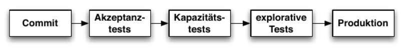
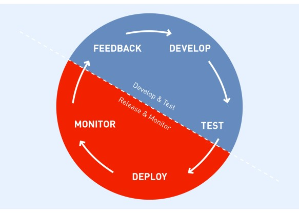
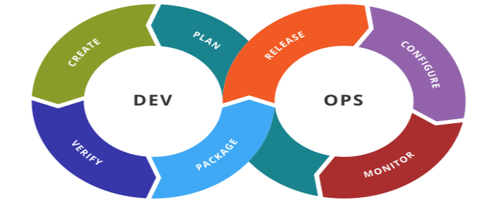

# Continuous Software Engineering

Autor: Nils Dralle

## Definition

"Continuous Software Engineering" beschreibt eine Möglichkeit der iterativen Softwareentwicklung. Dabei wird der agile Softwareentwicklungsprozess unterstützt. Continuous Software Engineering ist interdisziplinär und bezieht im Gegensatz zu reinen agilen Softwareentwicklungsmodellen mehr als die reine Softwareentwicklung mit ein.
Continuous Software Engineering lässt sich grob in folgende Teilbereiche einteilen:

* Continuous Integration
* Continuous Delivery
* Continuous Testing
* Continuous Deployment

Diese Teilbereiche sind nicht scharf definiert. Die individuelle Ausgestaltung der Teilbereiche wird dem Anwender überlassen.

## Continuous Integration

"Continuous Integration" beschreibt den Prozess, mit dem automatisiert von einer Software ein lauffähiger Build erzeugt werden kann. Einfache Tests, wie beispielsweise Unit-Tests, gehören ebenfalls zur "Continuous Integration".
"Continuous Integration" ist Grundlage und erster Schritt von "Continuous Delivery".

### Was gehört zu einem Build?

Aufgabe von Continuous Integration ist die Automatisierung des Build-Prozesses. Welche Schritte dabei ausgeführt werden, hängt natürlich stark von verwendeter Programmiersprache und angestrebter Zielumgebung ab. Im folgenden wird der Build-Prozess in einige typische Schritte zerlegt.

#### Kompilieren

Beim kompilieren wird der Sourcecode einer Anwendung in ein Format übersetzt, welches effizient vom Computer ausgeführt werden kann. Das Zielformat ist typischerweise nicht "menschenlesbar". Bei interpretierten Programmiersprachen entfällt dieser Schritt häufig.

#### Unit-Tests

Zu einem Build gehört auch das Ausführen und Auswerten von Unit-Tests. Unit-Tests testen einzelne in sich geschlossene Einheiten des Software-Systems, beispielsweise einzelne Klassen oder Dateien. Einfache Fehler können somit sehr schnell erkannt werden.

#### Ressourcen

Wenn die Software externe Ressourcen, beispielsweise Dateien, verwendet, müssen diese möglicherweise in ein Format umgewandelt werden, welches der Anwendung ermöglicht, diese Ressourcen effizienter zu verwenden. In bestimmten Fällen kann es beispielsweise vorteilhaft sein, in der Entwicklung genutzte Dateien zu komprimieren, um Dateisystemoperationen zu beschleunigen.

#### Artefakte

Am Ende des Build-Prozesses muss die Anwendung in wiederverwendbare Artefakte, beispielsweise executables oder Container, verpackt werden. Damit kann die Anwendung auch außerhalb der Entwicklungsumgebung ausgeführt werden.

#### Dokumentation

Wenn die Dokumentation des Sourcecode in einem passenden Format, beispielsweise JavaDoc für Java, geschrieben wurde, kann auch die automatisierte Erstellung des Sourcecode im Rahmen der Continuous Integration erfolgen.

### Build-Tools

Viele der Aufgaben in einem Build werden dem Software-Entwickler von der verwendeten Entwicklungsumgebung abgenommen. Um den Build jedoch von der Entwicklungsumgebung unabhängig zu machen, wird ein Build-Tool verwendet. Dies kann beispielsweise notwendig sein, wenn der Build-Prozess nicht auf dem Entwicklergerät stattfindet.
In der einfachsten Form ist ein Build-Tool ein Script, welches die oben genannten zu einem Build gehörenden Aufgaben nacheinander ausführt. Build-Tools sollen dem Entwickler einen Großteil der Konfiguration abnehmen.
Viele Build-Tools sind Programmiersprachen-spezifisch. Für Java gibt es unter anderem folgende Build-Tools:

* Ant

Bei Ant muss sich der Entwickler selbst um alle Aspekte des Builds kümmern und beispielsweise Ablageorte für kompilierten Sourcecode selbst festlegen. Dadurch kann Ant aber auch auf fast jede Build-Umgebung angepasst werden.
Ant orientiert sich stark an dem Unix-Build-Tool make.

* Maven

Maven verfolgt einen anderen Ansatz und definiert 'Konventionen' für beispielsweise den Ablageort von Sourcecode und die Phasen eines Builds. Wenn Projekt und Build-Prozess diesen Konventionen folgen, wird der Build-Prozess sehr einfach und erfordert nur sehr wenig Konfiguration durch den Entwickler. Dadurch muss aber im Zweifelsfall sehr viel an der Build-Umgebung an das verwendete Tool angepasst werden.

* Gradle

Gradle versucht, einen Mittelweg zu finden. Ähnlich wie bei Maven wird vieles über Konventionen abgebildet. Weicht das Projekt von den Konventionen ab, müssen die Abweichungen mit einer Gradle-spezifischen Skriptsprache definiert werden.

## Continuous Delivery

"Continuous Delivery" beschreibt ein Vorgehen aus dem Umfeld der agilen Softwareentwicklung, welches es ermöglicht, Software schneller und vor allem zuverlässiger in Produktion zu bringen. Grundlage dafür ist die sogenannte "Continuous Delivery Pipeline", die viele der nötigen Prozesse automatisiert und den Gesamtprozess der Auslieferung somit reproduzierbar macht.

### Warum?

Dadurch, dass Continuous Delivery vieles automatisiert und reproduzierbar macht, kann jede neue Version der Software daraufhin getestet werden, ob sie problemlos veröffentlicht werden kann. Somit werden Fehler schneller erkannt und können entsprechend behoben werden, bevor sie möglicherweise Monate später bei der Auslieferung der Software an den Kunden zu Problemen und Verzögerungen führen. Zudem kann die Software öfter als "gesamtes" getestet werden, und durch den hohen Grad an Automatisierung (und die bereits angesprochene Reproduzierbarkeit) ist sichergestellt, dass Fehler in der Testumgebung erkannt werden und nicht zu "false positives" führen.

### Vorteile der Automatisierung

Durch die hohe Automatisierung von Continuous Delivery Prozessen werden die am Release beteiligten Personen entlastet und können sich auf ihre eigentliche Aufgabe konzentrieren, beispielsweise das Beheben von Fehlern. Die mögliche hohe Frequenz an Veröffentlichungen und damit einhergehend die hohe Zahl an getesteten Versionen macht es möglich, problematische Änderungen schnell zu identifizieren.

### Automatisierte Softwaretests

Soweit möglich, werden die bei der Auslieferung nötigen Tests der Software automatisiert. Dadurch können Tests ohne erhöhten Aufwand mehrfach durchgeführt werden. Tests können beispielsweise nach jeder Änderung am Quellcode automatisiert ausgeführt werden und Fehler somit zeitnah erkannt und behoben werden. Wenn Tests häufiger ausgeführt werden, bekommen Entwickler/Entwicklerteams schnelles Feedback zu durchgeführten Änderungen.

### Risikominimierung

Menschen machen Fehler. Und so unwahrscheinlich es auch klingt, auch Software-Entwickler machen Fehler. Repetitive Aufgaben können die Wahrscheinlichkeit von Fehlern erhöhen. Deshalb automatisiert Continuous Delivery solche Aufgaben, um die Wahrscheinlichkeit von Fehlern zu minimieren.
Die bei Continuous Delivery angestrebte hohe Frequenz minimiert zudem das Risiko jedes einzelnen Release, da jedes Release weniger potentiell fehleranfällige Änderungen enthält.

### Continuous Delivery Pipeline



Abbildung 1 - Continuous Delivery Pipeline (Quelle: <a>[[WOLF14]](#ref_wolf14)</a>)

Abbildung 1 zeigt die Continuous Delivery Pipeline. Die Phasen werden sequentiell durchlaufen, wenn also beispielsweise die Akzeptanztests fehlschlagen, werden die Kapazitätstest gar nicht erst ausgeführt. Die Pipeline wird abgebrochen, und sobald der Fehler, welcher zum Abbruch geführt hat, behoben wurde, wird die Pipeline vom Anfang erneut durchlaufen.

#### Commit

Diese Phase deckt alles ab, was typischerweise Continuous Integration macht: Build, Unit-Test und statische Analysen.

#### Akzeptanztests

In dieser Phase werden, soweit möglich, automatisiert die Anforderungen des Kunden an die Anwendung getestet. Zusätzlich können die Anforderungen mithilfe automatisierter GUI-Tests getestet werden.

#### Kapazitätstests

Kapazitätstest testen das Verhalten der Anwendung unter erwartbaren Lastbedingungen. Dabei geht es nicht unbedingt um die Leistungsfähigkeit einer Anwendung, sondern um Skalierbarkeit. Dadurch können auch in einer Umgebung, die nicht der Produktionsumgebung entspricht, Rückschlüsse auf das Verhalten der Anwendung geschlossen werden.
Auch nicht funktionale Anforderungen können von den Kapazitätstests abgedeckt werden.

#### Explorativer Test

Beim explorativen Test wird die Anwendung mit Fokus auf neue Features und unvorhergesehenes Verhalten getestet. Diese Tests müssen nicht automatisiert erfolgen. Dadurch, dass viele der sonstigen Tests aber automatisiert sind, bleibt für diesen Testschritt mehr Zeit.

#### Produktion

Bei der Einführung in die Produktion geht es darum, die Anwendung in einer neuen Umgebung zu installieren. Durch die hohe Zahl an vorher ausgeführten Tests, die teilweise in einer der Produktionsumgebung ähnlichen Umgebung erfolgt sind, kann das Risiko an dieser Stelle verringert werden.

#### Dokumentation

Soweit die Dokumentation des Sourcecodes mit einem geeigneten Tool (wie JavaDoc für Java) erfolgt ist, kann auch die automatische Erstellung einer Sourcecode-Dokumentation Teil der Continuous Integration sein.

## Continuous Testing

Continuous Testing baut auf der Continuous Delivery auf und wird häufig als deren Teil betrachtet. Teil vom Continuous Testing sind manuelle Tests, wie beispielsweise explorative Tests und manuelle Akzeptanztests, aber auch alle anderen Test, die entweder nicht automatisiert werden können oder effizienter von einem dedizierten Testteam durchgeführt werden können. Auch eine vom Entwicklerteam unabhängige Qualitätskontrolle kann vom Continuous Testing abgedeckt sein.
Beim Continuous Testing testet das Testteam kontinuierlich den neuesten lauffähigen Stand der Software und gibt gefundene Fehler und sonstiges Feedback an das Entwicklungsteam weiter, sobald Fehler gefunden werden. Anders als bei traditionellen manuellen Testmethoden wird davon ausgegangen, dass die getestete Software sich mit der Zeit verändert, da jeweils das neueste verfügbare Release getestet wird.

## Continuous Deployment

Continuous Deployment ist eine Alternative zur Continuous Delivery, die zwar schneller, aber auch risikoreicher sein kann. Beim Continuous Deployment wird die Continuous Delivery Pipeline nicht sequentiell durchlaufen, sondern die Software nach minimalen Tests dem Endkunden zur Verfügung gestellt.
Bei diesem Vorgehen bekommt der Kunde sehr schnell die neueste Version und der Entwickler bekommt sehr schnell Feedback zur neuen Version vom Kunden, aber das Risiko, dass Fehler in der Produktion landen, ist sehr hoch.
  

# DevOps



Abbildung 2 - DevOps Cycle (Quelle: <a>[[PIEN18]](#ref_pien18)</a>)

## Definition

DevOps ist ein Ansatz zur Prozessverbesserung in Unternehmen. Das heißt, Prozesse, insbesondere diejenigen, die IT  und IT-Operations betreffen, sollen schneller und effizienter werden. Als Teil von DevOps kann Continuous Software Engineering verwendet werden, dies ist jedoch nicht zwingend. Es geht darum, die am besten funktionierenden Prozesse für das Unternehmen zu finden. Anders als Continuous Software Engineering konzentriert sich DevOps dabei eher auf die Buisness Architektur des Unternehmens.
DevOps ist Unternehmenskultur, keine Werkzeug zum lösen eines konkreten Problems. Werkzeuge des Continuous Engineering werden allerdings fast immer verwendet. Beispielsweise ist Automatisierung wichtiger Bestandteil von DevOps.

## Entwicklung/IT-Operations



Abbildung 3 - DevOps als Folge von IT und IT-Operations betreffenden Prozessen (Quelle: <a>[[ROOD16]](#ref_rood16)</a>)

Der Begriff DevOps setzt sich zusammen aus den Begriffen Development (Entwicklung) und Operations. Der Bereich Entwicklung ist für die Softwareentwicklung zuständig, der Bereich Operations für die notwendige IT-Infrastruktur (z.b. Bereitstellung notwendiger Tools). Wenn zusätzlich der Bereich Sicherheit involviert ist, spricht man auch von DevSecOps. Ziel ist es, dass diese Bereiche enger zusammenarbeiten und gemeinsam effizienter sind.
Im Bereich IT-Development wird bereits seit einigen Jahren vermehrt auf agile Methoden gesetzt. In anderen Bereichen, gerade im Bereich der IT-Operations, werden aber keine agilen Methoden eingesetzt, was zu Spannungen führen kann. DevOps möchte dieses Problem lösen.

## DevSecOps

Der Bereich Sicherheit, insbesondere die IT-Sicherheit, spielt bei DevOps eine große Rolle. Viele Softwarelösungen werden heutzutage in der Cloud verwendet, stehen also im Internet. Sicherheitslücken müssen dann schnell erkannt und behoben werden. Dev(Sec-)Ops-Prozesse können dabei helfen.

## DevOps als agiler Prozess

2001 wurde das "Agile Mainfest" geschrieben. In einem Ausschnitt heißt es

"Individuals and interactions over processes and tools

Working software over comprehensive documentation

Customer collaboration over contract negotiation

Responding to change over following a plan

That is, while there is value in the items on the right, we value the items on the left
more."

Der erste Punkt, "Individuals and interactions over processes and tools", also frei übersetzt "Der individuelle Mitarbeiter ist wichtiger als Prozesse und Werkzeuge", wird von DevOps sehr ernst genommen. Interaktionen zwischen Mitarbeitern sind wichtiger als die verwendeten Werkzeuge. Die verwendeten Werkzeuge sollen Interaktionen unterstützen, nicht bestimmen, wie diese ablaufen.
Trotzdem ist die Verwendung geeigneter Werkzeuge bei DevOps wichtig, mit Betonung auf geeignet. Wenn ein Werkzeug für Unruhe oder Streit innerhalb eines Teams führt, ist es eventuell nicht geeignet.

## Lean

Ein Grundgedanke bei DevOps ist "Lean". Jede Änderung, für die der Kunde nicht zahlt, entspricht verschwendeten Entwicklerressourcen. Eine Änderung, die der Kunde nicht hat, wird vom Kunden nicht bezahlt. Tools wie Automatisierung und Continuous Delivery helfen dabei, Änderungen möglichst schnell an den Kunden auszuliefern.


## Automatisierung

Bestandteil von DevOps ist die größtmögliche Automatisierung des (Software-)Auslieferungsprozesses durch den Einsatz geeigneter Tools und Continuous Delivery. Einfache, repetitive Aufgaben werden automatisiert, und mehr Wert auf menschliche Interaktionen gelegt. Am Ende muss aber immer ein Mehrwert für das Unternehmen entstehen.

### Automatisiertes Testen

Soweit möglich, wird bei DevOps automatisiert, bspw. mithilfe von Unit-Tests, getestet. Jedesmal wenn aus dem Quellcode ein neuer Build erstellt wird, werden automatisierten Tests ausgeführt und deren Ergebnisse an den Entwickler weitergeleitet. Nicht alle Test können automatisiert ausgeführt werden. Hier helfen dann Ansätze wie Continuous Testing. 

### Time to Market

DevOps hat zum Ziel, die "Time to market", also die Zeit, die es braucht, um ein (Software-)produkt auf den Markt zu bringen, zu verringern und im besten Fall damit Geld zu verdienen, zu verkürzen. Dabei ist es auch wichtig, zu messen, ob Prozessänderungen wirklich die erwarteten Verbesserungen bringen. Die Nutzung von mehr Technologie zur Automatisierung ist oft vorteilhaft, wenn dies allerdings am Ende durch mehr Administrationsaufwand zu keiner Verbesserung oder sogar einer Verschlechterung führt, ist auch keinem geholfen. 

## Feedback

Um Feedback möglichst schnell zum Entwickler zu bekommen, wird bei DevOps häufig ein Bugtracker verwendet. Ein Bugtracker dient dazu, Feedback von Testern zu sammeln, sodass der Entwickler die Möglichkeit hat, zeitnah auf Feedback einzugehen und eventuell gefundene Probleme zu beheben.
DevOps ist interdisziplinär, das heißt, am DevOps-Prozess sind mehre Teams beteiligt, und möglicherweise nutzt jedes Team einen Bugtracker. Warum nicht ein und derselbe Bugtracker für alle am Prozess beteiligten Teams? Das ist oft effizienter und führt zu weniger Reibereien zwischen den Teams.

## ITIL

ITIL (Information Technology Infrastructure Library) ist ein umfangreiches Framework, welches von vielen großen Unternehmen erfolgreich eingesetzt wird. ITIL bietet viele Werkzeuge, die den Softwareentwicklungsprozess (und dessen Supportprozesse) abbilden können. Besonders bei großen, monolithischen Systemen ist ein Prozess wie ITIL zum managen aller Komponenten und Prozesse sehr nützlich.
ITIL ist nicht das selbe wie DevOps, allerdings gibt es für viele Prozesse in ITIL direkte Entsprechungen in DevOps. ITIL ist kein typisches agiles Framework, sondern dient eher zur Organisation von Prozessen in einem Unternehmen und hat damit einen ähnlichen Grundgedanken wie DevOps.

## Tools

### Container

Ein bei DevOps sehr häufig genutztes Tool sind Container. (Software-)Container kann man sich vorstellen als ein Image einer Laufzeitumgebung (wie z.b. eines Betriebssystems), welches speziell auf die Software zugeschnitten ist. Für Container kann Virtualisierung eingesetzt werden. Virtualisierung ist allerdings recht ressourcenintensiv, deshalb werden häufig Tools wie der containerd von Linux verwendet, um die vom Container genutzten Ressourcen und die vom Host-Betriebssystem genutzten auf Kernel-Ebene zu trennen. Ein Beispiel für ein solches Tool ist Docker von der Firma Docker Inc.
Ein großer Vorteil von Container- (und teilweise auch Virtualisierungs-)umgebungen ist, sie ohne oder ohne größere Änderungen von z.b. einer Testumgebung in eine Produktionsumgebung umzuziehen. Dies reduziert den Administrationsaufwand erheblich und macht es sehr einfach, die Software zu deployen.
Damit alle Plattformen, die Container unterstützen, kompatibel sind und ein Container ohne Anpassungen auf allen Plattformen lauffähig ist, wird Containerisierung von der Cloud Native Computing Foundation unter der Linux Foundation standardisiert. An der Cloud Native Computing Foundation sind viele große IT-Firmen beteiligt, beispielsweise Amazon, Microsoft und Google. Diese Firmen bieten mit AWS, Azure und Google Cloud ähnliche Cloud-Produkte, und über den Standard ist garantiert, dass Container, die bei einem Anbieter lauffähig sind, auch bei einem anderen Anbieter funktionieren.

### Docker

#### Definition

Docker ist ein Tool zur Containerisierung von Software. Dabei wird die Software mit allen ihren Abhängigkeiten (z.b. Bibliotheken) in ein Image gepackt. Dieses Image kann dann von einem standardisierten Container ausgeführt werden.

Auch wenn Docker derzeit das bekannteste Containerisierungs-Werkzeug ist, es ist nicht das erste: Die Anfänge der Containerisierung gehen auf das in den 70ern und 80ern entwickelte chroot zurück. Anders als Docker hat chroot die betroffenen Prozesse aber nur auf Benutzerebene voneinander isoliert, während bei Docker einzelne Prozesse in unterschiedlichen Kernel-Namespaces laufen, um größtmögliche Isolation ohne Virtualisierung zu erreichen.
Docker ist auch nicht das einzige solche Werkzeug. Es existiert eine Vielzahl anderer proprietärer und open-source Lösungen, von denen einige nach ähnlichen Prinzipien aufgebaut sind wie Docker. Docker selbst basierte lange Zeit auf LXC, einer weiteren populären Lösung zur Containerisierung unter Linux.

Die Docker-Laufzeitumgebung ist an Linux angelehnt. Es stehen dem Entwickler somit alle die Funktionen von Linux zur Verfügung. Docker selbst ist ebenfalls Linux-Software und damit standardmäßig nur unter Linux lauffähig. Soll Docker unter Windows oder Mac OS ausgeführt werden, muss ein Linux-System in einer virtuellen Maschine genutzt werden. Dazu stehen von Docker erweiternde Werkzeuge zur Verfügung. Docker selbst nutzt jedoch keine Virtualisierung, sondern das Linux-Tool containerd zur Trennung von Betriebssystem- und Containerressourcen auf Kernel-Ebene. Das hat den Vorteil, dass im Gegensatz zur Virtualisierung wesentlich weniger Ressourcen reserviert werden müssen und vom Container genutzt werden.

#### Aufbau

##### Image

Ein Image ist ein Abbild der Software mit ihren Abhängigkeiten auf dem Dateisystem innerhalb des Image.

##### Layer

Ein Layer ist ein Set von Änderungen innerhalb eines Image. Für jede Änderung wird im Image ein neues Layer angelegt.

##### Container

Ein Container ist die laufende Instanz eines Images. Container bieten eine standardisierte Laufzeitumgebung für Images. Standardmäßig wird das neueste Layer in einem Image zur Instanziierung verwendet, theoretisch kann aber jedes Layer verwendet werden.

##### Dockerfile

Das Dockerfile ist einer Skriptdatei, die den Aufbau eines Docker-Image beschreibt. Wenn ein Docker-Image von einem Dockerfile neu gebaut wird, wird ein neues Layer angelegt.

```docker
FROM 32bit/ubuntu:16.04
RUN apt-get update
RUN apt-get install -y openjdk-8-jdk-headless
VOLUME ["/var/hellojavadocker"]
COPY HelloDocker.jar /var/hellojavadocker/
CMD java -jar /var/hellojavadocker/HelloDocker.jar

```

Listing 1 - Beispiel eines Dockerfile

Listing 1 zeigt den Aufbau eines einfachen Dockerfile. Mit dem Befehl ```FROM``` wird festgelegt, auf Basis welchen Images das neue Image gebaut werden soll. Wird hier kein *tag* angegeben (nach dem ':'), wird standardmäßig der Tag latest verwendet und die neueste Version des Image verwendet.
Soll das Image ohne Inhalt initialisiert werden, also 'from scratch', so ist genau das der Befehl - ```FROM scratch```. *scratch* ist ein spezielles leeres Image, welches von Docker bereitgestellt wird.
Die Befehle RUN und CMD dienen zum ausführen von Befehlen innerhalb des Containers. RUN-Befehle werden bei der Erstellung des Containers ausgeführt. Der Befehl CMD wird ausgeführt, wenn das fertige Image in einem Container gestartet wird. Jedes Dockerfile kann nur einen Befehl mit CMD ausführen.
Der Befehl VOLUME stellt einen bestimmten Pfad zur Verfügung, der vom Host-Betriebssystem gemountet werden kann. Er ist in diesem Beispiel nicht unbedingt nötig.
Der Befehl COPY kopiert eine Datei vom Host in den Container, wo diese dann verwendet werden kann. Ein alternativer Befehl zu COPY ist ADD. Dies ist nur eine Auswahl von Befehlen, die in einem Dockerfile verwendet werden können. 


#### Containerisierung vs. Virtualisierung


Abbildung 4 - Containerisierung vs. Virtualisierung (Quelle: <a>[[ROOD16]](#ref_rood16)</a>)

Ähnlich wie bei der Virtualisierung wird auch bei der Containerisierung eine Gast-Betriebssystem innerhalb des Host-Systems emuliert, Containerisierung hat gegenüber der Virtualisierung aber den Unterschied, dass das Container-System sich Ressourcen mit dem Host-System teilt. Dies soll bei der Virtualisierung vermieden werden. Die obige Grafik soll den Unterschied verdeutlichen: Auf der linken Seite laufen mehrere vollständig voneinander getrennte Betriebssysteme zeitgleich auf einem System, auf der rechten läuft nur ein Betriebssystem und die Anwendung läuft mit ihren Abhängigkeiten in einem Container, der sich Betriebssystemressourcen mit anderen Containern teilt.

Im Falle der Containerisierung hat das zum Vorteil, das Ressourcen besser genutzt werden und der "Overhead" einer containerisierten Anwendung sehr viel geringer ist als der einer virtualisierten Anwendung. Dies erlaubt dem Entwickler, problemlos mehrere containerisierte Anwendungen gleichzeitig laufen zu lassen, was bei der Virtualisierung oft nicht ohne weiteres möglich ist. Docker ist kein System zur Virtualisierung, sondern zur Containerisierung.

#### Betriebssystem-Container und Anwendungscontainer

Es gibt zwei Arten von Container. Betriebssystem-Container sind Container, in denen wie in einer VM ein vollwertiges Betriebssystem läuft. Jeder Betriebssystem-Container hat ein eigenes Dateisystem, und in jedem Betriebssystem-Container können mehrere Anwendungen laufen. Ein solcher Ansatz wird beispielsweise von LXC verfolgt.
Anwendungscontainer funktionieren anders. Anwendungscontainer haben kein eigenes Dateisystem, alle Daten werden außerhalb des Containers gespeichert. Jeder Container ist darauf ausgelegt, eine einzelne Anwendung auszuführen, und die ausgeführte Anwendung kann den Container selber nicht verändern. Dieser Ansatz ist schlanker als der der Betriebssystem-Container, allerdings kann die Isolierung vom Host-System auch nicht in gleichem Maße garantiert werden. Docker stellt Anwendungscontainer zur Verfügung.

#### Tools für Docker

##### Docker-Hub

Docker-Hub ist ein zentrales Repository, welches vorkonfigurierte Dockercontainer bereitstellt und durch die Integration in Docker das Management und die Verteilung von Docker-Images vereinfacht. Docker-Hub ermöglicht es dem Nutzer, jeden Layer des Images, also jeden Versionsstand, als vollwertiges Image herunterzuladen. Das macht es sehr einfach, zwischen Versionen zu wechseln beziehungsweise auf dem neuesten Stand zu bleiben.

##### Kubernetes

Kubernetes ist eine Plattform, die die Verteilung von Docker-Images und deren Betrieb über Netzwerke hinweg unterstützt. Kubernetes, ursprünglich von Google entwickelt, wird inzwischen unter dem Dach der Cloud Native Computing Foundation entwickelt.
Kubernetes definiert sogenannte Pods oder Deployment Units. Jedes Pod kann ins oder mehrere Docker-Images gruppieren und ausliefern. Jedes Pod stellt einen Service bereit.
Diese Architektur ist auch als Microservice bekannt, deswegen soll hier nicht weiter darauf eingegangen werden.
	
#### Versionsverwaltung

Docker hat eine integrierte Versionsverwaltung. Änderungen an einem Image werden innerhalb des Image in Form von Layern gespeichert. Mithilfe der Layer lässt sich die komplette Versionshistorie eines Image nachvollziehen.
Zusätzlich zur Versionierung mithilfe von Layern können einzelne Versionsstände auch zum Release getaggt werden. Über Tags lassen sich unterschiedliche Versionsstände selektieren, wenn ein Container ausgeführt wird. Der standardmäßig von Docker genutzte Tag *latest* zeigt beispielsweise immer auf die neueste Version. Die Nutzung des Tags *latest* ist bei Nutzung eine Continuous Delivery/Deployment Pipeline nicht immer vorteilhaft: Bei der Nutzung von *latest* überprüft Docker mithilfe der Online-Plattform DockerHub, ob eine neuere Version des Image als die lokale verfügbar ist und installiert diese automatisch.
		
#### Sicherheit

Die Docker-Laufzeitumgebung läuft mit *root*-Rechten, um Zugriff auf sämtliche Betriebssystem-Funktionen zu haben. Die Ressourcen der Anwendung im Container werden mithilfe von containerd allerdings vom Betriebssystem getrennt, und Docker schränkt den Zugriff auf wichtige Systemdateien ein. 
Neben containerd nutzt Docker weitere Werkzeuge, um Container- und Betriebssystemressourcen zu trennen, zum Beispiel kernel namspaces und das speziell zur Unterstützung von Containern in den Linux-Kernel integrierte Werkzeug der cgroups. 
Anders als bei Virtualisierung kann eine vollständige Trennung vom Betriebssystem nicht garantiert werden.

### JIRA

JIRA ist eine webbasierte  Plattform für Projektmanagement in Softwareteams. Vor allem agile Workflows werden unterstützt, aber eine Anpassung an andere Workflows ist möglich.
JIRA als Plattform ist recht umfangreich. Zu den Schritten, die von JIRA unterstützt werden, gehören das Anforderungsmanagement, das Statusmanagement und das Fehlermanagement.
Im Anforderungsmanagement werden die Anforderungen an das Softwareprojekt in das System übertragen. Im Statusmanagement wird der aktuelle Fortschritt des Projekts mithilfe der Plattform im Team kommuniziert. JIRA unterstützt agile Workflows wie beispielsweise Scrum, und viele der in Scrum verwendeten Organisations- und Dokumentationsformen werden dabei unterstützt.
Schließlich gibt es noch ein Fehlermanagement. Dies ist eigentlich ein klassischer Bugtracker, bei dem Tester gefundene Fehler (Bugs) in Form von Tickets eintragen können. Die Tickets können von weiteren Testern, und auch von den Entwicklern, um Informationen erweitert werden, sodass irgendwann ausreichend Informationen zur Verfügung stehen, um den Fehler zu beheben.
Alle Informationen werden in JIRA in Tickets organisiert, die jeder am Projekt beteiligte kommentieren kann.

### Jenkins

Jenkins ist ein serverbasiertes CI (Continuous Integration) und Continuous Delivery System. Jenkins ist open-source und ist darauf ausgelegt, möglichst viel zu automatisieren. Die Jenkins-Software basiert auf Java, es kann aber Quellcode in jeder beliebigen Programmiersprache gebaut un d getestet werde. Der Build- und Testprozess wird über Skripte gesteuert. Wo der zu bauende/testende Quellcode liegt, ist bei Jenkins (fast) egal: Mehrere VCS-Systeme wie Git und SVN werden unterstützt. 
Mit der Erweiterung Blue Ocean kann Jenkins auch Continuous Delivery. Nach dem CI-Prozess können automatisiert beliebige Tests und Skripte ausgeführt werden. Blue Ocean unterstützt nicht nur sequentielle Pipelines, sondern kann Prozesse auch parallel ausführen. Das heißt, wenn ein Test auf mehreren Plattformen ausgeführt wird, werden die Tests auf allen Plattformen parallel ausgeführt. Wenn ein Test auf einer Plattform fehlschlägt, werden die Tests auf anderen Plattformen nicht beeinflusst.
Blue Ocean kann mit populären Plattformen wie Github integriert werden. Das heißt, der Quellcode, der als Basis für den CI und Continuous Delivery Prozess dient, wird von Github geholt und das Ergebnis dieser Prozesse wird an Github zurückgemeldet und dort im Projekt angezeigt.

# Quellen

<a name="ref_kane16">[KANE16]</a>: "Docker Praxiseinstieg", 2016, Sean P. Kane, Karl Matthias

<a name="ref_pien18">[PIEN18]</a>: "Wie DevOps die IT beschleunigen", 2018, Frank Pientka, https://www.computerwoche.de/a/wie-devops-die-it-beschleunigen,3071433 (abgerufen am 26.06.2018)

<a name="ref_ravi16">[RAVI16]</a>: "Practical DevOps", 2016, A. Ravichandran et. al.

<a name="ref_rood16">[ROOD16]</a>: "Docker, Microservices And Kubernetes", 2016, Resa Roodsari

<a name="ref_vero16">[VERO16]</a>: "Practical DevOps", 2016, Joakim Verona

<a name="ref_wolf14">[WOLF14]</a>: "Continuous Delivery : Der pragmatische Einstieg", 2014, Eberhard Wolff