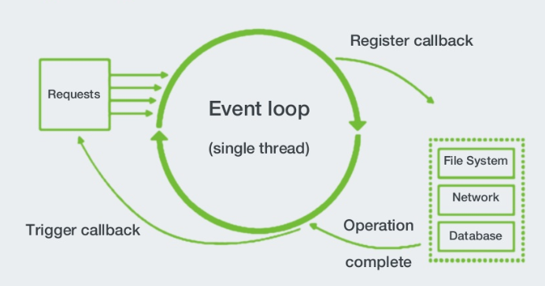
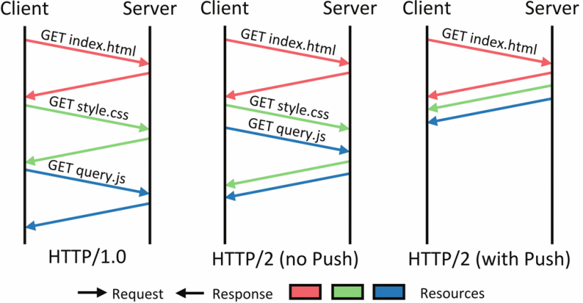
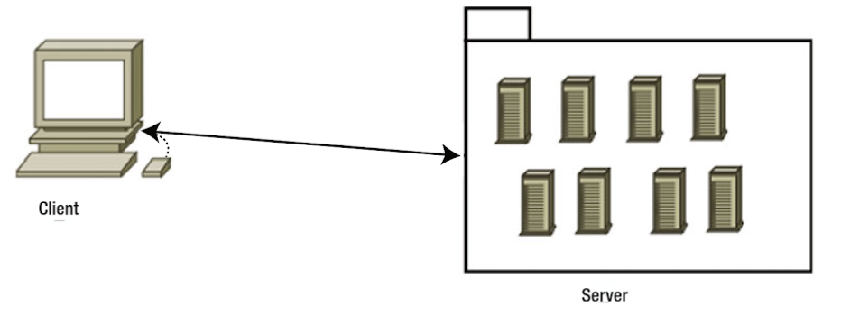
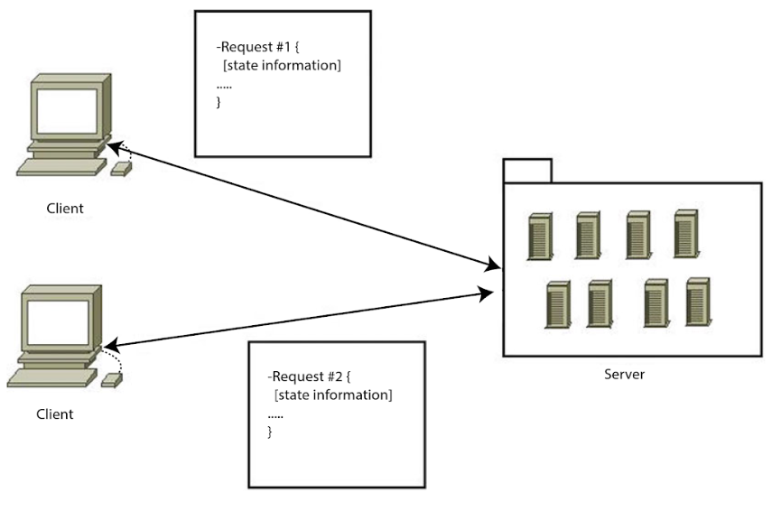
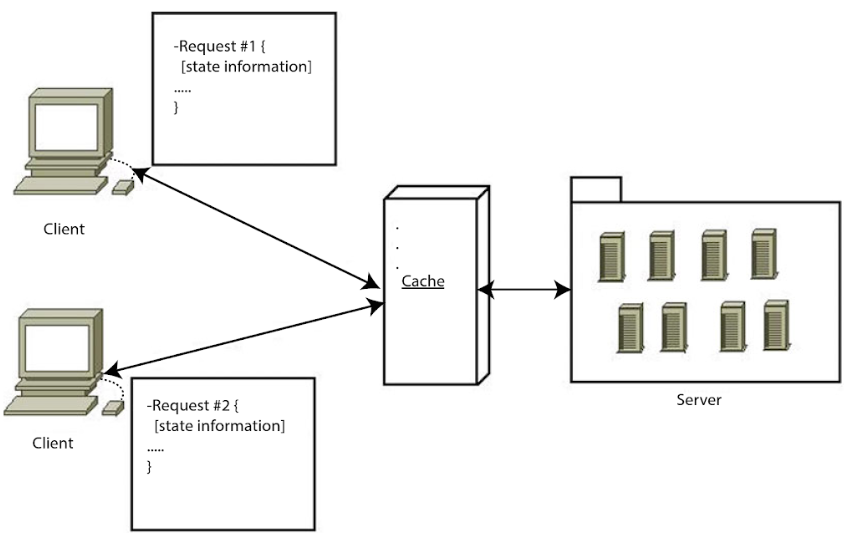
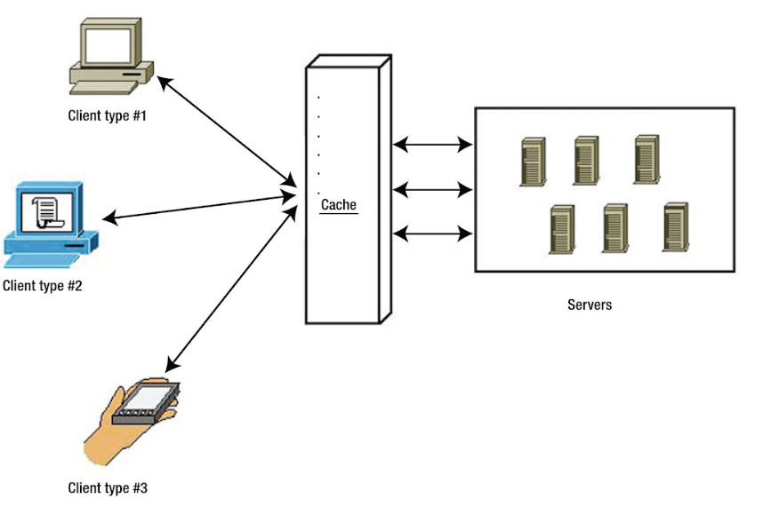
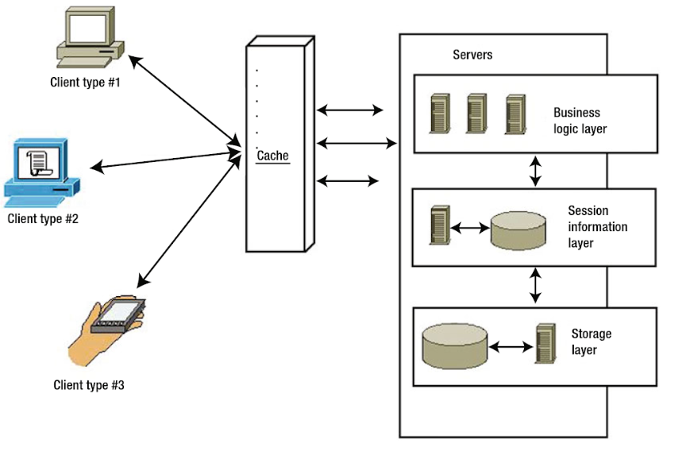
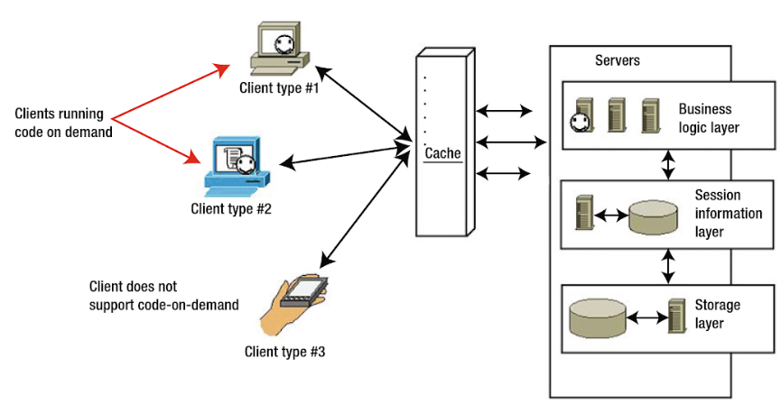

# Backend
## Node.js
### Allgemein
Node.js ist eine Plattform, die es ermöglicht JavaScript serverseitig laufen zu lassen und basiert auf Google's JavaScript-Laufzeitumgebung V8. V8 wurde ursprünglich für Google Chrome entwickelt und bietet daher eine schnelle und ressourcensparende Ausführung von JavaScript-Code, mithilfe der eine große Anzahl von parallelen Netzwerkverbindungen ermöglicht wird. <a>[[DAY14]](#ref_DAY14)</a>

### NPM
NPM ist ein Paket-Manager für JavaScript-Pakete und das weltgrößte Software-Register. Mit NPM können Pakete installiert, geteilt und Abhängigkeiten in Projekten gemanagt werden. <a>[[NPM18]](#ref_NPM18)</a>
Der Paket-Manager wird automatisch mit Node.js mitinstalliert und von diesem in großem Maße eingebunden. Um ein Paket zu installieren, muss lediglich der entsprechende Befehl auf der Kommandozeile ausgeführt werden:
```
npm install libraryname
```
Daraufhin ist es möglich über den `require`-Befehl die Bibliothek in das Node.js-Projekt einzubinden:
```
var lib = require('libraryname');
```

Mithilfe von NPM fällt die Entwicklung mit Node.js wesentlich leichter, da sehr simpel und schnell vorhandene Module installiert und genutzt oder eigene Bibliotheken verteilt werden können.

### Vorteile
#### JavaScript End-To-End
Durch große Fortschritte in der Ausführungsgeschwindigkeit, sind mittlerweile auch Skriptsprachen für serverseitige Anwendungen geeignet. Der Großteil der Web-Entwickler ist bereits mit JavaScript und der einhergehenden asynchronen Programmierung vertraut, wodurch die Einarbeitungszeit in Node.js minimal bleibt.
Dadurch, dass auf Client und Server JavaScript läuft, wird außerdem der Kontext-Wechsel in der Entwicklung reduziert und es kann sogar Code zwischen Server und Client geteilt werden. <a>[[HOTA14]](#ref_HOTA14)</a>

#### Event-Driven Scalability
Node.js benutzt einen einzigen Thread, um Netzwerk-Anfragen abzuarbeiten, indem ein Event-Model genutzt wird, welches in der folgenden Abbildung zu sehen ist.



Single-Threaded EventLoop - Abbildung aus <a>[[SLDS16]](#ref_SLDS16)</a>

Das Nutzen eines einzigen Threads hat den Vorteil, dass es im Gegensatz zu einem Multi-Thread-System ressourcensparender ist und kein Aufwand in die Implementierung von Ressource-Lock-Mechanismen gesteckt werden muss, da alle Anfragen nacheinander abgearbeitet werden. Hierdurch muss das System nicht darauf warten, dass eine Ressource freigegeben wird und kann so die Prozessorleistung effizienter verwenden. Mithilfe dieses Event-Models sind Node.js-Webserver somit in der Lage effizienter zu skalieren als Multi-Thread-Webserver.  
<a>[[DAY14]](#ref_DAY14)</a>

#### Erweiterbarkeit
Dank der großen Beliebtheit, der sich Node.js in den letzten Jahren erfreut, gibt es eine große Entwicklercommunity, die kontinuierlich neue Module veröffentlicht. Diese Module können mithilfe von NPM simpel und schnell installiert und genutzt werden.

### Nachteile
#### Nur experimenteller Multi-Threading-Support
Der ausgeführte JavaScript Code auf einem Node.js-Webserver läuft in der LTS-Version bisher nur Single-Threaded. Wenn in dieser Version multiple Threads genutzt werden sollen, müssen also auch multiple Prozesse eingesetzt werden, was sich mit Child-Prozessen bewerkstelligen lässt. <a>[[NODE18]](#ref_NODE18)</a>

Seit der Version 10.5, die Ende Juni 2018 herausgekommen ist, enthält Node.js auch nativ Multi-Threading-Support, welcher sich allerdings noch in einer experimentellen Phase befindet.
Eine weitere Möglichkeit zur Umsetzung multipler Threads ist das Einsetzen von JXCore <a>[[JXC18]](#ref_JXC18)</a>, welches eine Erweiterung von Node.js ist und unter anderem speziell für den Multi-Thread-Support entwickelt wurde.


## Kommunikation
In dem folgenden Abschnitt werden verschiedene Methoden zur Umsetzung einer Netzwerk-API erläutert. Es werden Alleinstellungsmerkmale aufgeführt, sowie Vor- und Nachteile beschrieben. Zum Abschluss des Kapitels werden die Technologien einander gegenübergestellt und jeweils passende Anwendungsgebiete präsentiert.  

### gRPC

#### Allgemein
gRPC ist ein von Google entwickeltes modernes, performantes Open Source RPC (Remote Procedure Call) Framework, welches innerhalb vieler verschiedener Umgebungen laufen kann. <a>[[GRPC18a]](#ref_GRPC18a)</a>

Mithilfe von gRPC kann eine Client-Anwendung direkt Methoden einer Server-Anwendung aufrufen, als wäre es ein lokales Objekt. Hierzu wird ein gRPC-Server und ein oder mehrere gRPC-Clients implementiert. Der Server bietet hierbei dieselben Methoden an, wie der Client, wobei ein Client-Methodenaufruf automatisch zur Aufrufung der Server-Methode führt (siehe folgende Abbildung).
Der Server und Client sind hierbei sprachunabhängig voneinander, was es ermöglicht, dass die Entwicklung eines neuen Clients oder Servers höchst flexibel bleibt. <a>[[GRPC18b]](#ref_GRPC18b)</a>


Abbildung entnommen aus <a>[[GRPC18b]](#ref_GRPC18b)</a>

Besonders hervorstechende Merkmale von gRPC sind die Nutzung von HTTP/2 und Protocol Buffers.

#### HTTP/2
HTTP/2 ist der Nachfolger von HTTP/1.1 und wurde 2015 veröffentlicht.
Durch das neue Protokoll wird die Latenz bei der Kommunikation zwischen Client und Server verringert, welches zu einer schnelleren Datenübermittlung führt.
Die größten Veränderungen gegenüber des Vorgängers können in die folgenden vier Punkte aufgeteilt werden.

##### Server Push
"Server Push" ermöglicht dem Server von sich aus Daten an den Client zu senden, eine sogenannte "bidirektionale Kommunikation". Dies steht gegenüber dem Prinzip von HTTP/1, bei dem die Kommunikation "Pull only" ablief und nur vom Client gestartet werden konnte. Mithilfe dieser Funktionalität wird die Netzwerk-Kommunikation beschleunigt, indem unnötige Client-Anfragen und somit Paketumlaufzeit (Round Trip Time) eingespart werden kann. Sinnvoll ist dies vor allem, damit der Server bei dem initialen Seitenaufruf Dateien an den Browser mitsenden kann, die er sowieso zur Anzeige der Seite benötigt (siehe folgende Abbildung).  
<a>[[ZIM17]](#ref_ZIM17)</a>



Abbildung entnommen aus <a>[[ZIM17]](#ref_ZIM17)</a>

Ein Nachteil kann durch den Server Push auftreten, wenn die Funktionalität falsch eingesetzt wird. Dies kann vorkommen, wenn ein Server Push vor dem Seitenrendering genutzt wird, was die Aufbauzeit der Seite verlangsamt, oder wenn ein Server Push Daten absendet, die der Client bereits gecachet hatte und somit nicht noch einmal benötigte. Damit es nicht zu solchen Problemen kommt, ist es notwendig, dass der Entwickler sich an sinnvolle Strategien für einen Server-Push hält.
<a>[[ZIM17]](#ref_ZIM17)</a>

##### Kommunikation auf einem Kanal
Die Kommunikation zwischen Browser und Server wird mit HTTP/2 über nur einen einzigen Kanal abgewickelt. In der Vorgängerversion wurden mehrere Verbindungen gleichzeitig aufgebaut, was zu einem Overhead und somit Performanceeinbußen führt.
<a>[[GRIG13]](#ref_GRIG13)</a>

##### Stream Priorisierung
Aufgrund der Reduzierung auf nur einen einzigen Kanal, ist es nun wichtiger in welcher Reihenfolge die Daten geladen werden. Mit HTTP/2 ist der Browser in der Lage dem Server mitzuteilen, welche der Dateien für ihn die höchste Priorität haben, damit er diese zuerst vom Server gesendet bekommt.
<a>[[GRIG13]](#ref_GRIG13)</a>

##### Kompression des Headers
Weiterhin ermöglicht HTTP/2 die Kompression des Headers. Der HTTP-Header muss bei jeder Anfrage mitgesendet werden und durch die Kompression kann so auf Dauer eine Menge an Daten eingespart werden.
<a>[[GRIG13]](#ref_GRIG13)</a>


#### Protocol Buffers
Protocol Buffers sind von Google entworfene sprachunabhängige, plattform-neutrale, erweiterbare Mechanismen, um strukturierte Daten zu serialisieren. Es ähnelt somit XML, ist jedoch kleiner, schneller und einfacher zu lesen.
<a>[[GOOG18]](#ref_GOOG18)</a>

Zu Beginn wird hierzu eine Struktur in einer _.proto_-Datei angelegt, die beispielsweise wie folgt aussehen könnte:

```
message Person {
  string name = 1;
  int32 id = 2;
  bool is_admin = 3;
}
```

Nachdem die Struktur angelegt wurde, kann der Protocol-Buffer-Compiler _protoc_ genutzt werden, um eine Klasse für die gewünschte Programmiersprache zu generieren. Mithilfe der generierten Klasse kann auf die Daten mit Setter- und Getter-Methoden zugegriffen und das Objekt anschließend zur Übertragung serialisiert oder geparst werden. <a>[[GRPC18b]](#ref_GRPC18b)</a>


#### Designprinzipien
Zum Verständnis des Frameworks definierte Google während der Entwicklung eine Reihe an Prinzipien und Anforderungen, die gRPC prägen und einiges über die Funktionalitäten des Frameworks aussagen.
<a>[[GRPC18c]](#ref_GRPC18c)</a>

__Services statt Objekten, Messages statt Referenzen__ -
Es soll die Mikroservice-Philosophie und das Nutzen der Proto-Buffer-Messages beworben werden, damit kein falsches Verständnis von Objekten und den Netzwerkeinschränkungen aufkommt. Auch wenn gRPC eine performante Kommunikation bietet, sollte an die Tücken einer Netzwerkanwendung gedacht und nicht so gearbeitet werden, als wären alle Objekte lokal verfügbar.

__Abdeckung und Simplizität__ -
Das Framework sollte auf jeder beliebten Entwicklungsplattform verfügbar und leicht zu benutzen sein. Außerdem sollte das System auf performancelimitierten Geräten laufen können.

__Kostenlos und offen__ -
Die fundamentalen Features sollen kostenlos und für alle zur Verfügung stehen. Alle Komponenten sollen als Open Source und mit Lizenzen zur freien Anpassung veröffentlicht werden.

__Interoperabel und Reichweite__ -
Das Protokoll muss in der Lage sein verschiedene Internet-Infrastrukturen zu traversieren.

__Genereller Zweck und Performance__ -
Das System sollte auf eine breite Klasse von Use-Cases passen, während so wenig Performance wie möglich, im Vergleich zu einem System für einen spezifischen Use-Case, verloren wird.

__Layered__ -
Hauptfacetten des Systems müssen unabhängig voneinander entwickelt werden können.

__Payload Agnostik__ -
Trotz des Standard-Payloads, der Protocol Buffer nutzt, müssen auch andere Typen wie JSON oder XML unterstützt werden. Außerdem muss das System Payload-Kompression für variable Use-Cases unterstützen.

__Streaming__ -
Eine Streaming-Funktionalität muss geboten werden, da viele Systeme Streaming benötigen, um große Daten zu übertragen oder um Daten live zu aktualisieren.

__Blocken und Nicht-Blocken__ -
Es muss sowohl asynchrones, als auch synchrones Abarbeiten von Nachrichten von Client und Server unterstützt werden. Dies ist essentiell für die Skalierung und zum Abarbeiten von Streams.  

__Abbruch und Timeout__ -
Manche Operationen sind ressourcenaufwendig und haben eine lange Laufzeit. Durch den Abbruch von Operationen kann der Server notfalls Ressourcen freigeben, die durch einen einzelnen Client blockiert werden. Zusätzlich soll der Client ein Timeout angeben können, damit der Server die Operationen einem Zeitfenster entsprechend anpassen kann.

__Lameducking__ -
Server müssen in der Lage sein in einem laufenden Übergang herunterzufahren. Dies bedeutet, dass keine neuen Anfragen mehr angenommen, aber die bestehenden Anfragen noch abgearbeitet werden.

__Datenflusssteuerung__ -
Ressourcen und Netzwerk-Kapazität sind meist im Ungleichgewicht zwischen Client und Server. Mithilfe von Datenflusssteuerung wird die Geschwindigkeit der Datenübertragung zwischen einem Client und dem Server so angepasst, dass optimal mit Buffern gearbeitet werden kann.

__Pluggable__ -
Features für Sicherheit, Health-Checks, Load-Balancing, Monitoring, Tracing und Logging sollen alle über Erweiterungen aktivierbar sein und eine Beispielimplementierung bieten.

__Erweiterungen als APIs__ -
Erweiterungen die eine Zusammenarbeit von Services benötigen, sollten auf APIs setzen, anstatt das Protokoll zu erweitern.

__Metadaten-Austausch__ -
In manchen Fällen, wie bei der Authentifizierung, müssen Metadaten ausgetauscht werden, die nicht im Standardinterface eines Services beinhaltet sind. Diese Features müssen individuell entwickelbar sein.

__Standardisierte Status Codes__ -
Es muss eine bestimmte Anzahl von standardisierten Status Codes geben, damit der Client entsprechend der Antwort des Servers reagieren kann. Falls ein System aussagekräftigere Status Codes benötigt, können diese zusätzlich implementiert und über den Metadaten-Austausch kommuniziert werden.

#### Vorteile

##### Performance und geringe Datengröße
Der Schwerpunkt von gRPC liegt darauf eine performante Netzwerk-Kommunikation zu ermöglichen. HTTP/2 und Proto Buffer sorgen dafür, dass die Anzahl der Anfragen und die zu übermittelnden Daten in der Größe reduziert und gleichzeitig die Geschwindigkeit erhöht werden kann. Diese Eigenschaften prägen gRPC somit als ein Kommunikations-Protokoll, welches besonders geeignet für Anwendungen ist, die den Hauptfokus auf eine hohe Performance legen.

##### Simple Integration von Erweiterungen
Das Pluggable-Prinzip ermöglicht es vorgefertigte Funktionen für Authentifizierung, Tracing, Load-Balancing und Health-Checking schnell und simpel zu integrieren.

#### Nachteile

##### Browser-Support
Zurzeit stehen verschiedene Versionen von gRPC-Bibliotheken zur Verfügung, um gRPC vom Browser aus einzusetzen. Hierzu zählen gRPC-js, gRPC-Web und gRPC-Web-Client. Leider verfügen alle drei Bibliotheken über technische Limitierungen, wie Browserinkompatibilität, wodurch eine native gRPC-Kommunikation nicht möglich ist und nur über einen Proxydienst abgehandelt werden kann. Diese Probleme sollen zwar in naher Zukunft durch nativen Browsersupport behoben werden, jedoch muss aktuell noch auf eine Proxy-Lösung zurückgegriffen werden.
<a>[[GWEB18]](#ref_GWEB18)</a>
<a>[[GJS18]](#ref_GJS18)</a>
<a>[[GWP18]](#ref_GWP18)</a>

### REST

#### Allgemein
Representational State Transfer (REST) ist das am meisten verbreitete und genutzte Mittel, um Netzwerk-APIs zu realisieren. Vorgestellt wurde die Technologie im Jahr 2000 von Roy Thomas Fielding im Rahmen seiner Dissertation und hat sich seitdem durchgesetzt.  <a>[[RITS17]](#ref_RITS17)</a>
Bei REST handelt es sich um einen Architektur-Style, welcher einen Leitfaden bilden soll, der vorgibt, wie eine zustandslose Kommunikation zwischen Client und Server ablaufen sollte.

##### Nutzung
Die Kommunikation zwischen Server und Client geschieht in dem Fall von REST mithilfe von Daten, die, wie der Name andeutet, einen Zustand wiederspiegeln.
Um eine bestimmte Ressource anzufragen oder abzusenden sendet der Client eine HTTP-Anfrage an eine bereitgestellte URL. Die Art der HTTP-Anfrage hängt davon ab was für eine Art von Operation auf dem Server ausgeführt werden soll.

| __Anfrage-Art__                | __Aktion__                     |
|---------------------------------|--------------------------------------|
|GET|Zugriff auf eine Ressource im Lesemodus|
|POST|Senden einer neuen Ressource zum Server|
|PUT|Aktualisieren einer vorhandenen Ressource|
|DELETE|Löschen einer vorhandenen Ressource|
|HEAD|Dient der Anfrage, ob eine Ressource existiert|
|OPTIONS|Gibt eine Liste von möglichen Operationen auf einer Ressource zurück|
<a>[[DOGL17]](#ref_DOGL17)</a>

Der Client sendet hierbei Zustandsrepräsentationen über Dateiformate wie JSON oder XML oder über URL-Parameter an den Server und der Server antwortet dementsprechend wieder mit einer Zustandsrepräsentation seinerseits.


##### Prinzipien
Um eine effiziente Architektur zu erreichen, definiert REST die folgenden sechs aufeinander aufbauenden Grundprinzipien, die F. Doglio in <a>[[DOGL17]](#ref_DOGL17)</a> beschreibt.

###### Client-Server
Das erste Grundprinzip behandelt die Netzwerk-Architektur Client-Server und damit auch die Separierung der Zuständigkeiten. Der Server bietet ein bestimmtes Set von Services bzw. Funktionalitäten an, welche vom Client aufgerufen werden können. Hierdurch stellt der Server Daten bereit, welche der Client abrufen und daraufhin darstellen und aufarbeiten kann. Mithilfe dieser Aufteilung können Client und Server unabhängig voneinander entwickelt werden und ermöglicht dadurch gleichzeitig, dass verschiedene Client-Applikationen für dieselben Server-Services genutzt werden können.



Client-Server-Architektur - Abbildung aus <a>[[DOGL17]](#ref_DOGL17)</a>

###### Stateless
Stateless bezeichnet die Eigenschaft, dass der Server keinen Status der Clients hält, sondern dass der Client bei jeder Anfrage alle zur Verständnis benötigten Daten an den Server senden muss.

Durch diese Eigenschaft verbessern sich einige Punkte an der Architektur:
- Die __Überwachung__ des Systems fällt leichter, wenn alle benötigten Informationen in der jeweiligen Anfrage enthalten sind.
- Das System __skaliert__ besser, da Ressourcen nach jeder Anfrage direkt wieder freigegeben werden, anstatt den Zustand halten zu müssen.
- Das System ist __verlässlicher__, da bei einem Systemabsturz keine Zustände wiederhergestellt werden müssen, sondern nur das System selbst.
- Das System ist __leichter zu implementieren__, da keine Sessions extra gemanagt werden müssen.



Jede Anfrage enthält alle State-Informationen - Abbildung aus <a>[[DOGL17]](#ref_DOGL17)</a>

###### Cache
Eine REST-API sollte die Möglichkeit von Cacheing bieten und Services dementsprechend markieren. Indem Antworten auf Anfragen gecachet werden, kann sich sowohl der Server einige Rechenoperationen sparen, als auch der Client die Daten schneller bereitstellen. Der Cache kann gleichzeitig Client- und Serverseitig genutzt werden, oder auch nur auf einer Seite des Systems. Ein Nachteil durch Cacheing kann auftreten, wenn die Cacheing-Regeln nicht optimal gesetzt sind, was zur Verarbeitung von veralteten Daten führen kann.



Cache wird von Client und von Server genutzt - Abbildung aus <a>[[DOGL17]](#ref_DOGL17)</a>

###### Uniform-Interface
Die API sollte so gestaltet sein, dass es einen eindeutigen Identifier für die Services in Form einer URI, wie beispielsweise einer URL, gibt. Der Zugriff auf die Services geschieht durch die HTTP-Anfragemethoden (GET, POST, PUT, DELETE, etc.) und liefert repräsentative Daten mit standardisierten Content-Typen, wie beispielsweise XML, JSON oder HTML, zurück.
Um durch die verschiedenen Services "navigiert" zu werden, stellt der Server dem Client nach Aufrufen eines Services Hyperlinks zu ähnlichen vorhandenen Services zur Verfügung. Diese Navigationshilfe nennt sich "Hypermedia As The Engine Of Application State (HATEOAS)".

Das so geschaffene Interface kann universell von verschiedenen Geräten genutzt werden.
Dies hat zwar den Vorteil, dass man nur eine Schnittstelle pflegen muss, doch kann man als Nachteil anmerken, dass es teilweise performanter sein kann maßgeschneiderte Lösungen für die einzelnen Arten von Endgeräten zu haben.  



Verschiedene Client-Arten nutzen gleiches Interface - Abbildung aus <a>[[DOGL17]](#ref_DOGL17)</a>

###### Layered System
Eine typische REST-API nutzt mehrere System-Layer, um die Logik verschiedener Bausteine voneinander zu entkoppeln. So besteht eine API meist aus einer "Business Logic Layer", einer "Session Information Layer" und einer "Storage Layer". Die Layers nutzen nur die jeweils untere Layer und kommunizieren die Ausgabe an die obere Layer. Hierdurch kann das Gesamtsystem simplifiziert werden und eine Weiterentwicklung vereinfachen.  

Der größte Nachteil an einem solchen System ist, dass es für kleine Systeme eventuell unnötige Komplexität hinzufügt und so die Performance mindert.



Multiple Layer innerhalb des Servers vereinfachen die Architektur - Abbildung aus <a>[[DOGL17]](#ref_DOGL17)</a>

###### Code-On-Demand
Code-On-Demand ist das einzige optionale Prinzip von REST. Hierbei geht es um das Prinzip, dass der Server Code bereitstellt, den der Client herunterladen und lokal ausführen kann. Dies bezieht sich meist auf JavaScript oder Java Applets.



Server können Clients Code bereitstellen, der optional lokal auf dem Gerät ausgeführt wird - Abbildung aus <a>[[DOGL17]](#ref_DOGL17)</a>

#### Vorteile

##### Bewährte Lösung
Durch seine große Popularität und mittlerweile jahrelange Nutzung ist REST eine bewährte Lösung für die Netzwerk-Kommunikation. Es lassen sich leicht Frameworks und Tools finden, die die Implementierung einer REST-API so simpel wie möglich gestalten und frei von Anfangsschwierigkeiten sind, wie sie viele neuere Technologien noch haben.

##### Methoden-Leitfaden
Durch HATEOAS bietet REST einen leicht zu folgenden Leitfaden für Clients an. Eine ausgereifte Umsetzung ermöglicht eine sich selbst dokumentierende API, bei der der Client auf keine externe Hilfe angewiesen ist.

#### Nachteile

##### Fehlerhafte REST-Implementierungen
Viele Leute haben ein falsches Verständnis davon was REST bedeutet und kennen die Kernprinzipien nicht. Aufgrund dessen geben viele Entwickler ihren APIs den Namen "RESTful", obwohl sie nicht den Prinzipien von REST folgen. So werden beispielsweise oft Cookies benutzt, um States zu halten, was gegen das "Stateless"-Prinzip verstößt. Fielding selbst äußerte sich einige Jahre nach seiner Dissertation dazu, dass er von dem Trend API's RESTful zu nennen, obwohl sie lediglich normale RPC API's sind, frustriert sei. <a>[[ROY08]](#ref_ROY08)</a>

##### Overhead durch die Prinzipien
Die Stateless-Eigenschaft einer REST-API sorgt dafür, dass alle benötigten Daten mit jedem Aufruf neu mitgesendet werden müssen. Aufgrund der fehlenden States ist es nicht möglich auf sessionübergreifende Daten zurückzugreifen, was zu einem Overhead bei den Netzwerk-Aufrufen führt, der mit States eingespart werden könnte.

Zusätzlich sorgt die "Layered System"-Eigenschaft dazu, dass System teilweise komplexer werden, als sie müssten. Dies führt zu einem Performance- und Speicher-Overhead für kleinere Systeme.

### GraphQL

#### Allgemein
GraphQL ist eine von Facebook entwickelte Query-Sprache und Runtime, die 2015 veröffentlicht wurde. Mithilfe von GraphQL können Clients präzise definieren welche Daten sie von der API anfordern. Durch diese Methode lässt sich die Anzahl der Abfragen einschränken und gleichzeitig der Daten-Overhead minimieren, da der Client immer nur genau die Daten erhält, die angefordert wurden. <a>[[GQL18]](#ref_GQL18)</a>  

Um GraphQL einzusetzen, wird ein Client, sowie ein Backend benötigt, welche beide mit der Query-Sprache umgehen können. Implementierungen der Technologie stehen auf beiden Seiten in vielen verschiedenen Programmier- und Skriptsprachen zur Verfügung.

GraphQL stellt zwischen Client und Server eine zusätzliche Schicht dar, welche die Aufgabe der Kommunikation übernimmt. Es geschieht schnell, dass man die Technologie mit einer Datenbank-Technologie verwechselt. Tatsächlich handelt es sich aber um eine Query-Sprache für APIs, nicht für Datenbanken. <a>[[RITS17]](#ref_RITS17)</a>
GraphQL kann hierbei auf Backend-Logik aufgesetzt werden und so Query-Operationen auf den vom Backend gelieferten Daten, bereitstellen. Die Lese-Operationen werden von GraphQL "Queries" genannt und die Erstell- und Bearbeitungs-Operationen nennen sich "Mutationen".

#### Vorteile

#### GraphiQL
GraphiQL ist eine von GraphQL mitgelieferte Oberfläche, um schnell und simpel bereitgestellte Funktionalität auszuprobieren.
Auf der Oberfläche kann ein Nutzer automatisch die Dokumentation der Schnittstelle einsehen. Anhand dieser Dokumentation weiß der Nutzer welche Queries er ausführen kann und kann diese direkt testen.
Die Oberfläche nimmt sowohl dem Client-, als auch dem Server-Entwickler somit viel Arbeit ab, indem direkt in der Oberfläche gedebugged werden kann. Der Server-Entwickler kann Fehler in der Ausgabe aufdecken und der Client-Entwickler kann den in der Oberfläche getesteten Code in seine Client-Applikation übernehmen.
GraphiQL hilft somit immens die Entwicklung zu vereinfachen.  

##### Effiziente Datenabfrage
Der Grund, warum Facebook GraphQL entwickelt hat, war, dass durch die große und stark steigende Nutzeranzahl der Datenverkehr über das Netzwerk immer größer wurde und aktuelle Lösungen die Anfragen nur ineffizient abarbeiten konnte.
<a>[[HGQL18]](#ref_HGQL18)</a>  

Somit wurde eine Technologie entwickelt, die die zu übermittelnden Daten auf ein Minimum beschränkt und gleichzeitig die Anzahl der Anfragen so klein wie möglich hält.

Die zu übermittelnde Datenmenge kann von GraphQL optimiert werden, indem sogenanntes "Over-Fetching" und "Under-Fetching" verhindert wird. "Over-Fetching" bezeichnet das Abrufen von zu viel Informationen, während "Under-Fetching" das Abrufen von zu wenig Informationen beschreibt, was in den meisten Fällen zu einer zusätzlichen Netzwerk-Anfrage führt. Beide Praktiken sorgen für eine stärkere Netzwerk-Auslastung und führen somit zu Performanceproblemen.

Um diese Probleme zu verhindern, erlaubt es GraphQL dem Client die benötigten Daten selbst zu definieren.

Wenn man diese Möglichkeit auf einen Use-Case für Facebook anwenden möchte, bietet sich als Beispiel eine Benutzersuche an. Ein normales Benutzerprofil umfasst viele verschiedene Daten. Ein Datensatzausschnitt hieraus könnte wie folgt aussehen:
```json
{
    {
      "name": "John Doe",
      "location": "Minden",
      "birthday": "24.02.1997",
      "image": "picture.jpg",
      ...
    }
}
```
Ein Client, der anhand des Datensatzes eine Benutzersuche implementieren möchte, möchte allerdings nur das Profilbild, den Namen, sowie den Wohnort verwenden, um Vorschläge in der Auto-Vervollständigung anzuzeigen, also sieht seine Anfrage und das entsprechende Ergebnis wie folgt aus:

__Query:__
```json
{
  users{
    name
    location
    image
  }
}
```
__Ergebnis:__
```json
{
  "data":{
    "users": [{
      "name": "John Doe",
      "location": "Minden",
      "image": "picture.jpg"
    },
    ...]
  }
}
```

Dem Client ist es somit freigestellt selber festzulegen, welche Daten er benötigt. Bei einer Live-Benutzersuche, die performant bleiben muss, ist es hilfreich nur mit kleinen Objekten arbeiten zu müssen, während eine erweiterte Benutzersuche mit weiteren Filtermöglichkeiten Zugriff auf zusätzliche Eigenschaften benötigt. Beide Anwendungsfälle können mit GraphQL mit derselben Schnittstelle abgedeckt werden, ohne dass ein Mehraufwand für das Backend entsteht.  

Auch die Anzahl der Anfragen kann mit GraphQL klein gehalten werden, indem der Client die Möglichkeit hat mehrere Anfragen zu kombinieren und somit effektiv nur eine Anfrage über das Netzwerk an den Server senden muss.

Als Beispiels-Anwendungsfall kann hier das Vergleichen zweier Profile gesehen werden. Um das Profil eines bestimmten Benutzers zu suchen, wird als Parameter der Name mitgegeben. Damit dieselbe Query zweimal genutzt werden kann, muss vor dem Methodennamen noch ein Alias geschrieben werden, damit die zwei Resultate voneinander zu unterscheiden sind.

__Query:__
```json
{
  firstUser: user(name: "John Doe"){
    name
    location
    birthday
    image
    ...
  }
  secondUser: user(name: "Jane Doe"){
    name
    location
    birthday
    image
    ...
  }
}
```

Diese zusammengefasste Query kann innerhalb einer einzigen Netzwerk-Anfrage von der API abgehandelt werden, ohne dass die API eine entsprechende Funktion explizit bereitstellen muss. Mithilfe dieser Funktionalität kann GraphQL den Traffic zum API-Server geringhalten.

##### Viele unterstützte Plattformen
Wie bereits zu Beginn des Kapitels erwähnt, wird GraphQL in vielen verschiedenen Programmiersprachen durch entsprechende Bibliotheken unterstützt.
| __Clientseitig__                | __Serverseitig__                     |
|---------------------------------|--------------------------------------|
|<ul><li>C# / .NET</li><li>Go</li><li>Java / Android</li><li>JavaScript</li><li>Swift / Objective-C iOS</li><li>Python</li></ul>|<ul><li>C# / .NET</li><li>Clojure</li><li>Elixir</li><li>Erlang</li><li>Erlang</li><li>Go</li><li>Groovy</li><li>Java</li><li>JavaScript</li><li>PHP</li><li>Python</li><li>Scala</li><li>Ruby</li></ul>|
<a>[[GQLG18]](#ref_GQLG18)</a>

Durch die Kompatibilität der GraphQL-Schnittstellen ist es irrelevant welche Sprache für Server oder Client ausgewählt wurde. Unabhängig von der Wahl können Client und Server ohne zusätzliche Konfigurationen miteinander kommunizieren.
Die Auswahl der Technologie liegt dementsprechend ganz bei dem Entwickler des Clients beziehungsweise des Servers.  

Zur Einarbeitung in GraphQL auf Basis einer bestimmten Technologie stellt die Webseite <a href="https://howtographql.com">https://howtographql.com</a> einen guten Einstiegspunkt dar.

Auf der Seite werden verschiedene Software-Stacks für Backend und Frontend vorgestellt und kurze Tutorials für einen ersten Einstieg präsentiert.

Eine beliebte Umsetzung von GraphQL bietet [Apollo](https://www.apollographql.com/), da Apollo einen Client "Apollo Client", eine Bibliothek zur Servererstellung "Apollo Server" und einen Gateway "Apollo Engine" bereitstellt. Mithilfe dieser drei Komponenten und den von Apollo gestellten Dokumentationen und Tutorials kann schnell eine End-To-End GraphQL-Anwendung implementiert werden, die dank Apollo Gateway sogar Caching-Funktionalitäten bietet, die mit GraphQL standardmäßig problematisch sind.  

##### Schnelle Funktionalitäts-Erweiterung
Die so durch GraphQL geschaffene Schnittstelle ist dementsprechend leicht anzupassen. Der Server kann an der Schnittstelle zusätzliche Informationen bereitstellen, ohne dass der Client dazu gezwungen ist seine Anfrage an die zusätzlichen Informationen anzupassen, da er sie einfach ignorieren kann. Ebenso kann der Client sich dazu entscheiden zuvor ungenutzte Daten mit abzurufen und somit neue Funktionalitäten implementieren ohne eine Schnittstellen-Änderung am Server anzufordern. Die Entwicklung von Client und Server ist somit voneinander entkoppelt, was für eine individuellere und schnellere Entwicklung sorgt, die durch kleine Anpassungen in den Queries geregelt werden kann.  

##### Datenbank-Agnostik
GraphQL setzt, wie standardmäßig eine REST-API auch, nicht direkt an der Datenbank an. Daher ist es für die GraphQL-Technologie nicht relevant von welcher Quelle der bereitgestellte Datensatz entstammt.

Durch diese Vorgehensweise ist dem Entwickler die Freiheit gegeben zu wählen, welche Art der Datenspeicherung er nutzen möchte. Dies können relationale Datenbanken, als auch NoSQL-Datenbanken sein.

Da die Syntax und Herangehensweise von GraphQL jedoch sehr nah an der von gängigen SQL-Datenbanken liegt, existieren auch zahlreiche Bibliotheken, die die Verbindung zwischen der Datenbank und GraphQL erleichtern, wie beispielsweise GraphQL-Sequelize oder PostGraphile.
<a>[[GQLS18]](#ref_GQLS18)</a>
<a>[[PGL18]](#ref_PGL18)</a>

#### Nachteile
##### Caching
Da GraphQL an einem einzigen POST-Endpunkt arbeitet, ist es schwer Netzwerk-Caching zu betreiben. Caching kann in diesem Fall clientseitig von Bibliotheken wie Apollo oder Relay bereitgestellt werden. Die Problematik hierbei ist jedoch, dass der Client nicht immer wissen kann, wann die Daten aktualisiert wurden und arbeitet somit eventuell mit veralteten Daten. <a>[[RITS17]](#ref_RITS17)</a>

##### Datei-Upload
Die GraphQL-Spezifikation beinhaltet aktuell standardmäßig leider keine Möglichkeit um Dateien hochzuladen, da nur mit serialisierbaren Daten gearbeitet werden kann. Als Lösung können Dateien Base64-Decodiert und als String übermittelt werden, was allerdings mehr Speicher und Rechenleistung benötigt oder es muss auf eine Erweiterung in Form einer zusätzlichen REST-API oder GraphQL-Bibliothek, wie beispielsweise "GraphQL-Multipart-Request-Spec" <a>[[GQLM18]](#ref_GQLM18)</a>, gesetzt werden.  

### Vergleich der Technologien
Aus den vorangegangenen Kapiteln wird ersichtlich, dass alle Technologien ihre Vor- und Nachteile haben, sowie Spezialisierungen auf bestimmte Anwendungsfälle vorgesehen wurden.
Innerhalb dieses Abschnittes wird noch einmal ein Vergleich zwischen den Technologien gezogen, um aufzuzeigen, welche Technologie für welchen Anwendungsfall besser und welche weniger gut geeignet ist.

#### Geschwindigkeit und Kompression
Das RPC Framework gRPC legt seinen Fokus auf schnelle Kommunikation. HTTP/2 und ProtoBuffer gewähren gRPC einen Geschwindigkeits- und Datenkompressions-Vorteil gegenüber REST, welches mit dem Overhead durch seine Prinzipien, HTTP/1 und dem JSON-Format zu kämpfen hat. Problematisch an REST ist ebenfalls, dass durch generalisierte Schnittstellen große Payloads und oft mehrere Anfragen abgesendet werden müssen, um an die Daten zu kommen, die benötigt werden. GraphQL löst dieses Problem, indem der Client dank Queries nur die Daten zurückgeliefert bekommt, die er auch benötigt, was den Payload und die Anzahl der Anfragen gering hält. Dies geht allerdings mit dem Entfall der Cacheability einher, welche REST nutzt.

gRPC bietet somit die meisten Vorteile in Anbetracht von Geschwindigkeit und Kompression. GraphQL bietet den Vorteil des "optimalen Payload" für effiziente Datenübertragung und REST liefert Cacheability auf Client- und Serverseite, die die Anzahl der Anfragen reduzieren kann.  

#### Flexibilität
GraphQL's Queries ermöglichen es den Clients genau die Daten anzufordern, die benötigt werden und auch mehrere Queries in einer Anfrage zu kombinieren. Mit dieser Eigenschaft schafft es GraphQL mit einer einzigen  Schnittstelle die Anforderungen vieler verschiedenen Clientarten zu erfüllen, welches der Grund für die Entwicklung durch Facebook und deren Wechsel von einer RESTful API zu GraphQL war. REST bietet zwar die Möglichkeit über Parameter die Rückgabewerte flexibel zu halten, doch ist dies in der Nutzung und Implementierung keineswegs optimal. gRPC ist in diesem Aspekt REST noch ein Stück voraus, da es sich nicht an Prinzipien, wie die Zustandslosigkeit halten muss und somit an Flexibilität gewinnt.     

#### Architektur
Mithilfe von REST's Layered-Prinzip und der expliziten Trennung von Client und Server fällt die unabhängige Weiterentwicklung der einzelnen System-Komponenten leicht, da die Komponenten nicht ineinander gekoppelt sind. Ebenso können die Funktionen und Daten von GraphQL angepasst werden ohne dass der Client diese Neuerungen direkt nutzen muss. Zusätzlich setzt GraphQL meist auf einer vorhandenen Backend-Komponente auf, wodurch der Name "A query language for your API" entstanden ist. Beide Technologien sind dementsprechend innerhalb der Komponenten entkoppelt. Bei gRPC besteht, trotz eines Layered-Systems, eine stärkere Kopplung innerhalb der Komponenten, da die Clients und Server dieselben Methoden implementieren, um die Methodenaufrufe lokal wirken zu lassen.

#### Dokumentation
Eine API, die sich an die Prinzipien von REST hält, benötigt dank HATEOAS nur wenig oder sogar keine Dokumentation, um genutzt zu werden. HATEOAS bietet "Discoverability", wodurch der Client nach Aufruf einer Methode eine Auflistung seiner nächsten möglichen Operationen bekommt und somit durch die API navigiert wird. Dementsprechend dokumentiert sich REST mehr oder weniger von selbst.

Ebenso kann bei einer GraphQL-Schnittstelle GraphiQL eingesetzt werden, welche zum Testen und Einarbeiten in die Schnittstelle hilfreich ist. GraphiQL generiert automatisch eine Dokumentation der Queries, Mutationen und der Query-Objekte, welche auf der Schnittstelle oder direkt in der Oberfläche genutzt werden können und bietet so einen guten Startpunkt zur Einarbeitung in die API.

gRPC hängt in diesem Aspekt den anderen Technologien leider nach und beinhaltet keine Discoverability oder einen Einstiegspunkt, wie die anderen beiden Technologien, weshalb eine Client-Entwicklung ein ausreichendes Wissen über die Server-Methoden voraussetzt.  

#### Verlässlichkeit
Im Punkt Verlässlichkeit glänzt REST durch seine jahrelange Nutzung und der dementsprechenden Reife. Während die modernen Technologien GraphQL und gRPC noch Probleme aufweisen, wie GraphQL's Probleme mit Datei-Handling und gRPC's Browserinkompatibilität, ist REST nach jahrelanger Nutzung wesentlich ausgereifter.

#### Überblick   
| __gRPC__                |__REST__                     | __GraphQL__|
|-------------------------|-----------------------------|------------|
|+ Schnelle Datenübertragung|+ Bewährte Technologie |+ Effiziente Rückgabedaten|
|+ Weniger Anfragen durch HTTP/2|+ Discoverability durch HATEOAS |+ Weniger Anfragen durch Query-Dynamik|
|- Browsersupport|- Overhead durch Prinzipien|+ Dynamisch für viele verschiedene Clientarten|
||- Große Payloads oder viele spezielle Methoden|- Kein Fileupload|
||- Viele Aufrufe| - Kein Caching|

#### Anwendungsfälle
Aufgrund dieser verschiedenen Eigenschaften ist jede Technologie für verschiedene Arten von Anwendungsfällen geeignet.

__gRPC__ eignet sich für Mikroservices, bei denen eine hohe Anzahl an Anfragen versendet werden, da gRPC den Overhead der einzelnen Anfragen gering hält und somit effizient und schnell arbeiten kann.

__REST__ eignet sich für API's, die komplexe Methoden und Prozesse abbilden und ansonsten schwer navigierbar wären.

__GraphQL__ eignet sich für API's, die viele verschiedene Client-Arten mit verschiedenen Anforderungen unterstützen müssen oder für Anwendungsfälle, bei denen komplexe Datenstrukturen genutzt werden müssen.

Zusammengefasst kann man sagen, dass keine Technologie perfekt ist und je nach Projekt die Anforderungen und Use-Cases analysiert werden müssen, um zu schauen, welche API-Technologie sich am besten für das Projekt eignet.  


# Literaturverzeichnis
<a name="ref_DAY14">[DAY14]</a>: Dayley, Brad: Node.js, MongoDB, and AngularJS Web Development, 2014, ISBN: 978-0-321-99578-0 [Online](https://books.google.de/books?hl=de&lr=&id=8kTCAwAAQBAJ&oi=fnd&pg=PR6&dq=nodejs&ots=Hg5ff4UIdE&sig=Tldw6TM8yJIq4utBZyXlSIz5mcg#v=onepage&q=nodejs&f=false)

<a name="ref_DOGL17">[DOGL17]</a>: Doglio, Fernando: Pro REST API Development with Node.js, 2015, ISBN: 978-1-4842-0918-9 [Online](https://books.google.de/books?hl=de&lr=&id=kjUwCgAAQBAJ&oi=fnd&pg=PR7&dq=5.+Pro+REST+API+Development+with+Node.js&ots=f149Pu5Rua&sig=5C39PrLsUvNHatLVGiogA8Shtvk#v=onepage&q=5.%20Pro%20REST%20API%20Development%20with%20Node.js&f=false)

<a name="ref_GJS18">[GJS18]</a>: GRPC-JS, abgerufen am 30.06.2018 [Online](https://github.com/grpc/grpc-node/tree/master/packages/grpc-js-core)

<a name="ref_GOOG18">[GOOG18]</a>: Protocol Buffers - Google Developers, abgerufen am 30.06.2018 [Online](https://developers.google.com/protocol-buffers/)

<a name="ref_GQL18">[GQL18]</a>: GraphQL, abgerufen am 30.06.2018 [Online](https://graphql.org/)

<a name="ref_GQLG18">[GQLG18]</a>: Code - GraphQL, abgerufen am 30.06.2018 [Online](http://graphql.github.io/code/)

<a name="ref_GQLM18">[GQLM18]</a>: GraphQL-Multipart-Request-Spec, abgerufen am 30.06.2018 [Online](https://github.com/jaydenseric/graphql-multipart-request-spec)

<a name="ref_GQLS18">[GQLS18]</a>: GraphQL-Sequelize, abgerufen am 30.06.2018 [Online](https://github.com/mickhansen/graphql-sequelize)

<a name="ref_GRIG13">[GRIG13]</a>: Grigorik, Ilya: High Performance Browser Networking: : What every web developer should know about networking and web performance, 2013 [Online](https://hpbn.co/http2/#)

<a name="ref_GRPC18a">[GRPC18a]</a>: gRPC - About, abgerufen am 30.06.2018 [Online](https://grpc.io/about/)

<a name="ref_GRPC18b">[GRPC18b]</a>: gRPC - Guides, abgerufen am 30.06.2018 [Online](https://grpc.io/docs/guides/)

<a name="ref_GRPC18c">[GRPC18c]</a>: gRPC - Motivation and Design Principles, abgerufen am 30.06.2018 [Online](https://grpc.io/blog/principles)

<a name="ref_GWEB18">[GWEB18]</a>: GRPC-WEB, abgerufen am 30.06.2018 [Online](https://github.com/grpc/grpc-web)

<a name="ref_GWP18">[GWP18]</a>: GRPC-WEB-Protokoll, abgerufen am 30.06.2018 [Online](https://github.com/grpc/grpc/blob/master/doc/PROTOCOL-WEB.md)

<a name="ref_HGQL18">[HGQL18]</a>: HowToGraphQL: Learn GraphQL Fundamentals, abgerufen am 30.06.2018 [Online](https://www.howtographql.com/basics/0-introduction/)

<a name="ref_HOTA14">[HOTA14]</a>: Hota, A.K.; Prabhu, D. Madan: NODE.JS:
Lightweight, Event driven I/O web development, 2014 [Online](http://informatics.nic.in/uploads/pdfs/26b47a73_node.js.pdf)

<a name="ref_JXC18">[JXC18]</a>: JXCore, abgerufen am 30.06.2018 [Online](https://github.com/jxcore/jxcore)

<a name="ref_NODE18">[NODE18]</a>: NodeJS - Child Process, abgerufen am 30.06.2018 [Online](http://nodejs.org/api/child_process.html)

<a name="ref_NPM18">[NPM18]</a>: NPMjs, abgerufen am 30.06.2018 [Online](https://www.npmjs.com/)

<a name="ref_PGL18">[PGL18]</a>: Postgraphile, abgerufen am 30.06.2018 [Online](https://github.com/graphile/postgraphile)

<a name="ref_RITS17">[RITS17]</a>: Ritsilä, Aleksi: GraphQL: The API Design Revolution, 2017 [Online](https://www.theseus.fi/bitstream/handle/10024/141989/GraphQL-%20The%20API%20Design%20Revolution.pdf?sequence=1&isAllowed=y)

<a name="ref_ROY08">[ROY08]</a>: Untangled: REST API's must be hypertext-driven, abgerufen am 30.06.2018 [Online](http://roy.gbiv.com/untangled/2008/rest-apis-must-be-hypertext-driven)

<a name="ref_SLDS16">[SLDS16]</a>: ElAchèche, Bedis, Node.js essentials, abgerufen am 30.06.2018 [Online](https://www.slideshare.net/elachechebedis/nodejs-essentials)

<a name="ref_ZIM17">[ZIM17]</a>: Zimmermann, T. et al: How HTTP/2 pushes the web: An empirical study of HTTP/2 server push, 2017 IFIP Networking Conference (IFIP Networking) and Workshops, Stockholm, 2017, pp. 1-9. [Online](https://ieeexplore.ieee.org/document/8264830/)
