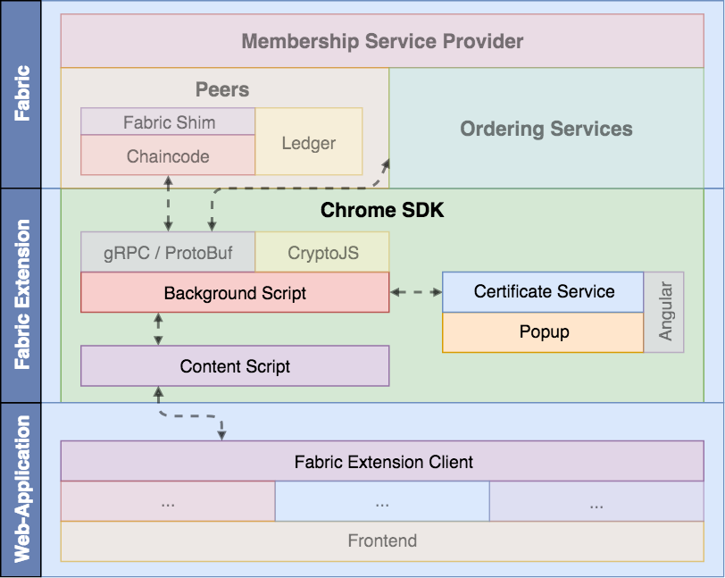

# Hyperledger Fabric Extension
Autor: Cem Basoglu

*"Hyperledger ist eine bereichsübergreifende Open-Source-Initiative zur Förderung
branchenübergreifender Blockchain-Technologien. An diesem weltweiten
Kooperationsprojekt, das von The Linux Foundation gehostet wird, nehmen führende
Unternehmen aus Branchen wie Banken und Finanzen, Internet of Things,
Supply-Chain, Fertigung und IT teil"* [[HYPE18](#ref_hype18)].

Zu den von der Hyperledger Initiative geförderten Projekten gehört unter anderem
auch das von IBM initiierte Fabric Framework. Das Fabric Framework besteht aus
einer Distributed Ledger Plattform und diversen Client Bibliotheken zum Zugriff
auf den Ledger. Weitere Informationen zum Fabric Framework sind im Kapitel
[Populäre Blockchain Plattformen](/blockchain/plattformen/#hyperledger)
verfügbar.

Um aus einer Webapplikation heraus mit dem Distributed Ledger zu kommunizieren,
erfordert das derzeitige [Fabric SDK](https://fabric-sdk-node.github.io/)
zwangsläufig eine serverseitige Schnittstelle zwischen Hyperledger Fabric und
der clientseitigen Webapplikation. Diese Restriktion ist darin begründet, dass
der Fabric Client zum einen das `fs` und `path`-Modul aus Node.js benötigt und
zum anderen eine GRPC Implementierung verwendet, die nicht im Browser lauffähig
ist [[SANG18](#ref_sang18)].

Für die Authentifizierung eines Nutzers gegenüber dem Distributed Ledger,
verwendet das Hyperledger Fabric Framwork x509-Zertfikate. Der mit dem
Zertifikat verbundene private Schlüssel hingegen, wird für die Signierung der
Anfragen verwendet. Da das Fabric SDK die Aufgabe der Authentifizierung
gegenüber dem Distributed Ledger und die Signierung der Anfragen übernimmt,
müssen die Zertifikate und die privaten Schlüssel, je nach Implementierung der
serverseitigen Schnittstelle, auf dem Server vorgehalten oder an diesen mit
jeder Anfrage übertragen werden. Beide Varianten der Implementierung stellen
jedoch ein großes Sicherheitsrisko dar, da der private Schlüssel nur
clientseitig vorgehalten werden sollte [[MINY18](#ref_miny18)].

Moderne Browser wie Chrome, Firefox, Opera oder auch Microsoft Edge, erlauben es
Entwicklern eigene Erweiterungen zu implementieren. Durch die Implementierung
einer Erweiterung, können die oben genannten Sicherheitsrisiken umgangen werden,
indem die Erweiterung die Verwahrung der Zertifikate und die Signierung der
Anfragen übernimmt. Diese Erweiterung kann anschließend aus der clientseitigen
Webapplikation genutzt werden, um mit dem Distributed Ledger zu interagieren.
Somit verbleiben privaten Schlüssel jederzeit beim Client und nur die mit
privaten Schlüssel signierten Anfragen werden über das Netzwerk übertragen.

## Anforderungen
Die sichere Verwahrung der Zertifikate und privaten Schlüssel stellt die
zentrale Anforderung an die Fabric Chrome Erweiterung dar. Dazu müssen die
Zertifikate und privaten Schlüssel vor einem unberechtigten Zugriff, sowohl
ausserhalb des Browser als auch aus einer Webapplikation heraus, geschützt
werden.

Der Benutzer muss die Möglichkeit haben neue Zertifikate zu hinterlegen und
bestehende Zertifikate zu verwalten. Dies soll direkt über die Erweiterung im
Browser möglich sein und muss mit einem Passwort gesichert werden.

Für die Interaktion mit der Erweiterung, muss es eine API bereitgestellt werden
die in die clientseitige Webapplikation eingebunden werden kann. Diese soll
berechtigten Webapplikation die Möglichkeit geben, zu prüfen ob ein Zertifikat
für die aktuelle Webapplikation vorhanden ist. Zusätzlich müssen allgemeine
Informationen über das Zertifikat abgerufen werden können. Für die Interaktion
mit dem Distributed Ledger müssen beliebige Chaincode Funktionen aufgerufen
werden können.

## Analyse
Um die Anforderungen umzusetzen muss zunächst untersucht werden, welche
Möglichkeiten bestehen um aus einer Chrome Extension mit einem gRPC-Dienst zu
kommunizieren und wie aus einer clientseitigen Webapplikation mit der
Extension kommuniziert werden kann.

### Fabric Client
Wie bereits einleitend erwähnt, benötigt das [Fabric SDK](https://fabric-sdk-node.github.io/)
die Module `fs` und `path` aus Node.js, um Zertifikate für die Wiederverwendung
abzulegen. Diese Module sind jedoch nicht in einer Browser bzw. Extension
Umgebung verfügbar, sodass für die Persistierung eine alternative Lösung
verwendet werden muss. Zusätzlich verwendet das SDK die [gRPC-Node](https://www.npmjs.com/package/grpc)
Bibliothek um mit dem Fabric Netzwerk zu kommunizieren. Dieser Client ist jedoch
als natives C++ Node Module umgesetzt und kann ebenfalls nicht im Browser
verwendet werden.

Für die Implementierung einer Chrome Extension müssen daher
die Funktionalitäten der Fabric SDK neu implementiert werden. Zu diesen
Funktionalitäten zählt die Interaktion mit der gRPC-Schnittstelle des Fabric
Netzwerks und das erzeugen der kryptografische Signatur zur Signierung der
Anfragen. Um auch aus der Chrome Extension auf das Fabric Netzwerk zuzugreifen,
muss auf eine gRPC Bibliothek zurückgegriffen werden, die auch aus dem Browser
heraus genutzt werden kann. Zu diesem Zweck sollen an dieser Stelle die
alternative gRPC Bibliotheken, auf die Verwendbarkeit im Browser betrachtet
werden.

#### gRPC-js
Die gRPC-js Bibliothek ist ein, ausschliesslich in Javascript implementierter,
gRPC-Client wodurch Abhängigkeit zu der C++ Implementierung wegfällt [[GRJS18](#ref_grjs18)].
Diese Bibliothek verwendet das [HTTP/2](https://nodejs.org/api/http2.html)-Modul
aus Node.js um mit dem gRPC-Server zu kommunizieren und unterstützt somit
ebenfalls Dienste mit bidirektionalen Datenströmen zwischen Client und Server.

Das HTTP/2 Protokoll wird zwar ebenfalls von modernen Browsern unterstützt, aber
stellt diese Funktionalitäten implizit über die `fetch` bzw. `XMLHttpRequest`
API bereit. Daher kann das dieses Modul ebenfalls nicht Browser eingesetzt
werden, da in diesem das HTTP/2-Modul aus Node.js nicht verfügbar ist.

#### gRPC-Web
Für den Zugriff auf einen gRPC Server aus dem Browser, gibt es seit kurzem
eine öffentliche Beta-Phase der offiziellen gRPC-Web Bibliothek
[[GRWE18](#ref_grwe18)]. Diese nutzt intern, je nach Browser und Verfügbarkeit,
die `fetch` bzw. `XMLHttpRequest` API

#### gRPC-Web-Client
https://github.com/improbable-eng/grpc-web

### Chrome Extension

<a name="img_2222">Abbildung 2.2.2.2</a> - Chrome Extension Architektur *Quelle:* [[CHEX18](#ref_chex18)]

#### Popup

#### Background Script

#### Content Script

https://developer.chrome.com/extensions/content_scripts#host-page-communication

## Entwurf
Für die sichere Persistierung der Zertifikate werden diese verschlüsselt im
Browser Storage abgelegt. Der Schlüssel für den Zugriff auf die Zertifikate ist
vom Benutzer einzugeben und dient gleichzeitig als Passwort für die Fabric
Extension. Für den Zugriff aus einer berechtigten Webapplikation muss die Fabric
Extension einmalig entsperrt werden. Anschliessend kann aus der Webapplikation,
mittels einer Javascript Bibliothek, auf die Zertifikate zugegriffen werden.
In den Attributen der Zertifikate ist eine URL in Form eines regulären Ausdrucks
hinterlegt, der die Webapplikation autorisiert auf das Zertifikat zuzugreifen.

Da die Verwendung der Fabric SDK für Node.js Applikationen ausgelegt ist, muss
direkt mit den Peers und dem Ordering Service kommuniziert werden. Dazu werden
die gRPC-Schnittstellen direkt angesprochen und die Transaktionen in der Fabric
Extension signiert.

### Architektur

<a name="img_2231">Abbildung 2.2.3.1</a> - Fabric Extension Architektur

#### Background Script

#### Content Script

#### Popup / Certificate Service

#### Fabric Extension Client

### Sequenzdiagramme

## Evaluation
Zur Evaluation der Fabric Extension wird eine Webapplikation implementiert,
die Information aus der digitalen Patientenakte vom [Health Ledger Projekt](https://github.com/SGSE18/health-ledger/)
anzeigt. Dabei steht jedoch die Demonstration der Funktionalität, wie die
Authentifizierung der Webapplikation gegenüber der Erweiterung, im Vordergrund.

## Referenzen

<a name="ref_hype18">[HYPE18]</a> IBM Blockchain auf Basis von Hyperledger Fabric der Linux Foundation [Online](https://www.ibm.com/blockchain/de-de/hyperledger.html)

<a name="ref_sang18">[SANG18]</a> Siddesh Sangodkar: Browser compatible fabric-node-sdk [Online](https://jira.hyperledger.org/browse/FAB-8129)

<a name="ref_miny18">[MINY18]</a> Min Yu: 2018 Projects - Project 5: Hyperledger Fabric Chrome Extension [Online](https://wiki.hyperledger.org/internship/project_ideas)

<a name="ref_grwe18">[GRWE18]</a> Github: gRPC for Web Clients [Online](https://github.com/grpc/grpc-web)

<a name="ref_grjs18">[GRJS18]</a> Github: Pure JavaScript gRPC Client [Online](https://github.com/grpc/grpc-node/tree/master/packages/grpc-js-core)

<a name="ref_chex18">[CHEX18]</a> Google Chrome Extension Dokumentation - Content Scripts [Online](https://developer.chrome.com/extensions/overview#contentScripts)
