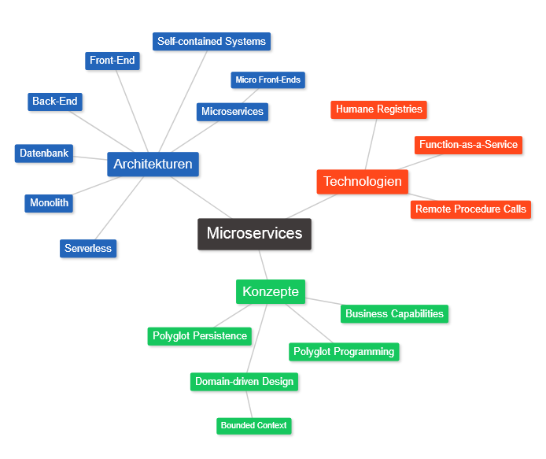
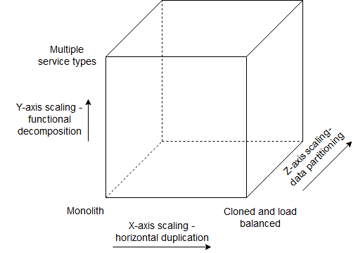
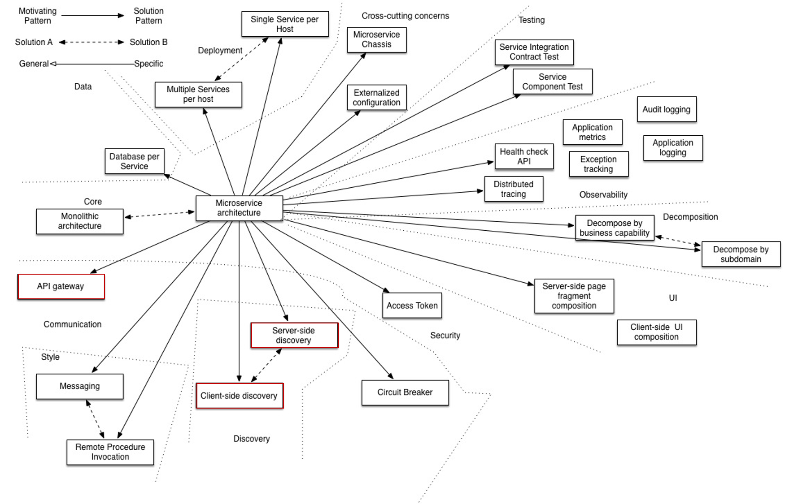
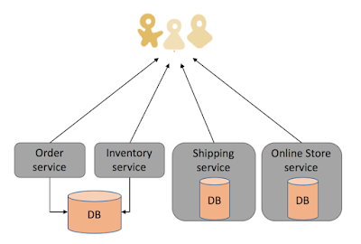
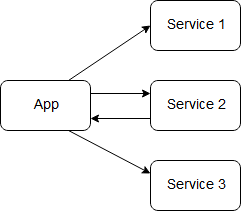
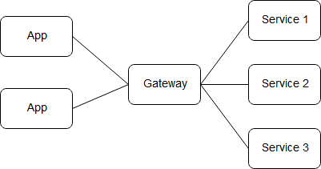
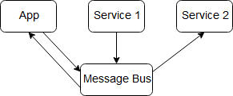

# Microservices

- [Einführung](#einführung)
- [Charakteristiken einer Microservice-Architektur](#charakteristiken-einer-microservice-architektur)
    - [Komponentisierung via Services](#komponentisierung-via-services)
    - [Aufbau um Business Capabilities](#aufbau-um-business-capabilities)
    - [Service als Produkt](#service-als-produkt)
    - [Smart endpoints and dumb pipes](#smart-endpoints-and-dumb-pipes)
    - [Dezentralisierte Führung](#dezentralisierte-führung)
    - [Dezentralisiertes Datenmanagement](#dezentralisiertes-datenmanagement)
    - [Infrastructure Automation](#infrastructure-automation)
    - [Design for failure](#design-for-failure)
    - [Evolutionäres Design](#evolutionäres-design)
    - [Kommunikation mit Microservice](#kommunikation-mit-microservice)
    - [Humane Registries](#humane-registries)
    - [Serverless](#serverless)
- [Unterschiede zu monolithischen Anwendungen](#unterschiede-zu-monolithischen-anwendungen)
    - [Vorteile](#vorteile)
    - [Nachteile](#nachteile)
- [Abgrenzung zu Self-Contained Systems und Containern](#abgrenzung-zu-self-contained-systems-und-containern)
- [Microservices als Front-Ends](#microservices-als-front-ends)
- [Einsatz von Microservices](#einsatz-von-microservices)
- [Quellen](#quellen)

## Einführung

Diese Mindmap soll einen Überblick darüber erschaffen, welche Themen in der Ausarbeitung angesprochen werden und wie sie anzuordnen sind.

Ein Microservice ist ein leichtgewichtiger autonomer Dienst, der eine einzige Aufgabe erfüllt und mit anderen ähnlichen Diensten über eine gut definierte Schnittstelle kollaboriert. Eine der Hauptaufgaben von Microservices ist eine Minimierung von Einflüssen im Falle einer möglichen Schnittstellenänderung. <a>[[NAMI14]](#ref_Nami14)</a>

Monolithischen Anwendungen werden als ein Ganzes entwickelt. Die sogenannte Drei-Schichten-Architektur beinhaltet:
- Clientseitige Applikation
- Serverseitige Applikation
- Datenbank

Eine serverseitige Applikation ist ein solches Monolith, weil sie für HTTP-Anfragen zuständig ist, Zugriffe auf die Datenbank steuert und mit dem Browser interagiert. Eine Änderung im System führt zu einer neuen Version der ganzen Software. Die ganze Logik konzentriert sich in einer ausführbaren Datei. Es ist ein natürlich Weg zu entwickeln. Optimierung kan mithilfe eines Load Balancer erfolgen, damit mehrere Instanzen der Applikation nebenbei laufen können.
Allerdings kann schwierig werden eine solche Anwendung auf Dauer zu entwickeln. Es erfordert viel Aufwand ständige Änderungen und Korrekturen zu implementieren, denn bei einem Monolith muss jedes Mal das ganze System neu erstellt werden. Desweiteren ist es aufwändig die Modularität der Software aufrecht zu erhalten, ohne das intern ungewollte Abhängigkeiten zwischen den Modulen entstehen. Auch eine Skalierung des ganzen Systems erfordert viel mehr Ressourcen, als eines einzelnen Moduls. <a>[[LEWI14]](#ref_Lewi14)</a>

Ein Vergleich einer monolithischen Anwendung in Microservices kann in der nächsten Abbildung betrachtet werden.

_Microservices vs Monolith_, Abbildung entnommen aus <a>[[TATV16]](#ref_Tatv16)</a>

Um die Nachteile von monolithischen Anwendungen zu umgehen, werden diese aufgeteilt in einzelne Dienste oder Services. Eine der weit verbreitenden Illustration der verschiedenen Ansätze der Partitionierung von Monolithen ist der Skalierungswürfel. Auf der horizontalen Ebene geht es um Skalierbarkeiteines Systems durch mehrere Instanzen einer Applikation. Diese können unter anderem hinter einem Load-Balancer laufen. Auf diese Weise wird versucht die Last umzuverteilen und konstante Antwortzeiten zu erzielen. Die Z-Achse der Skalierung würden mehrere Server eine identische Kopie an Code unterhalten. Hier unterhält jeder Server nur eine Untermenge der Daten. Auftretende Probleme wären Datenkonsistenz, Datenverteilung und Datenverfügbarkeit. Die X-Achse und die Z-Achse verbessern die Skalierbarkeit und Verfügbarkeit, jedoch auch die Komplexität des Systems. Um die Komplexität zu verringern wird auf der Y-Achse skaliert. Die Skalierung nach der Y-Achse setzt voraus, dass ein System logisch und physisch in funktionale Bereich zerlegt werden kann. Dies kann zum höheren Kommunikationsaufwand führen, bringt aber mehr Flexibilität mit sich. <a>[[PIEN16]](#ref_Pien16)</a>, <a>[[NAMI14]](#ref_Nami14)</a>

_Skalierungswürfel_, Abbildung entnommen aus <a>[[PIEN16]](#ref_Pien16)</a>

Es gibt viele Entwurfsmuster, die zu Microservices verwandt sind. Die abgebildete monolithische Architektur ist als eine  Alternative zu Microservices zu verstehen. Bei einer wachsenden Größe der Microservices, können diese schnell wieder sich zu kleineren Monolithen zusammensetzen. Die Muster werden nach folgenden Bereichen aufgeteilt:
- Kommunikation
- Datenhaltung
- Kern
- Stil
- Einsatzarten
- Sicherheit

Wobei es noch einige mehr sind. Im Laufe der Entwicklung werden Probleme auftauchen für welche diese Muster hilfreich sein werden.     
Die Dienste werden nach Front-End und Back-End Services unterschieden. Je nach Client ergeben sich unterschiedliche Anforderungen an Granularität und Formate eines Service. Aus diesem Grund anstatt einer universellen Schnittstelle, sollten speziell entwickelte Lösungen für Nutzer angeboten werden. Ein API-Gateway ist eine Vermittlungskomponente welche benötigt wird, damit Services sich nicht direkt aufrufen können. Direkte Aufrufe können bei vielen Diensten die Kommunikationsstruktur schnell unübersichtlich und die Fehlersuche aufwändig machen. Außerdem erlauben lose Koppelungen zwischen den Microservices unabhängige Entwicklung, Einsatz und Skalierung. Das Gateway kann sich um Format- und Protokollumwandlung, Authentifizierung oder Überwachung kümmern. Um die angefordeten, am besten passenden Services zu finden stehen zwei Möglichkeiten zur Verfügung: clientseitig und serverseitig. Beide setzen voraus, dass die Dienste sich bei der Service-Registry an- und abmelden, auch in Fehlerfällen.
1. _Client-side discovery_: Hier wird eine zentrale Service-Registry benötigt, für die Verwaltung von Diensten und deren Orten. Der Client braucht nur den entsprechenden Service aufzufordern und bekommt die nötigen Aufrufinformationen zurück. Die Dynamik, welche mit Microservices verbunden ist, macht die Automatisierung von diesem Prozess notwendig. Die Orte (Host, Port) der Microservices werden zur Laufzeit ermittelt und ändern sich nach Verfügabarkeit.
2. _Server-side discovery_: Im Gegensatz zur vorherigen Lösung wird die Anfrage an einen Load-Balancer gestellt. Dieser fungiert als ein Router für den Service und kommuniziert mit einer Service-Registry. Der Code ist einfacher strukturiert verglichen mit den clientseitigem Fall, allerdings muss der Load Balancer ausfallsicher und skalierbar sein. Es kann eine cloudbasierte Lösung sein oder es wird eine Clusterlösung auf jeden Service-Host verwendet als lokalen Proxy. <a>[[RICH17]](#ref_Rich17)</a>, <a>[[PIEN16]](#ref_Pien16)</a>

Auf alle Entwurfsmuster einzugehen würde den zeitlichen Rahmen um vielfaches sprengen, weswegen nur diese drei Muster beschrieben wurden.

_Verwandte Entwurfsmuster_, Abbildung entnommen aus <a>[[RICH17]](#ref_Rich17)</a>

Um einen gemeinsamen Datenbestand für alle Services und damit einen Engpass zu vermeiden, sollte "Database-per-service"-Muster zum Einsatz kommen - jeder Service verwaltet seine eigenen Daten. Es wird bewusst eine Datenredundanz in Kauf genommen. Dies erlaubt jedem Dienst eine eigene, für ihn geeignete Technologie zu wählen. <a>[[PIEN16]](#ref_Pien16)</a> 
Die Abbildung _Microservices Architektur_ zeigt einen möglichen Aufbau von Microservices. Jedem Dienst entspricht eine Funktionalität. Einige Dienste haben eigene Datenbanken, andere greifen auf eine gemeinsame Datenbank zu.

_Microservices Architektur_, Abbildung entnommen aus <a>[[MIRI17]](#ref_Miri17)</a>

## Charakteristiken einer Microservice-Architektur

Es gibt keine formale Definition dieses Architekturstils. Allerdings gibt es gemeinsame Charakteristiken, welche von vielen Microservices geteilt werden. <a>[[LEWI14]](#ref_Lewi14)</a>

### Komponentisierung via Services

Normalerweise wird unter einem Komponenten der Teil einer Software verstanden, welches unabhängig von anderen veränderbar ist. Microservices bezeichnen einzelne Services, aber auch Bibliotheken, als Komponenten. Eine Bibliothek ist eine eingebundene Komponente und wird durch Funktionsaufrufe aus dem Speicher aufgerufen. Ein Service hingegen wird durch Remote Calls bzw. Web Requests aufgerufen.
Der Vorteil eines Service gegenüber einer Bibliothek liegt in der Unabhängigkeit des Ersten. Ein einziger Prozess kann aus mehreren Bibliotheken bestehen und wäre eine davon verändert, müsste die gesamte Applikation neu aufgesetzt werden. Eine Aufteilung in Services wirkt dem entgegen, weil meistens nur der jeweilige Service geändert werden muss. Desweiteren bringt eine solche Aufsplittung sauber definierte Komponentenschnittstellen mit sich. Das bedeutet, dass einzelne Softwarekomponenten besser voneinander getrennt sind. <a>[[LEWI14]](#ref_Lewi14)</a>

### Aufbau um Business Capabilities

Microservices sollten rund um die Business Capabilities der Organization aufgebaut werden. Business Capabilities definieren die wichtigsten Businessfunktionen. Sie beschreiben "was" ein Unternehmen macht. Denn das Gesetz von Conway besagt: Jede Organisation die ein System entwirft bekommt am Ende ein Entwurf welches die Kommunikationsstruktur der umzusetzenden Organisation nachbildet. Der Technologiestack deckt ein breites Feld von Software ab, wie GUI, Datenbanken, Schnittstellen. Das wiederum bedeutet, dass es cross-functional Entwicklerteam sein muss, um all die Bedingungen zu erfüllen. <a>[[LEWI14]](#ref_Lewi14)</a>

Die nächste Abbildung stellt dar, wie Microservices sich den Business Capabilities einer Organisation anpassen.

_Microservices und Business Capabilities_, Abbildung entnommen aus <a>[[LEWI14]](#ref_Lewi14)</a>

### Service als Produkt

Software sollte nicht als ein Projekt, sonder vielmals als ein Produkt gesehen werden. Das bedeutet, dass ein Entwicklungsteam während des gesamten Lebenszyklus sich darum kümmert. Auf diese Weise hat dieses Team das Feedback für das Verhalten der Software in realen Arbeitsbedingungen und einen engeren Kontakt zu den Nutzern. Das kreiert eine engere Bindung an das eigene Produkt. Diese Mentalität geht Hand in Hand mit dem Einsatz von Business Capabilities. Eine Software wird nicht mehr als ein Bündel von Funktionalitäten zu betrachten, die fertiggestellt werden müssen, sondern es wird zu der Software eine andauernde Beziehung aufgebaut, um die Business Capability zu verbessern. <a>[[LEWI14]](#ref_Lewi14)</a>

_Betreuung während des Lebenslaufs_, eigene Abbildung

### Smart endpoints and dumb pipes

Die Applikationen der Microservices sollten abgekoppelt und zusammenhängend wie möglich sein: Empfangen einer Anfrage, Bearbeitung und senden einer Antwort. Die Protokolle sollten hingegen unkompliziert sein. Einer der meistgenutzten Protokolle ist HTTP. Das erlaubt die Infrastruktur des Webs zu nutzen, um Ressourcen zu sparen.
Eine andere populäre Möglichkeit ist es den Lightweight Message Bus zu nutzen, wo die Infrastruktur nur als Router von Nachrichten fungiert (dumb pipes). <a>[[LEWI14]](#ref_Lewi14)</a>

### Dezentralisierte Führung

Dezentralisierte Führung ist ein Konzept welches aus mehreren Ansätzen besteht. Eines davon erlaubt den einzelnen Entwicklerteams ihre Stärken in verschiedenen Technologien anzuwenden und zusammen ein leistungsfähiges Produkt zu entwickeln, anstatt ihnen einen technologischen Standard aufzuzwingen. Das heißt, dass unter anderem jeder einzelner Service in der dafür am besten passenden Programmiersprache geschrieben werden kann, aber nicht unbedingt muss. Diese Eigenschaft heißt __Polyglot Programming__. Die Entscheidung liegt auf der Ebene der Entwickler, was nicht bedeutet, dass es überhaupt keine Richtlinien gibt.
Einen weiterer Ansatz der dezentralisierten Führung bringt die Amazons Herangehensweise zur Geltung: "You build it, you run it!". Damit ist gemeint, dass ein Entwicklungsteam nicht nur die eigentliche Entwicklung übernimmt, sondern auch die Installation, die Überwachung und die Steuerung dieses Produktes im Einsatz. Das geht weg von dem üblichen Konzept "Entwickeln und vergessen", wo nach der Entwicklung andere Bereiche sich um das Produkt kümmern. <a>[[LEWI14]](#ref_Lewi14)</a>, <a>[[PECK17]](#ref_Peck17)</a>

### Dezentralisiertes Datenmanagement

Domain-driven Design (DDD) modelliert komplexe Systeme basierend auf Domänen; eine Domäne ist wiederum ein Einsatzbereich einer Software. Bounded Context ist ein Entwurfsmuster aus dem DDD. Es beschreibt eine Abgrenzung in der ein bestimmtes Modell definiert und verwendet wird. Es teilt komplexe Domänen in mehrere Kontextgrenzen und beschreibt die Beziehungen zwischen ihnen. Je nach Kontext variieren sich die Sichtweisen auf bestimmte Modelle: Modell _Customer_ kann im Kontext von _Sales_ vorkommen, aber nicht unbedingt bei _Support_. Das ist sowohl für Monolithen, als auch für Microservices nutzbar, wobei die letzteren eine natürliche Korrelation zu Bounded Context besitzen. Bounded Context verdeutlicht und verstärkt eine Trennung in verschiedene Kontextbereiche. <a>[[EVAN15]](#ref_Evan15)</a>, <a>[[FOWL14]](#ref_FOWL14)</a>, <a>[[LEWI14]](#ref_Lewi14)</a>

Hier sind klar erkennbare Grenzen der Bereiche Sales und Support mit Berührungspunkten bei Customer und Product definiert.

_Bounded Context_, Abbildung entnommen aus <a>[[FOWL14]](#ref_FOWL14)</a>

Die Dezentralisierung bei Microservices betrifft auch die Datenbanken. Es wird bevorzugt pro Service eine Datenbank zu haben, seien es nur unterschiedliche Datenbank-Instanzen oder komplett unterschiedliche Datenbanktechnologien. Eine der Probleme von dezentralisiertem Datenmanagement ist Update Management. Wenn im monolithischen Systemen Transaktionen für Updates genutzt werden, um Datenkonsistenz zu garantieren, kann es bei Microservices aufgrund von temporären Kupplung problematisch. Verteilte Transaktion sind sehr schwer umzusetzen, weswegen Microservices transaktionslose Koordination zwischen den Services einsetzen. Mögliche Probleme werden von kompensierenden Operationen abgefangen. <a>[[LEWI14]](#ref_Lewi14)</a>

Die nächste Abbildung vergleicht ein monolithisches System mit Microservices in Bezug auf die Datenbanken.

_Dezentralisierte Datenbanken_, Abbildung entnommen aus <a>[[LEWI14]](#ref_Lewi14)</a>

### Infrastructure Automation

Testautomatisierung und Ansätze wie Continuous Integration und Continuous Delivery helfen bei der Entwicklung von stabiler und hochwertiger Software. Das illustriert das nächste Bild. <a>[[LEWI14]](#ref_Lewi14)</a>

_Basic Pipeline_, Abbildung entnommen aus <a>[[LEWI14]](#ref_Lewi14)</a>

### Design for failure

Ein Service ist nicht gegen Ausfälle und Fehler geschützt, deshalb sollte er immer gegen mögliche Fehlerfälle ausgiebig getestet werden. Verglichen mit einem monolithischen Design, fällt das bei Microservices komplexer aus, wodurch die Entwickler ständig beachten müssen wie es auf die Benutzbarkeit beim Nutzer auswirkt. Da allerdings nicht alle möglichen Probleme abgedeckt und vorhergesehen werden können, kommt Echtzeit-Monitoring zum Einsatz. So kann bei einem Ausfall direkt eingegriffen und ein Service wieder zum laufen gebracht werden. Relevanten Metriken und weitere wichtige Informationen über den Softwarestatus erlauben es rechtzeitig Fehler zu erkennen. <a>[[LEWI14]](#ref_Lewi14)</a>

### Evolutionäres Design

Eine Software sollte so entworfen werden, dass statt es bei größeren Änderungen zu verwerfen, diese weiterentwickelt werden kann. Die wichtigsten Eigenschaften eines Komponenten sind Austauschbarkeit und Erweiterungsfähigkeit - wie kann eine Komponente überarbeitet werden, ohne dass andere Komponenten davon betroffen sind. Oftmals wird ein Service verworfen anstatt auf lange Sicht überarbeitet zu werden. Manchmal macht es Sinn mehrere Dienste zu gruppieren, falls diese immer wieder Abhängigkeiten während Änderungen zeigen. <a>[[LEWI14]](#ref_Lewi14)</a>

In dieser Liste sind die Vorraussetzungen für Microservices zusammengefasst: <a>[[NAMI14]](#ref_Nami14)</a>
1. Request/Response calls mit willkürlich strukturierten Daten
2. Asynchrone Events in Echtzeit
3. Bidirektionale Requests und Responses
4. Requests und Responses können willkürlich geschachtelt sein
5. Nachrichtenformat: wie JSON, XML

### Kommunikation mit Microservices

Wenn es um Microservices geht müssen die Remote Procedure Calls (RPCs) näher betrachtet werden, da Microservices out-of-process Komponenten sind. Einige häufig anzutreffende Entwürfen von RPCs sind Direct Call, Gateway und Message Bus. <a>[[NAMI14]](#ref_Nami14)</a>

__Direct Call__

Der erste Kommunikationsentwurf ist ein Direct Call. Wie die Bezeichnung impliziert, kommunizieren Microservices direkt mit der Applikation. Obwohl sehr flexibel, kann es zu potentiellen Verzögerungen kommen wenn die Anzahl der RPCs zu groß wird. <a>[[NAMI14]](#ref_Nami14)</a>

_Direct Call_, Abbildung angepasst aus <a>[[NAMI14]](#ref_Nami14)</a>

__Gateway__

Um den Verzögerunden entgegenzuwirken kommt der Gateway-Entwurf zum Einsatz. Um den Andrang zu verringern kommen diverse Caches und Middleware, wie ein Transaktionsmonitor, hinzu.

_Gateway_, Abbildung angepasst aus <a>[[NAMI14]](#ref_Nami14)</a>

__Message-bus__

Message Bus erlaubt asynchrone Requests und Responses. Das kommt gerade den Applikationen aus dem IoT-Bereich zugute.

_Message Bus_, Abbildung angepasst aus <a>[[NAMI14]](#ref_Nami14)</a>

https://www.nginx.com/blog/building-microservices-using-an-api-gateway/
https://www.nginx.com/blog/building-microservices-inter-process-communication/

### Humane Registries

Humane Registry ist eine automatisierte Dokumentation für Microservices, designt um Informationen automatisch in menschlich lesbaren Form zu schreiben und zu aktualisieren. Die wichtigesten Merkmale so einer Dokumentation sind:
- _Verständlichkeit_: der Format sollte für alle lesbar und verständlich sein
- _Automation_: Entwickler haben selten Zeit eine Dokumentation zu pflegen
- _Einfachheit_: eine Erweiterung der Informationen sollte unkompliziert sein

Solch ein Dokumentationswerkzeug durchsucht den Quellcode des Systems und stellt detaillierte Informationen darüber bereit, welcher entwickler wann und wieviel zum Microservices beigetragen hat. So können Mitarbeiter sehen an wem sie sich in bestimmten Fällen wenden können. Mithilfe von Daten aus verschiedensten Systemen, wie Continuous-Integration-Servern, von Versionsverwaltungsprogrammen und Issue-Tracking-Systemen, wird eine übergreifende Dokumentation erschaffen. <a>[[FOWL08]](#ref_Fowl08)</a>

### Serverless

Serverless steht für Serverless computing und wird in zwei Bereichen eingesetzt:
1. Es wird komplett auf die serverseitige Logik verzichtet und stattdessen werden Cloud-Services von Drittanbietern integriert. Übliche Anwender sind sogenannte "Rich Clients" - Single-Page-Webanwendungen und mobile Apps. Zu solchen Cloud-Services zählen Datenbanken, Authentifizierungsmechanismen und so weiter. Weshalb dieser Typ von Microservices auch "Backend as a Service" genannt wird.
2. Ein anderer Bereich von Serverless ist "Function as a Service" (FaaS). In diesem Szenario wird serverseitige Logik immer noch vom Entwickler geschrieben, jedoch verpackt in Container und von einer Cloud gemanagt. Diese Container sind zustandslos, ereignisgesteuert und kurzlebig. Der bekannteste Beispiel ist AWS Lambda von Amazon.

Die folgende Abbildung zeigt die Unterschiede zwischen der üblichen Architektur und Serverless. Die Authentifizierung erfolgt über den Cloud-Service. Der Client hat Zugriff auf die Produkt-Datenbank, welche von Drittanbietern gehostet wird. Ein Teil der früheren Serverlogik der alten Architektur kann in den Client implementiert werden, siehe Single-Page-Webanwendung. Mit HTTP-Anfragen kann über die API eine Suche in der Datenbank getriggert werden - es ist nicht nötig, dass ständig ein Server am laufen sein muss. Es ist möglich Teile von eigenem Quellcode in Plattformen wie AWS Lambda zu verwenden, falls die Programmiersprache unterstützt wird. Die Funktionalität "Kaufen" kann ebenfalls durch "Function as a Service" ersetzt werden. Zum einen, um den Client leichtgewichtiger zu halten, zum anderen aus Sicherheit. <a>[[ROBE18]](#ref_Robe18)</a>

_Serverless_, Abbildung angepasst aus <a>[[ROBE18]](#ref_Robe18)</a>

Vereinfacht ausgedrückt - FaaS ist eine Ausführung von Backend-Quellcode ohne dabei einen eigenen Server oder dauerhaft arbeitende Serverprogramme laufen zu haben. FaaS ist darauf ausgelegt innerhalb kürzester Zeit (Millisekunden) je nach Anfrage benötigte Anwendungen zu starten und zu beenden. Die Vorteile sind eine Vereinfachung der Architektur durch den Wegfall einer Schicht und Übergabe der serverseitigen Logik an die Cloud-Services. Die Einsparung von Entwicklungs-, Installations- und Instandhaltungsaufwänden zählt ebenfalls zu den Vorteilen gegenüber der üblichen Drei-Schichten-Architektur. <a>[[ROBE18]](#ref_Robe18)</a>

## Unterschiede zu monolithischen Anwendungen

Die folgenden Kapiteln gehen auf die Vor- und Nachteile von Microservices gegenüber einer monolithischen Architektur. Die Nachteile eines Monoliths wurden in der Einführung beschrieben.

### Vorteile

Der offensichtlichste Vorteil welchen Microservices mit sich bringen ist eine bessere Übersicht von Quellcode. Jeder Service ist sauber logisch und technisch von anderen getrennt, was es viel einfacher macht neue Entwickler reinzubringen. Wenn ein Microservice modifiziert werden soll, muss nicht die gesamte Architektur deswegen verändert werden, weil es keine Abhängigkeiten zu anderen Microservices gibt. Dies favorisiert eine kontinuierliche Entwicklung, weil von vorne rein viel weniger Raum für Querabhängigkeiten im Quellcode entsteht. Daraus resultiert eine erhöhte Einsatzfähigkeit, kürzere Entwicklungszeiten und bessere Umsetzung von innovativen Lösungen - Continuous Integration und Continuous Delivery. Microservices haben eine höhere Resistenz gegenüber Fehlern, da aufgrund ihrer Größe der Quellcode übersichtlicher ist und die Kommunikation mit anderen Microservices über klar definierte Schnittstellen erfolgt. Daraus resultiert ein weiterer Vorteil: Unabhängigkeit in der Entwicklung. Jeder Dienst wird autonom von einem Team entwickelt. Laut Amazon sollte ein Teams maximal so groß sein, dass es von zwei Pizza satt wird, also nicht mehr als ein Dutzend Entwickler.Es gibt ebenfalls eine Regel der halben Pizza, wovon ein zwei Mann Team satt wird. Die optimale Größe von Microservice Entwicklerteams variiert also zwischen zwei bis zwölf Mitgliedern.   
Microservices vereinfach das schreiben von Tests aufgrund ihrer Granularität und Unabhängigkeit, was auch zur besseren Fehlereingrenzung führt. Jedes einzelnes Microservice kann in komplett anderer Programmiersprache geschrieben sein und sich technologisch komplett unterscheiden. So kann ein Service flexibel auf die kommenden Forderungen reagieren und sich mit der zeit anpassen, was zu einem langlebigen Programm führt. Allerdings hat es sich herausgestellt, dass Microservices eher verworfen und neu realisiert werden, anstatt sich auf lange Sicht darum zu kümmern. Im Gegensatz dazu kann eine monolithische Architektur zwar mehrere Dienste oder Komponenten enthalten - sie bilden aber trotzdem ein Ganzes und haben eine Programmiersprache. Bei einem Ausfall, können andere Microservices weiterarbeiten und ihren Beitrag zur Funktionalität der Applikation leisten. Ein immenser Vorteil eines Microservice ist die Möglichkeit in anderen Systemen wiederzuverwenden, solange die Schnittstelle richtig konfiguriert ist. <a>[[LEWI14]](#ref_Lewi14)</a>, <a>[[NAMI14]](#ref_Nami14)</a>, <a>[[RICH17]](#ref_Rich17)</a>

### Nachteile

Die Kommunikation zwischen den Microservices und der Applikation geschieht nur über die Schnittstellen, was zu einer großen Menge an Remote Calls führt. Remote Calls verbrauchen mehr Ressourcen als In-Prozess Calls einer monolithischen Struktur. Ein weiterer großer Nachteil ist, dass Microservices zuerst partitioniert werden müssen. Am Anfang eines Systems ist nicht unbedingt offensichtlich wie es in Zukunft aussehen wird und der Aufwand einer Microservice-Architektur ist kann zu immens erscheinen. Jedes Service braucht einen klar definierten Anwendungsfall und muss frei von unnützen Funktionalitäten sein. Das kann wie im Falle von Amazon zu hunderten Microservices führen und dementsprechend dutzende  Teams. Kommunikation zwischen diesen Entwicklerteams ist von entscheidender Bedeutung, denn Anwendungsfälle können sich über mehrere Services spannen. Monolithische Systeme können ebenfalls in einzelne Dienste aufgebrochen werden. Je größer eine Applikation ist, desto komplizierter ist die Umstrukturierung, denn zuerst müssen alle internen Abhängigkeiten aufgelöst werden. Microservices beanspruchen mehr Ressourcen, weil die Menge an monolithische Instanzen N ersetzt wird durch die Menge an Microservice-Instanzen N x M. Beim Einsatz von JVM oder deren Äquivalenten für die Isolierung einzelner Microservices steigt der Overhead ins M-fache der eingesetzten JVM-Runtimes.   
Obwohl die kompakte Größe eines Miroservice das Schreiben von Testfällen erleichtert, wird durch die Komplexität der gesamten Architektur das Testen insofern schwieriger, dass die Zusammenarbeit mit anderen verteilten Diensten überprüft werden muss. Dezentralisierte Datenverteilung ist ein weiterer wichtiger Punkt. In dieser Architektur ist es üblich eine Datenbanklösung pro Service zu haben, wodurch Probleme mit der Datenkonsistenz auftretten können. Die Komplexität die verteilten Systeme zu managen und einzusetzen ist entsprechend höher als mit Monoliths, weil sie in komplett anderen Technologien und Sprachen umgesetzt sein können. <a>[[LEWI14]](#ref_Lewi14)</a>, <a>[[NAMI14]](#ref_Nami14)</a>, <a>[[RICH17]](#ref_Rich17)</a>

Die nächststehende Tabelle führt die Vor- und Nachteile kurz nochmal zusammen.

| __Vorteile__                    | __Nachteile__                        |
|---------------------------------|--------------------------------------|
| Kompakter Quellcode             | Größerer Ressourcenbedarf            |
| Leichterer Einstieg ins Team    | Use Cases nicht eindeutig            |
| Erhöhte Einsatzfähigkeit        | Sehr komplex                         |
| Kürzere Entwicklungszeiten      | Überhang an Services möglich         |
| Autonome Services               | Testsfälle werden komplexer          |
| Kleine dedizierte Teams         | Abhängig von Schnittstellen          |
| Resistent gegen Ausfall         | Probleme mit Datenkonsistenz         |
| Business Case abhängig          | Aufwändig zu managen                 |
| Technologie unabhängig          | Großer Kommunikationsaufwand pro Team|
| Wiederverwendbare Services      |                                      |

Die Microservice-Architektur ist vorteilhaft, wenn die Rede um eine flexible und dennoch robuste Software geht.

## Abgrenzung zu Self-Contained Systems

Self-contained Systems (SCS) ist ein Architekturmuster, der den Fokus auf Separation einer Funktionalität in mehrere unabhängige Systeme legt. Aus der Kollaboration dieser Systeme entsteht ein neues logisches System. So werden Probleme von großen monolithischen Systemen umgangen, da sie ständig wachsen und nicht mehr wartbar werden.   
Sie sind den Microservices sehr ähnlich und teilen mit ihnen viele Merkmale. Zu diesen Merkmalen gehören unabhängige Einheiten, Anpassung von organisatorischen und architektonischen Grenzen, Diversität in technologischen Auswahl und dezentralisierte Infrastruktur. Dennoch gibt es einige Unterschiede:
- Ein Microservice ist üblicherweise kleiner als ein SCS
- Es gibt normalerweise weniger SCSs als Microservices, ein Shop kann 5-25 SCSs haben oder bis zu 100 Microservices
- SCSs sollten nicht miteinander kommunizieren, was für Microservices bis zu einem gewissen Grad in Ordnung ist
- SCSs besitzen eine UI, während Microservices die UI üblicherweise (nicht immer) in eigenes Service auslagern
- Microservices werden normalerweise auf der Logikschicht integriert und SCSs auf der UI-Schicht

Es ist möglich Self-contained Systems weiter in die Microservices aufzuteilen. SCS fokussiert sich auf großen Projekten und Aufteilungen in mehrere Teams. Bei Microservices sind eher kleine Teams oder einzelne Entwickler im Einsatz, was erlaubt Continuous Delivery einfacher anzuwenden, robustere Systeme zu entwerfen oder einzelne Services zu skalieren. Microservices sind vielseitiger, aber Self-contained Systems lösen Probleme mit der Architektur und Organisation großer Projekte.
<a>[[SCSVSM]](#ref_Scsvsm)</a>

## Microservices als Front-Ends

Für Webanwendungen gewinnt Front-End immer mehr an Bedeutung, während Back-End weniger wichtig wird. Der Trend geht in Richtung einer 90 zu 10 Aufteilung zu Gunsten von Front-End. Der monolithische Design ist für Front-End zu schwerfällig, so dass eine Aufteilung in kleinere Module nötig ist. Der aktuelle Trend heißt "Micro Front-Ends" und Unternehmen, wie Spotify und Zalando sind schon umgestiegen. Das sind einige der Umsetzungsmöglichkeiten:
1. Eine Kombination aus mehreren Frameworks auf einer Webseite ohne das die Webseite aktualisiert werden muss.
2. Mehrere Singe-Page-Applikationen, die über verschiedene URLs zugänglich sind. Diese Applikationen nutzen Paketverwaltung für geteilte Funktionalität.
3. Micro-Apps in IFrames verpacken und über APIs koordinieren.
4. Verschiedene Module können über einen gemeinsamen Event-Bus kommunizieren. Jedes Modul benutzt sein eigenes Framework und handelt nur eingehende und ausgehende Events.
5. Mithilfe von einem Web-Beschleuniger verschiedene Module zu integrieren.
6. Webkomponenten als eine Integrationsschicht zu verwenden. Sie erlauben wiederverwendbare Komponenten in Webanwendungen und Webdokumenten zu erstellen.
7. React-Komponenten in einer Blackbox zu isolieren. Hier wird der Zustand einer Applikation im Komponenten festgehalten und über die API werden nur die Eigenschaften zugänglich gemacht. <a>[[SÖDE17]](#ref_Söde17)</a>

| __Vorteile__                    | __Nachteile__                                          |
|---------------------------------|--------------------------------------------------------|
| Unabhängig                      | Erhöhter Betriebsaufwand                               |
| Einfacher einzusetzen           | Erhöhte Komplexität (z.B. Infrastruktur, Kommunikation)|
| Hohe Testbarkeit                | Schlechtere Performance                                |
| Unabhängige Technologiestacks   | Restrukturierung kann sehr komplex werden              |
| Unabhängig im Fehlerfall        |                                                        |
| Parallele entwicklung möglich   |                                                        |

Tabelle angepasst aus <a>[[LECH17]](#ref_Lech17)</a>

__TODO: Bild beschreiben__
In dieser Abbildung ist eine mögliche Aufteilung des Front-End in Micro Front-Ends. Wie auch im Back-End Bereich ist hier jedes Team für einen Dienst zuständig: Product, Checkout, etc. Links in der Abbildung sind die drei Schichten Front-End, Back-End und Datenbank zu sehen. Jedes Entwicklerteam behandelt alle drei Bereiche seines Services. Das korreliert mit Microservices im Back-End in dem Sinne, dass Polyglot Persistence eingesetzt wird - eine Datenbank pro Service.

_Micro frontend_, Abbildung entnommen aus <a>[[GEER17]](#ref_Geer17)</a>

## Einsatz von Microservices

Es ist schwierig zu entscheiden in welchen Fällen Microservices eingesetzt werden sollten, denn viele Probleme mit monolithischer Architektur tauchen erst mittelfristig auf und keiner möchte die zusätzliche Komplexität am Anfang eines Projekts auf sich nehmen. Die Entwicklung einer verteilten Architektur ist langwierig. Deswegen sind für Startups, die auf rapide Entwicklung und Versionierung aus sind, Microservices nicht unbedingt die erste Wahl. Allerdings können in späterer Entwicklung Probleme mit der Skalierung auftretten was zu einer funktionellen Dekomposition führt. Es könnte schwierig sein die internen verworrenen Abhängigkeiten aufzulösen.   
Genauso wichtig wie die Frage "Wann", ist die Frage "Wie" - wie soll die Aufteilung von Microservices aussehen? Eine Möglichkeit ist die Dekomponierung nach Business Capabilities, die andere nach Domain-Driven Design. Die beiden Fälle wurden in vorherigen Kapiteln erklärt. Dekomponierung nach Anwendungsfällen definiert Services die für bestimmte Aktionen verantwortlich wären, wie z.B. Shipping Service. Partitionierung nach Nomen (Ressourcen) definiert Services für Operationen an Ressourcen oder Entitäten, wie z.B. Account Service. Ein Service sollte ein Set an Verantwortlichkeiten haben, wessen Klassen nach Single Responsibility Principle (SRP) entworfen werden. SRP besagt, dass jede Klasse eine einzige fest definierte Aufgabe im System erfüllen muss und diese Zweckerfüllung übernehmen lediglich dessen Methoden.   
Den Weg von Monolith zu Microservices gingen unter anderem Netflix, Amazon und EBay. Netflix generiert bis zu 30% des weltweiten Datenverkehrs und besitzt eine massive serviceorientierte Architektur, welche über eine Milliarde Zugriffe auf ihren Video-Hostingdienst von 800 verschiedenen Geräten aus verwaltet. Amazon benutzt von 100 bis 150 Microservices beim Einsatz dessen Webseite. <a>[[RICH17]](#ref_Rich17)</a>

## Quellen

<a name="ref_Chen18">[CHEN18]</a>: Chen, Lianping: Microservices: Architecting for Continuous Delivery and DevOps, IEEE International Conference on Software Architecture, 2018, URL: https://www.researchgate.net/publication/323944215_Microservices_Architecting_for_Continuous_Delivery_and_DevOps

<a name="ref_Evan15">[EVAN15]</a>: Evans, Eric: Domain­‐Driven Design Reference, Domain
Language Inc. pp vi-2, 2015, URL: http://domainlanguage.com/wp-content/uploads/2016/05/DDD_Reference_2015-03.pdf (letzter Zugriff: 06.06.2018)

<a name="ref_Fowl08">[FOWL08]</a>: Fowler, Martin: HumaneRegistry, 01.12.2008, URL: https://martinfowler.com/bliki/HumaneRegistry.html (letzter Zugriff: 27.05.2018)

<a name="ref_Fowl14">[FOWL14]</a>: Fowler, Martin: BoundedContext, 15.01.2014, URL: https://martinfowler.com/bliki/BoundedContext.html (letzter Zugriff: 06.06.2018)

<a name="ref_Geer17">[GEER17]</a>: Geers, Michael: What are Micro Frontends?, 2017, URL: https://micro-frontends.org/ (letzter Zugriff: 03.06.2018)

<a name="ref_Miri17">[MIRI17]</a>: Miri, Ima: Microservices vs. SOA, 04.01.2017, URL: https://dzone.com/articles/microservices-vs-soa-2

<a name="ref_Lech17">[LECH17]</a>: Lechner, Alexander: Micro-Frontends - Die bessere Art User Interfaces zu implementieren?, 15.11.2017, URL: https://www.it-economics.de/blog/2017-11/micro-frontends-die-bessere-art-user-interfaces-zu-implementieren (letzter Zugriff: 02.06.2018)

<a name="ref_Lewi14">[LEWI14]</a>: Lewis James; Fowler, Martin: Microservices, a definition of this new architectural term, 25.03.2014, URL: https://martinfowler.com/articles/microservices.html (letzter Zugriff: 31.05.2018)

<a name="ref_Nami14">[NAMI14]</a>: Namiot, Dmitry; Sneps-Sneppe, Manfred: On Micro-services Architecture, International Journal of Open Information Technologies ISSN: 2307-8162 vol. 2, no. 9, 2014,
URL: https://cyberleninka.ru/article/v/on-micro-services-architecture (letzter Zugriff: 26.04.2018)

<a name="ref_Peck17">[PECK17]</a>: Peck, Nathan: Microservice Principles: Decentralized Governance, 05.09.2017, URL: https://medium.com/@nathankpeck/microservice-principles-decentralized-governance-4cdbde2ff6ca (letzter Zugriff: 24.05.2018)

<a name="ref_Pien16">[PIEN16]</a>: Pientka, Frank: Wie lassen sich Microservice-Muster effizient umsetzen?, 09.02.2016, URL: https://www.informatik-aktuell.de/entwicklung/methoden/wie-lassen-sich-microservice-muster-effizient-umsetzen.html, (letzter Zugriff: 01.06.2018)

<a name="ref_Rich17">[RICH17]</a>: Richardson, Chris: Pattern: Microservice Architecture, 2017, URL: http://microservices.io/patterns/microservices.html (letzter Zugriff: 31.05.2018)

<a name="ref_Robe18">[ROBE18]</a>: Roberts, Mike: Serverless Architectures, 22.05.2018, URL: https://martinfowler.com/articles/serverless.html (letzter Zugriff: 27.05.2018)

<a name="ref_Scsvsm">[SCSVSM]</a>:SCS vs. Microservices, URL: http://scs-architecture.org/vs-ms.html (letzter Zugriff: 02.06.2018)

<a name="ref_Söde17">[SÖDE17]</a>: Söderlund, Tom: Micro frontends—a microservice approach to front-end web development, 06.07.2017, URL: https://medium.com/@tomsoderlund/micro-frontends-a-microservice-approach-to-front-end-web-development-f325ebdadc16 (letzter Zugriff: 31.05.2018)

<a name="ref_Tatv16">[TATV16]</a>: TatvaSoft: The Difference between Web Services and Micro Services, 30.06.2016, URL: https://www.tatvasoft.com/blog/the-difference-between-micro-services-and-web-services/