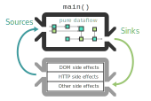

# Functional Reactive Programming


## Functional Programming Konzept
In den letzten Jahren ist das Thema funktionales Programmieren verstärkt aufgekommen. Die Ziele,
welche beim funktionalen Programmieren erreicht werden sollen, sind dabei die selben wie auch im objektorientierten Programmieren:

* Wartbarer Code
* Wiederverwertbarer Code
* Verständlicher Code

Auch wenn die Ziele der beiden Ansätze gleich sind, so sind die unterliegenden Paradigmen doch völlig unterschiedlich:
Beim objektorientieren Ansatz wird versucht, die Daten und die damit verbundenen Verhalten miteinander zu vereinen. 
Die daraus resultierende Vereinigung ist die Grundlage des OOP-Ansatzes: Das Objekt. 
In einem Objekt werden über Instanzvariablen Daten gehalten, die den Zustand des Objektes beschreiben. Zusätzlich
enthält das Objekt Verhalten in Form von Methoden, mit deren Hilfe der Zustand des Objektes manipuliert werden kann.

Ein einfaches Beispiel ist die Klasse Arbeiter:

```java
public class Arbeiter{
    private String name;
    private int gehalt;

    public Arbeiter(String _name, int _gehalt){
        this.name = _name;
        this.gehalt = _gehalt;
    }

    public int gehaltsErhoehung(int zuschlag){
        this.gehalt += zuschlag;
        return this.gehalt;
    }

    public String toString(){
        return this.name + " verdient " + this.gehalt;
    }
}
```
Nun könnten die Instanzen dieses Arbeiterobjektes in einer Liste gehalten werden, um sie so beispielsweise zu verwalten.
Ein Anwendungsfall könnte es des Weiteren sein, dass alle Arbeiter in dieser Liste eine Gehaltserhöhung bekommen sollen.
Um dies in einer objektorientierten Sprache wie in diesem Falle Java zu realisieren, müsste das zu schreibende Programm
über die Liste der Arbeiter iterieren und für jeden Arbeiter die Methode zur Gehaltserhöhung aufrufen.

```java
for (angestelltenListe Angestellter: tempAngestellter){
    tempAngestellter.gehaltsErhoehung(200);
}
```

Derselbe Sachverhalt kann natürlich auch mit einem funktionalen Ansatz abgebildet werden:

```javascript
arbeiter = [
  [ "Alice",  10000.0 ],
  [ "Bob", 12500.0 ]
]
```
Hier wird direkt der erste Unterschied zum objektorientieren Ansatz deutlich: Die Trennung von Daten und Verhalten.
Wo im OOP-Ansatz bei der Erstellung der Daten auch gleichzeitig die Methoden zum Manipulieren der Daten mitliefern
werden musste, so bleiben im FP-Ansatz die Daten rein. Hier können die Daten durch den Einsatz von einfachen Arrays
repräsentiert werden. 

Zur Veränderung der Daten können nun verschiedene Funktionen geschrieben werden. Dabei sollten allerdings verschiedene
Schlüsselkonzepte beachtet werden: 

<center><b>1. Funktionen haben eine einzige Aufgabe</b></center>

Die geschriebenen Funktionen haben genau eine Aufgabe. Dadurch wird erreicht das verschiedene Funktionen 
miteinander kombinierbar werden und so ein komplexeres Programm bilden. Zudem erhöht das Beschränken einer
Funktion auf eine einzige Aufgabe die Testbarkeit des Codes. Für das Arbeiterbeispiel bedeutet dies, dass
es eine Funktion names gehälter_erhöhen() geben wird, welche nur dafür Zuständig ist über die Arbeiter der 
Liste zu iterieren. Diese Funktions erhält zwei Eingabeparameter: Eine Liste mit Arbeiters und der eigentliche 
Gehaltserhöhung. 
Zusätzlich wird es eine Funktion gehalt_erhöhen() implementiert, welche anschließend nur zur Aufgabe hat, das Gehalt eines einzelnen 
Arbeiters zu erhöhen. 

<center><b>2. Daten sind Immutable</b></center>

Durch den Funktionsaufruf von gehalt_erhöhen() wird kein Wert des originalen Arrays verändert. Immutable bedeutet,
dass es keine Funktion geben kann, welche die Daten auf irgendeine weise verändern kann. Im OOP-Ansatz ist es übelich den
Zustand oder "state" eines Objektes beliebig zu verändern. Im FP-Ansatz hingegen werden nur Kopien der veränderten Daten 
erzeugt, mit denen im Verlauf des Programmes weitergearbeitet wird. Der originale "state" in einem funktionalen Programm
bleibt somit erhalten. 
Dies hat zum Vorteile das einerseits ein Funktionsaufruf auf den selben Daten in jedem Fall den selben Output besitzt,
zum anderen kann der Zustand so, falls gewünscht, über den gesamten Programmablauf verfolgt werden. Auch dieses 
Konzept trägt zur Lesbarkeit und Wartbarkeit des Codes bei.

<center><b>3. Funktionen sind rein (Pure)</b></center>

Funktionen verhalten sich im funktionalen Ansatz ähnlich wie mathemetische Funktionen. Bei einer mathematischen Funktion
wird ein oder mehrere Eingabewerte genau einem Ausgabewert zugeordnet. Egal wie oft diese Funktion mit den selben 
Eingabewerten berechnet wird, sie führt immer zu dem selben Ergebnis. 
Dies trifft auch auf die Funktionen im funktionalen Ansatz zu: Mit den selben Eingabeparametern erhält der Aufrufer 
jedes Mal den selben Rückgabewert. Dabei geht es vor allem darum, dass Funktionsaufrufe nicht von dem globalen State 
der Applikation abhängen sollen, welcher sich zur Laufzeit ändern kann. Ein Funktionsaufruf muss unabhängig vom State 
zu jeder Zeit vorhersagbar sein. 
Ein weiterer Punkt der zum Aspekt der Reinheit einer Funktion gehört, ist das Auftreten von Seiteneffekten (Side effects). 
Seiteneffekte können vielfältig sein: Das Ändern einer globalen Variable im Funktionsaufruf, das Lesen aus einer Datei oder
das Werfen einer Exception. Beispielsweise kann das Lesen einer Datei in einer Funktion den Rückgabewert unabhängig  
von den übergebenen Parametern verändern, was nicht mehr der Definition einer reinen Funktion entsprechen würde. 

<center><b>4. Funktionen sind erste Klasse (First-Class)</b></center>

Dieses Konzept wird nicht nur von rein funktionalen Programmiersprachen genutzt (z.b Javascript und PHP), ist allerdings
unabdingbar für den funktionalen Ansatz. First-Class sind Funktionen, welcher einer Variable im Programm zugeordnet werden
können. Dadurch können Funktionen wie ein normaler Datentyp behandelt werden und zugleich im Verlauf des Programmes ausgeführt 
werden.
Ebenfalls wird es dadurch möglich eine Funktion einer anderen Funktion als Übergabeparameter zu übergeben. Auch wird es
dadurch möglich Funktionen als Rückgabewert zu verwenden. So ist es beispielsweise möglich eine Filterfunktion zu erstellen,
welche als Parameter eine Funktion übergeben bekommt. Die übergebene Funktion entscheidet dann, ob Werte den Filter passieren
oder aussortiert werden.

Mit diesen vier Konzepten als Vorlage könnten die Funktionen zur Gehaltserhöhung folgendermaßen aussehen:

```javascript
var function gehaelter_erhoehen(arbeiterListe, erhoehung){
  let neueArbeiterListe = arbeiterListe.map(arbeiter =>{
    gehalt_erhoehen(erhoehung);
  })
  return neueArbeiterListe;
}
```

```javascript
var function gehalt_erhoehen(arbeiter, erhoehung){
  let neuerArbeiter =  [arbeiter[0], arbeiter[1] += erhoehung];
  return neuerArbeiter;
}
```


## Reactive Programming

Beim reaktiven Programmieren geht es darum, die Veränderung eines Zustandes zu beobachten und gegeben falls mit einer Veränderung
des eigenen Zustandes zu reagieren. Eine Zustandsänderung könnte zum Beispiel das Drücken eines Knopfes auf einer Benutzeroberfläche oder
aber das Abholen von Daten über einen HTTP Aufruf. Bibliotheken wie RxJS, xStream oder Most.js erlauben es von fast jeder Variable oder Objekt
ein Observable zu erstellen. So kann unter RxJS beispielsweise mit dem `just()` Operator ein Observable von der Zahl 1 erstellt werden:

```javascript
var oneStream = Rx.Observable.just(1);

oneStream.subscribe(number =>{
    console.log(number); \\prints 1
});
```

Ein Observable ist zu verstehen als ein Objekt, welche über einen bestimmten oder auch unbestimmten Zeitraum 
Werte ausgibt (emitted). Ein Observable ist somit zu stehen als ein Stream von Daten. Um an die emitteten Daten zu gelangen, kann dem Stream über die `subscribe()` Methode gelauscht werden. Erst nachdem jemand auf den Stream
subscribed hat, fängt der Stream an, Werte auszugeben. Dabei wird der Callback innerhalb der Subscribe Methode 
in jedes mal ausgeführt, sobald ein neuer Wert von dem Stream emittet wurde. 

```javascript
var numbers = [1,2,3];
var arrayStream. = Rx.Observable.form(numbers);

arrayStream.subscribe(number =>{
    console.log("Number " + number); 
}); 

//Output:
//Number 1
//Number 2
//Number 3
```

In diesem Beispiel wurde mit dem `fromArray()` Operator aus einem Array ein Observable erstellt und das Array
so als Stream verfügbar gemacht. Nach dem ein Observer den Stream abonniert (subscribed), emittet der Stream so lange Werte bis das Ende des Arrays erreicht ist. 
Ein Mittel die Streams darzustellen sind die sogenannten Marble-Diagramme: Diese Diagramme bestehen aus einem
Pfeil, welcher eine Zeitleiste darstellt.

-------------->

Auf dieser Zeitleiste könnten Werte als Events dargestellt werden, um zu verdeutlichen, dass diese Werte
über einen bestimmten Zeitraum emittet worden sind. Für das obere Beispiel würde eine Zeitleiste mit Events
folgendermaßen aussehen:

---1---2---3-->

Über einen bestimmten Zeitraum wurden also Events auf einem Stream ausgegeben. Da nach der 3 das Ende des 
Arrays erreicht ist, endet (completed) der Stream nach diesem Event. Dies wird durch einen Senkrechten Strich
in der Zeitleiste dargestellt.

---1---2---3--|->


### Der Observer
Der Observer wird in den oberen beiden Beispielen impliziert erstellt. Ein Observer besteht im Wesentlichen aus
drei Methoden: `onNext()`, `onError()` und `onComplete()`. In den Beispielen wurde mit der `subscribe()` Methode
ein neuer Observer erstellt, welcher nur die `onNext()` Methode als anonyme Funktion übergeben bekommen hat. Damit wird der Observer nur über einen
neue emitteten Wert des Streams informiert. Die `onComplete()` Methode würde im Beispiel nach dem Ausgeben des letzten
Wertes aufgerufen um dem Observer mitzuteilen, dass auf diesem Stream keine neuen Werte mehr ausgegeben werden.  

Dieses Designpattern wird auch Observerpattern genannt, was sich vermutlich schon alleine vom Namen "Observable" ableiten ließ.
Die untere Abbildung zeigt wie das Observerpattern in UML-Schreibweise aussieht.


<a>[[GBLE18]](#ref_gble18)</a>

Um hier die parallele zur RxJS Bibliothek zu ziehen: Die mit `subscribe()` übergeben Funktion ist in diesem Falle der Observer. Zu einen
Stream können beliebig viele Observer hinzugefügt werden. Das im UML angegebene Subject ist der eigentliche Stream. Die `registerObserver()`
Methode ist die `subscribe()` Methode des Observables.

### Das Observable
Das Observable ist ein Konstrukt mit der Aufgabe, die abonnierten Observer über neu erzeugte Werte zu informieren. Die Werte
selbst stammen dabei von einem Producer, welcher im inneren des Observables Werte generiert.

```javascript
var buttonEvent = document.querySelector('.myButton');
var clickStream = Rx.Observable.fromEvent('buttonEvent', click);
```

In diesem Beispiel wird ein Stream von Klicks auf einen Button erstellt. Der Producer des Stream ist in diesem Fall das Klickevent des
Knopfes. Ein Observable ist also das Bindeglied zwischen dem Producer, welcher die eigentlichen Werte emittet und den abonnierten Observern,
welche die emitteten Werte konsumieren. RxJS biete viele Funktionen an, um aus einer Variablen oder einer Eventsource ein Observable mit dem
dazu passendem Producer zu erstellen:

* from()        - Erstellt ein Observable von Datenstruktur und Iteriert über diese falls möglich
* just()        - Erstellt ein Observable von Datenstruktur und emittet eben diese
* fromEvent()   - Erstellt ein Observable von einer Eventsource und emittet das Event
* interval()    - Erstellt ein Observable welches in einem bestimmten Intervall aufsteigende Zahlen emittet

### Die Operatoren
Die Frage die man sich jetzt stellen kann, ist die, welchen Vorteil die Verwendung von Observables beziehungsweise Streams hat. 
Über ein Array kann auch mit einer Schleife iteriert werden oder von einer Eventsource muss in der Regel kein Stream erstellt werden
um diesen auszuwerten. Das Ware Potential von RxJS und anderen reaktiven Bibliotheken liegt in der Bereitstellung der Operatoren, welche
auf den Stream angewendet werden können.

Nehmen wir das Klickevent Beispiel von oben: Die Aufgabe soll es sein, die Anzahl der Klicks auf den Button zu zählen. Aber anstatt die
komplette Logik in die `subscribe()` zu packen, können wir uns einer Vielzahl an Operatoren bedienen, welche den Stream manipulieren. 
Zunächst sollen alle Events, die auf dem Stream passieren auf einen neuen Wert abgebildet werden. Dazu kann der `map()` Operator genutzt werden:

```
var buttonEvent = document.querySelector('.myButton');
var clickStream = Rx.Observable.fromEvent('buttonEvent', click);

var numberStream = clickStream.map(event => 1);
``` 

Im Diagramm würden die beiden Streams nun so aussehen:

clickStream &nbsp;&nbsp;&nbsp;&nbsp;&nbsp; ---x----x-x----x-x-->   
&emsp;&emsp;&emsp;&emsp;&emsp;&emsp;&emsp;&emsp;&emsp;&emsp;map()  
numberStream &nbsp;---1----1-1----1-1-->

Nun, da die Klickevents auf eine Zahl gemapt worden sind, müssen die vom numberStream emitteten Zahlen nur noch addiert werden. Dazu muss
es State geben, in welchem das Ergebnis der vorheringen Addition gehalten wird. Ein Operator mit eingebautem State ist der `scan()`
Operator. 

```javascript
var buttonEvent = document.querySelector('.myButton');
var clickStream = Rx.Observable.fromEvent('buttonEvent', click);

var numberStream = clickStream.map(event => 1);
var numberClickStream = numberStream.scan((accumulator, current) => accumulator + current);

numberClickStream.subscribe(number => console.log(number));

\\Output: 
\\1
\\2
\\3
...
``` 
clickStream &nbsp;&nbsp;&nbsp;&nbsp;&nbsp;&nbsp;&nbsp;&nbsp;&nbsp;&nbsp;&nbsp;&nbsp;&nbsp;&nbsp;&nbsp; ---x----x-x----x-x-->   
&emsp;&emsp;&emsp;&emsp;&emsp;&emsp;&emsp;&emsp;&emsp;&emsp;map()  
numberStream &nbsp;&nbsp;&nbsp;&nbsp;&nbsp;&nbsp;&nbsp;&nbsp;&nbsp;&nbsp;&nbsp;---1----1-1----1-1-->  
&emsp;&emsp;&emsp;&emsp;&emsp;&emsp;&emsp;&emsp;&emsp;&emsp;scan()  
numberClickStream &nbsp;---1----2-3----4-5-->

Der fold() Operator hält im ersten Parameter der übergeben Funktion (accumulator) den State. In dem zweiten Parameter (current) wird der
vom Stream emittete Wert entgegengenommen. Anschließend muss in der Funktion lediglich der derzeitige Wert auf den State addiert werden.
In diesem Beispiel wurden nur Zahlen addiert, allerdings können auch komplexe Objekte oder sogar Streams selbst emitted werden. 
Anstatt das Event auf eine '1' zu mappen, könnte das Event ebenso gut auf ein JSON Objekt gemapt werden:

```javascript
var buttonEvent = document.querySelector('.myButton');
var clickStream = Rx.Observable.fromEvent('buttonEvent', click)
    .map(event => {
        button: 'myButton',
        Wert: 1,
        eventDaten: event.data
    })
    .fold([], (acc, cur)=> acc.push(cur));
```

Hier wird dem `fold()` Operator als ersten Wert eine leere Liste übergeben. Diese dient als Seed für den State innerhalb des Operators.
Nachdem das erste Event den `fold()` Operator erreicht, wird das Event-JSON zu der Liste hinzugefügt. Würde man nun den clickStream 
abonieren, so würde man bei jedem Klickevent eine Liste mit JSON Objekten erhalten, deren länge davon anhängt, wie oft der Knopf 
gedrückt worden ist. 
Dieses Beispiel zeigt zusätzlich das für jeden Operator nicht jedesmal ein neuer Stream erstellt werden muss. Operatoren können 
beliebig lang auf einem Observable verkettet werden. Im oberen Fall wird das Oberservable mit dem `map()` Operator und dem `fold()`
Operator verknüpft. 

### Gebräuchliche Operatoren

Die hier vorgestellten Operatoren sind nur eine kleine Auswahl aus der RxJS Bibliothek, welche über 75 Operatoren enthält. Diese
Operatoren kommen in fast jedem Projekt zum Einsatz, falls es einen Berührungspunkt mit der RxJS Bibliothek gibt. Beispielsweise
verwendet Angular 2 in seinem HTTP-Modul Observables um REST-Aufrufe durchzuführen. Eine Anwendung muss also nicht komplett um die
Bibliothek herumkonzipiert werden, um die Vorteile von rxJS nutzen zu können.

#### Map
Der `map()` Operator ist vermutlich der am häufigsten benutzte Operator. Er kann Werte auf dem Stream auf beliebige Weise transformieren.
Wird ein Observable beispielsweise zum Ausgeben von Klickevents genutzt, kann mit Hilfe `map()` diesem Klickevent direkt ein eigener Wert
zugeordnet werden. Dadurch wird es im `subscribe()` einfacher, einen bestimmten Wert zu antizipieren.

clickStream &nbsp;&nbsp;&nbsp;&nbsp;&nbsp;&nbsp;&nbsp;&nbsp;&nbsp;&nbsp;&nbsp;&nbsp;&nbsp;&nbsp;&nbsp; ---x----x-x----x-x-->   
&emsp;&emsp;&emsp;&emsp;&emsp;&emsp;&emsp;&emsp;&emsp;&emsp;&emsp;&emsp;map()  
numberStream &nbsp;&nbsp;&nbsp;&nbsp;&nbsp;&nbsp;&nbsp;&nbsp;&nbsp;&nbsp;&nbsp;---1----1-1----1-1-->  

#### Merge
Durch den `merge()` Operator können eine beliebige Anzahl von Streams zu einem einzigen Stream kombiniert werden. Um bei dem
Beispiel eines Klickevents zu bleiben, könnten über hier die Events von vielen Streams zu einem einzigen verbunden werden.

clickStream1 &nbsp;&nbsp;&nbsp;&nbsp;&nbsp;&nbsp;&nbsp;&nbsp;&nbsp;&nbsp;&nbsp;&nbsp;&nbsp;&nbsp;&nbsp;&nbsp; ---x------x------x-->   
clickStream2 &nbsp;&nbsp;&nbsp;&nbsp;&nbsp;&nbsp;&nbsp;&nbsp;&nbsp;&nbsp;&nbsp;&nbsp;&nbsp;&nbsp;&nbsp; ------x-------x----->   
clickStream3 &nbsp;&nbsp;&nbsp;&nbsp;&nbsp;&nbsp;&nbsp;&nbsp;&nbsp;&nbsp;&nbsp;&nbsp;&nbsp;&nbsp;&nbsp; --------x------x---->   
&emsp;&emsp;&emsp;&emsp;&emsp;&emsp;&emsp;&emsp;&emsp;&emsp;&emsp;&emsp;merge()  
mergedStream &nbsp;&nbsp;&nbsp;&nbsp;&nbsp;&nbsp;&nbsp;&nbsp;&nbsp;&nbsp;&nbsp;&nbsp;&nbsp;---x--x-x-x---xx-x-->  

#### CombineLatest
Auch `combineLatest()` kann als Parameter eine beliebige Anzahl an Streams aufnehmen. Dieser Operator wird beispielsweise 
für Berechnungen benutzt, bei denen von mehreren Streams ein Eingabewert benötigt wird. `combineLatest()` merkt sich die
letzte Ausgabe von allen Streams und gibt erst einen Wert aus, wenn alle Streams mindestens einen Wert auf ihrem jeweiligen
Stream ausgegeben haben. Danach wird immer dann ein Wert ausgegeben, wenn einer der Eingabestreams einen Wert ausgibt, kombiniert
mit der letzten Ausgabe der anderen Streams.

inputStream1 &nbsp;&nbsp;&nbsp;&nbsp;&nbsp;&nbsp;&nbsp;&nbsp;----1---2------------3------->  
inputStream2 &nbsp;&nbsp;&nbsp;&nbsp;&nbsp;&nbsp;&nbsp;-----------A-----B--------C-->  
&emsp;&emsp;&emsp;&emsp;&emsp;&emsp;&emsp;&emsp;&emsp;&emsp;&emsp;&emsp;combineLatest()   
outputStream &nbsp;&nbsp;&nbsp;&nbsp;&nbsp;&nbsp;&nbsp;-----------A2---B2--B3--C3->  


#### Buffer
Über den `buffer()` Operator können auf einem Stream ausgegebene Werte gebuffert werden, bis ein Event über einen anderen Stream
ausgelöst wird. Der `buffer()` Operator könnte zum Beispiel genutzt werden, um Eingaben in eine Suchleiste zu buffern. So würde der
gebufferte Stream erst einen Wert ausgeben, wenn der Benutzer die Entertaste drückt. Die Ausgabe erfolgt über den zu buffernden Stream
in Form eines Arrays, welches alle Elemente, die zuvor auf dem Stream ausgegeben worden sind, enthält.

keyStream   &nbsp;&nbsp;&nbsp;&nbsp;&nbsp;&nbsp;---H---A---L--L----O------------->  
enterStream   &nbsp;&nbsp;&nbsp;---------------------x----------->  
&emsp;&emsp;&emsp;&emsp;&emsp;&emsp;&emsp;&emsp;&emsp;&emsp;buffer()  
resultStream   &nbsp;&nbsp;&nbsp;----------------------[H,A,L,L,O]->


### Hot und Cold Observables

In RxJS gibt es bei Observables zusätzlich eine Unterscheidung zwischen Hot und Cold Observables. Als Beispiel für ein Hot
Observable kann ein Stream genommen werden, welcher von dem `interval()` Operator erzeugt wurde:

```javascript
let liveStream = Rx.Observable.interval(1000);

setTimeout(() => {
   liveStream.subscribe( 
        data => console.log('Stream: ' + data);
    )
},3000)
```

Der liveStream Stream wurde so erzeugt, dass jede Sekunde ein hochzählender Wert emittet wird.

liveStream ---1---2---3---4---5---6--->

Allerdings gibt es für die ersten 3 Sekunden noch keinen Abonnenten, welcher die Werte aus dem Stream entgegennehmen könnte.
Der Timeout für den ersten Abonnenten wird erst 3 Sekunden nach Erstellung des Streams getriggert. Folgende Ausgabe wird auf 
der Konsole ausgegeben:

```
Stream: 4
Stream: 5
Stream: 6
```

Der Stream emittet also schon Werte noch bevor ein Observer ihn abonniert hat. Würde zu einem späteren Zeit ein weiterer Observer
den Stream abonnieren, würde dieser Observer erst beim nächsten Emit des Streams benachrichtig werden, alle vorhergehenden Werte
die vor dem Abonieren des neuen Observers liegen, bekommt der neue Observer nicht mit.

Anders verhält es sich mit Cold Observables. Hier wird für jeden Observer ein neuer Stream aufgemacht und nach einem abonnieren
des Streams bekommt der Observer alle Werte, welche von dem Stream emittet worden sind.

Als Beispiel eines Cold Observables kann man die Erzeugung eines Stream aus einem Array von Zahlen nehmen:

```javascript
var numbers = [1,2,3];
var arrayStream. = Rx.Observable.form(numbers);

setTimeout(() => {
   arrayStream.subscribe(number =>{
    console.log("First Sub " + number); 
});
},1000)

setTimeout(() => {
   arrayStream.subscribe(number =>{
    console.log("Second Sub " + number); 
});
},3000)
```

Ausgabe:
```
First Sub: 1
First Sub: 2
First Sub: 3

Second Sub: 1
Second Sub: 2
Second Sub: 3
```

In diesem Fall teilen sich die beiden Observer nicht einen Stream, sondern jeder für jeden Observer wird ein gesonderter Stream
erzeugt. Der Stream emittet keinen Wert solange nicht mindestens ein Observer den Stream abonniert hat. Ob ein Stream Hot oder Cold
ist hängt davon hab mit welchem Konstruktor das Observable erzeugt wurde.


## CycleJS
CycleJS ist ein funktionale reaktives Javascript Framework, geschrieben von André Staltz. CycleJS verbindet den das funktionale Konzept mit
einer Streaming Bibliothek. Dabei kann sowohl RxJS als auch das speziell für CycleJS entwickelte xStream als "Streamengine" genutzt werden.


### Konzept
Das Kernkonzept von CycleJS lautet: "Was wäre wenn der Nutzer eine Funktion wäre?". Es ist einfach sich eine moderne graphische 
Anwendung als eine große Funktion vorzustellen: Sie nimmt die Nutzereingaben des Nutzer über Eingabegeräte wie Maus und
Tastatur auf, verarbeitet diese, und gibt anschließend ein Resultat über den Bildschirm aus. Der Nutzer wiederrum nimmt die 
Ausgabe der Oberfläche als Eingabe, verarbeitet diese, und gibt die Ausgabe der Nutzerfunktion über seine "Ausgabegeräte" wie
Hände oder auch Sprache an die Oberfläche zurück. 


<a>[[MHUS16]](#ref_mhus16)</a>

Das obere Bild veranschaulicht dieses Konzept und zeigt gleichzeitig, woher CycleJS seinen Namen hat: Die Eingaben und Ausgaben
bilden einen Kreis, wo die Ausgaben der einen Funktion die Eingaben der anderen Funktion ist. Funktional sieht das Konzept 
folgendermaßen aus:

```
var UserOutput = UserFunction(DisplayInput);
var DisplayInput = DisplayFunction(UserOutput);
```

Hier erkennt man auch direkt, welche Lösung das CycleJS Framework bereitstellen muss. Es gibt eine zirkuläre Abhängigkeit zwischen
der Benutzerfunktion und der Oberflächenfunktion. Um diese Abhängigkeit deutlicher zu machen kann die Eingabe einer Funktion mit
der produzierenden Funktion subsituiert werden:

```
var UserOutPut = UserFunction(DisplayFunction(UserOutput));
```

Zu Beginn des Programmes ist der `UserOutPut` nicht definiert, weshalb er nicht genutzt werden kann um einen neuen Wert für die Displayfunktion zu generieren, was wiederum dazu führt das kein neuer `UserOutPut` generiert werden kann.  
CycleJS löst dieses Problem, indem 
es, anstatt beide Funktionen direkt miteinander zu verknüpfen, eine eigene `run()` Methode bereitstellt, welche als Argumente die 
`UserFunction()` und die `DisplayFunction()` erhält und so als Bindeglied zwischen den beiden Funktion dient.  
In CycleJS wird die `UserFunction()` mit `main()` bezeichnet. Sie enthält die Logik, die es dem Nutzer ermöglicht Eingaben zu machen und
transformiert diese Eingaben dahingehend, dass sie von der `DisplayFunction()` genutzt werden kann.  
Eine Oberfläche auf dem Display auszugeben
ist natürlich nur eine Weise, wie ein Computer mit der externen Welt interagieren kann. Ein Computer könnte auch Sound über die Boxen ausgeben,
einen HTTP-Request zu einem Server schicken oder über einen WebSocket mit einer anderen Anwendung kommunizieren. All diese Anwendungsfällen 
werden bei CycleJS unter dem Oberbegriff `Driver` zusammengefasst. Ein `Driver` ist also eine Funktion, welche wie die `DisplayFunktion()`, mit
dem Nutzer, beziehungsweise der externen Welt, agiert.  

### Sources and Sinks

Eine Beispielapplikation in CycleJS kann folgendermaßen aussehen:
```javascript
01 import xs from 'xstream';
02 import {run} from '@cycle/run';
03 import {div, input, p, makeDOMDriver} from '@cycle/dom';
04
05 function main(sources) {
06   const sinks$ = {
07    DOM: sources.DOM.select('input').events('change')
08       .map(ev => ev.target.checked)
09       .startWith(false)
10       .map(toggled =>
11         div([
12           input({attrs: {type: 'checkbox'}}), 'Toggle me',
13           p(toggled ? 'ON' : 'off')
14         ])
15       )
16   };
17   return sinks$;
18 }
19
20 run(main, {
21   DOM: makeDOMDriver('#app')
22 });
 ```

Was zunächst auffällt, ist, dass dieses Beispiel nicht die RxJS Bibliothek zum bereitstellen von Streams importiert. Stattdessen wird
die xStream Bibliothek benutzt, welche eigens für die Benutzung von CycleJS entwickelt wurde. Allerdings kann CycleJS ebenso gut mit RxJS oder
Most.js benutzt werden. Dabei unterscheiden sich diese Bibliotheken im Grund nur darin, welche Operatoren zur Verfügung gestellt werden und wie
die Operatoren und Funktionen benannt werden. So ist die 'subscribe()` Methode unter RxJS nun die 'addListner()' Methode in xStreams.   
Zudem macht die xStream Bibliothek keine Unterscheidung zwischen Hot und Cold Streams, da jeder mit xStream erzeugte Stream ein Hot Stream ist.  

Das der Beispielcode soll folgende Ausgabe produzieren:


Dazu wird im Programm zunächst mit der `makeDOMDriver()` ein neuer Driver für den DOM erstellt. Dieser DOM Driver kann in der HTML Datei
unter dem Tag `#app` den DOM manipulieren und bootstrapt so das Framework. Die `run()` Methode stellt der `main()` Methode den instanziierten
Driver über den Übergabeparameter `sources` zur Verfügung. Das `source` Objekt enthält alle Driver, welcher in der `run()` Methode angelegt
worden sind.  
Nun kann in der `main()` Methode ein neuer Stream erzeugt werden. In diesem Beispiel wird über den DOM Driver ein Stream von einem Event erzeugt,
welches jedesmal einen Wert emitten soll, fall sich der der Wert des Eingabefeldes ändert. Ein Marble-Diagram für Zeile 07 sieht wie folgt
aus:

Nutzer:  ---Click------Click----Click------Click---->  

sink$:   -----x----------x--------x----------x------>  

Der Nutzer klickt auf die CheckBox, was bei jedem Klick ein `Change` Event hervorruft. Der sink$ Stream emittet mit jedem Klick auf die
Checkbox nun ein komplettes Event. Da für die Anwendung nur der mit dem Event assoziierte Wert von Bedeutung ist, muss der Stream mit dem
`map()` Operator manipuliert werden. 

sink$: -----x--------x-------x------x---------x---->

&emsp;&emsp;&emsp;&emsp;&emsp;&emsp;&emsp;&emsp;&emsp;map()  
sink$:----true----false-----true---false-----true-->

In der `map()` Methode wird das Event auf sein eigentlichen Wert gemapt. Da das Event von einer Checkbox kommt, ist der assoziierte Wert
abwechselnd `true` oder `false`.  
Nachdem das Event auf den Wert gemapt worden ist, wird der Stream mit dem `startWith()` Operator initialisiert.  

sink$:---------true----false-----true---false-----true-->  

&emsp;&emsp;&emsp;&emsp;&emsp;&emsp;&emsp;&emsp;&emsp;startWith(false)    
sink$:false----true----false-----true---false-----true-->

Da der Stream am Ende auf einen virtuellen DOM gemapt wird, muss er einen initialen Wert haben. Würde kein Wert mit `startWith()` gesetzt, so
würde der DOM erst mit einer Aktion des Nutzers angezeigt werden, da erst durch eine Aktion ein Wert auf dem Stream emittet wird.  
Da der Stream
allerdings von dem DOM Driver genutzt wird um die Oberfläche darzustellen, würde auch hier eine Deadlock entstehen. Der Nutzer hätte keine 
Möglichkeit einen initialen Wert zu emitten weil keine View gerendert wurde und es wird keine View gerendert da kein initialer Wert von dem
Stream emittet wird.  
Die `startWith()` Methode emittet auf dem Stream ein initialen Wert, welche als Startpunkt für die View genutzt werden kann.

Zuletzt wird der Wert des Streams auf die DOM Elemente gemapt. Zusammengefasst sammelt der `sink$` Stream Events von einer Checkbox, wandelt
die Events auf dem Stream in `true` oder `false` um, initialisiert den Stream mit einem `false` und mapt diese Werte auf ein div Element, welches
die Checkbox besitzt von der die Events stammen und einen Paragraphen, der je nach dem welcher Wert auf dem Stream emittet wird auf "ON" oder "off"
geschaltet werden kann.  
Dieser `sink$` Stream wird von der `main()` Methode returned und dient als Eingabe für den Driver, welcher wiederum das `source` Objekt der `main()`
Methode bildet. 


### Side effects
Aufgrund der Trennung von Nebeneffekten wie Lesen einer Datei, Manipulieren des DOMs oder Abschicken eines HTTP-Requests von der reinen Logik des
Programmes, stellt CycleJS funktionales Framework dar. Die folgende Abbildung verdeutlicht den vorherigen Abschnitt und zeigt gut die Trennung von
Logik zu Nebeneffekten:


<a>[[ALEX16]](#ref_alex16)</a>

Die Sources, welcher der Main Funktion zur Verfügung gestellt werden diesen als Eingabewert. Dieser Eingabewert wurde von den Drivern erstellt und
kann das Lesen einer Datei, ein HTTP-Request oder ähnliche Operationen sein, welcher Nebeneffekte haben können. Dadurch, dass die `main()` Funktion
keinerlei State oder Nebeneffekte abhandeln muss, wird es sehr leicht Tests für ein CycleJS Programm zu schreiben. Eingabestreams von Sourcen können
leicht gemockt werden und die Ausgabe über den Sinkstream kann mit der Erwarten Ausgabe verglichen werden.  
Es muss nicht wie im Objektorientierten Umfeld eine Funktion aus dem Kontext gerissen werden und ein State nachgebildet werden, unter welchem
die Funktion richtige Ausgaben produziert.

### Erstellung von Komponenten
Wie in anderen Frameworks auch, erlaubt CycleJS die Erstellung von wiederverwertbaren Komponenten. Wie die `main()` Funktion in einer CycleJS
Anwendung, besteht eine Komponente ebenfalls aus einer einzelnen Funktion. Diese Funktion erhält auch Eingabewerte über ein Sources Objekt und
gibt mit dem Sink Objekt eine Ausgabe zurück. Dadurch entsteht eine Art fraktales Design bei der Erstellung einer CycleJS Applikation, wo
die Komponenten selbst eine kleine CycleJS Applikation darstellen.  

<a>[[ASTA15]](#ref_asta15)</a>

Komponenten erhalten über einen `props$` Stream alle Informationen, welche zur Erstellung der Komponente nötig sind. Dieser `props$` Stream wird
zusätzlich zu dem Source Stream übergeben, welches die Komponenten von seiner Parentkomponente erhält. So erhält die Komponente zugriff auf die
in der Parentkomponente definierten Driver und kann beispielsweise dazu dienen HTTP-Request zu rendern. Über den `props$` Stream würde die 
Childkomponente mitgeteilt bekommen, auf welchen HTTP-Request es lauschen soll. So können verschiedene dieser Komponenten instanziiert und
individuell konfiguriert werden.   
Die Ausgabe einer solchen Komponente wäre ein Sink Stream, welcher einen virtuellen DOM beinhaltet. Diese virtuellen DOM Streams können in der
Parentfunktion gebündelt werden und anschließend an den DOM Driver weitergereicht werden, wo die Komponenten gerendert werden.

### Beispiel Komponente
```javascript
function main(sources) {
  const changeWeight$ = sources.DOM.select('#weight').events('input')
    .map(ev => ev.target.value);
  const changeHeight$ = sources.DOM.select('#height').events('input')
    .map(ev => ev.target.value);

  const state$ = Observable.combineLatest(
    changeWeight$.startWith(70),
    changeHeight$.startWith(170),
    (weight, height) => {
      let heightMeters = height * 0.01;
      let bmi = Math.round(weight / (heightMeters * heightMeters));
      return {weight, height, bmi};
    }
  );

   const vdom$ = state$.map(({weight, height, bmi}) =>
     div([
       div([
         'Weight ' + weight + 'kg',
         input('#weight', {
           attrs: {type: 'range', min: 40, max: 140, value: weight}
         })
       ]),
       div([
         'Height ' + height + 'cm',
         input('#height', {
           attrs: {type: 'range', min: 140, max: 210, value: height}
         })
       ]),
       h2('BMI is ' + bmi)
     ])
  );

  return {
    DOM: vdom$,
  };
}

run(main, {
  DOM: makeDOMDriver('#main-container')
});
```

Im oberen Codebeispiel ist eine BMI Applikation zu sehen, in welcher zwei Slider benötigt werden um den BMI einer Person zu berechnen. Von diesen beiden
Slidern wird ein Stream von Eingaben erstellt und im `state$` Stream zunächst kombiniert. `combinedLatest()` nimmt dabei als Argumente eine beliebige 
Anzahl an Streams an und emittet selbst einen Wert, wenn einer der beiden Argumentstreams einen neuen Wert emittet hat. Zusätzlich wird dabei der letzte
emittete Wert der übrigen Streams ausgegeben. Der `state$` Stream enthält nun alle Werte, welche auf der Oberfläche Angezeigt werden sollen.  
Das Problem ist, dass bei der Erstellung der Slider Elemente viel Code doppelt geschrieben werden muss. Hier würde sich anbieten eine Sliderkomponente
zu erstellen, welche eine Codedublizierung verhindert.


```javascript
function LabeledSlider(sources, props$) {
  const change$ = sources.DOM.select('.slider').events('input')
    .map(ev => ev.target.value);
  
  const initialValue$ = props$.map(props => props.init).first();
  const value$ = initialValue$.concat(change$);

  const state$ = Observable.combineLatest(value$, props$, (value, props) => {
    return {
      label: props.label,
      unit: props.unit,
      min: props.min,
      max: props.max,
      value: value,
    };
  });

  const vtree$ = state$.map(state =>
      div('.labeled-slider', [
        label('.label', `${state.label}: ${state.value}${state.unit}`),
        input('.slider', {type: 'range', min: state.min, max: state.max, value: state.value})
      ])
    );

  return {
    DOM: vtree$,
    value: state$.map(state => state.value),
  };
}
```
Die Funktion `LabeledSlider()` erhält über das das `sources` Objekte zugriff auf alle Driver, welche auch das Paraentobjekt hätte. Über die `props$` kann 
nun der Anfangswert, Min und Max Werte und die Beschriftung des Sliders vergeben werden. Von der Sliderkomponente wird am Ende ein virtueller DOM sowie
der aktuelle Wert der Komponente zurück an die Parentkomponente gegeben. Die neue Sliderkomponente kann nun in der `main()` Funktion verwendet werden.

```javascript
function main(sources) {
  const weightProps$ = Observable.of({
    label: 'Weight',
    unit: 'kg',
    min: 40,
    max: 150,
    init: 70
  });

  const weightSinks$ = LabeledSlider({sources, weightProps$});

  const heightProps$ = Observable.of({
    label: 'Height',
    unit: 'cm',
    min: 140,
    max: 220,
    init: 170
  });

  const heightSinks$ = LabeledSlider({sources, heightProps$});

  const bmi$ = Observable.combineLatest(weightSinks$.value, heightSinks$.value,
    (weight, height) => {
      const heightMeters = height * 0.01;
      const bmi = Math.round(weight / (heightMeters * heightMeters));
      return bmi;
    }
  );

  const vtree$ = Observable.combineLatest(
    bmi$, weightSink$.DOM, heightSink$.DOM, (bmi, weightVTree, heightVTree) =>
      div([
        weightVTree,
        heightVTree,
        h2('BMI is ' + bmi)
      ])
  )

  return {
    DOM: vtree$
  };
}
```
Die `main()` Funktion wurde in diesem Beispiel refactored, um Gebrauch von der neu erstellten Sliderkomponente zu machen. Die beiden
Slider werden nun in `weightSink` und `heightSink` Streams gehalten. Über die `props$` erhalten die beiden Slider ihrer jeweiligen 
Eigenschaften.  
Um den BMI zu berechnen, können die beiden Sliderstreams zu einem neuen Stream kombiniert werden, welcher bei jeder Änderung eines Sliders direkt den neuen BMI Wert berechnet und emittet. Zur Darstellung des DOMs werden ebenfalls beide Sliderstreams kombiniert,
nur wird anstelle des akutellen Wertes der DOM der Sliderkomponente mit dem DOM der Parentkomponente zusammengefügt. Diese Zusammenführung bildet den
`vtree$` Stream, welcher an der DOM Driver zur Renderung weitergeleitet wird.

### Model-View-Intent Pattern
Wenn die Labelsliderkomponente betrachtet wird, fällt schnell auf das manche Streams nur der Darstellung dienen und wieder andere eine Art Zustand halten, welcher 
durch den virtuellen DOM dargestellt wird.  
Umgangssprachlich werden diese Bestandteile auch View und Model genannt. Die View soll dabei die Daten im Model anzeigen.
Normalerweise wird bei dem allgemeinen MVC Pattern die View mit einem Controller gepaart, welcher die Aufgabe hat das Model mit der View zu verbinden und das Model durch 
Eingaben vom Nutzer zu verändern. 


<a>[[HDOR16]](#ref_hdor16)</a>

Was zum normalen MVC Pattern nun noch fehlt ist ein Controller, der jeweils die View als auch das Model kennt und bei miteinander vereint. Dies wäre der Objektorinierte
Ansatz. In einem funktonalem Framework wie CycleJS gibt es allerdings keine Objekte, die wiederum andere Objekte mit neuen Informationen updaten. Stattdessen
eignet sich für ein solches Framework das Model-View-Intent Pattern.   
Das eigentlich neue ist hier nur der Intent-Teil. Mit Intent ist gemeint, was der Nutzer mit einem Klick auf einen Knopf oder das Verschieben eines Reglers im Grundsatz
erreichen möchte. Am beispiel der Sliderkomponente im BMI Rechner ist der Intent des Benutzers das Einstellen einer neuen Körpergröße oder Körpergewicht. 
Mit diesem Ansatz kann die Sliederkomponente nocheinmal refactored werden.

```javascript
function intent(DOMSource) {
  return DOMSource.select('.slider').events('input').map(ev => ev.target.value);
}

function model(newValue$, props$) {
  const initialValue$ = props$.map(props => props.init).first();
  const value$ = initialValue$.concat(newValue$);
  return Rx.Observable.combineLatest(value$, props$, (value, props) => {
    return {
      label: props.label,
      unit: props.unit,
      min: props.min,
      max: props.max,
      value: value,
    };
  });
}

function view(state$) {
  return state$.map(state =>
      div('.labeled-slider', [
        label('.label', `${state.label}: ${state.value}${state.unit}`),
        input('.slider', {type: 'range', min: state.min, max: state.max, value: state.value})
      ])
    );
}

function LabeledSlider(sources) {
  const action$ = intent(sources.DOM);
  const state$ = model(action$, sources.props);
  const vtree$ = view(state$);
  return {
    DOM: vtree$,
    value: state$.map(state => state.value),
  };
}
```

Hier wird das MVI-Pattern gut ersichtlich: Der Nutzer hat die Absicht (Intent), den Slider zu verändern und damit eine neue Eingabe zu veranlassen. 
Der daraus entstehende Eingaben Stream wird an das Model weitergereicht, welches sich aufgrund der Eingabe verändert. In diesem Fall würde der neue
Wert vom Slider das `value` Feld aktualisieren. Aufgrund der Änderung im Model wird eine Änderung in der View angestoßen, welche letztendlich von der
Childkomponete an die Parentkomponete und von dort an den DOM Driver weitergegeben wird.  


<a>[[DAVI16]](#ref_davi16)</a>

Dieses Diagramm verdeutlicht die Struktur der Komponente sehr gut. Auch in der Sliderkomponente wird aus der Absicht eine vom Benutzer ausgeführte
Aktion, welche an das Model weitergegeben wird und schlussendlich zur View wird, welche den virtuellen DOM an den Sink Stream der Komponente weitergibt.
Zwischen diesen Schritten können Artefakte entstehen, welche ebenfalls für die Parentkomponente bestimmt sein kann und nicht der virtuelle DOM ist. Im
Fall der Sliderkomponente wäre dies der momentane Wert der Sliderkomponente, welche ebenfalls über den Sink Stream an die Parentkomponente weitergegeben
wird. Der aktuelle Wert wird in der Komponente vom `state$` Stream entnommen.


## Quellen

<a name="ref_davi16">[DAVI16]</a>: David: Composition in CycleJS, Choo, React and Angular2 16.07.2016, URL: http://blog.krawaller.se/posts/composition-in-cyclejs-choo-react-and-angular2/ (letzter Zugriff: 29.06.2018)

<a name="ref_hdor16">[HDOR16]</a>: Hannes Dorfmann: MODEL-VIEW-INTENT ON ANDROID, 04.03.2016, URL: http://blog.krawaller.se/posts/composition-in-cyclejs-choo-react-and-angular2/ (letzter Zugriff: 29.06.2018)

<a name="ref_asta15">[ASTA15]</a>: Andre Stalz: Components, 2015, URL: https://cycle.js.org/components.html (letzter Zugriff: 29.06.2018)

<a name="ref_alex16">[ALEX16]</a>: Alex: Demystifying Cycle.js (core source), 13.04.2016, URL: https://medium.com/@_whitecolor/demystifying-cycle-js-core-source-7bcae39fb64c (letzter Zugriff: 29.06.2018)

<a name="ref_mhus16">[MHUS16]</a>: Maarten Hus: Post-MVC part 7: Cycle.js 28.07.2016, URL: http://dontpanic.42.nl/2016/07/cyclejs.html
(letzter Zugriff: 29.06.2018)

<a name="ref_gble18">[GBLE18]</a>: Gregory Bleiker 18.01.2018 URL: https://en.wikipedia.org/wiki/Observer_pattern#/media/File:Observer_w_update.svg
(letzter Zugriff: 29.06.2018)


