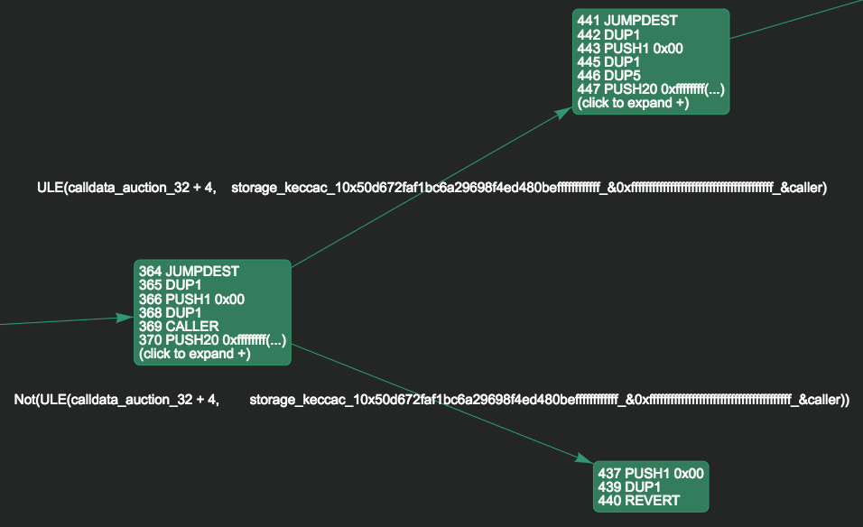

# Smart Contracts
<!-- load css for math symbols -->
<link rel="stylesheet" href="https://cdnjs.cloudflare.com/ajax/libs/KaTeX/0.5.1/katex.min.css">
<link rel="stylesheet" href="https://cdn.jsdelivr.net/github-markdown-css/2.2.1/github-markdown.css"/>

Autor: Cem Basoglu

Mit der Erweiterung der Blockchain und Distributed Ledger Technologien um [Smart
Contracts](/blockchain/usecases/#smart-contracts), ergeben sich vielseitige
Möglichkeiten für neue und bestehende Anwendungsbereiche
[[REYN18](#ref_reyn18), [LASK18](#ref_lask18), [STRU18](#ref_stru18)]. Wie mit
jeder neuen Technologie, aus denen sich neue Möglichkeiten ergeben, gehen diese
auch bei Smart Contracts mit neuen Risiken einher. Neben rechtlichen und
finanziellen Risiken nehmen Fehler im Design bzw. der Implementierung von
Smart Contracts, einen weitaus größeren Stellenwert ein. Im Gegensatz zu
klassischen Applikationen, lassen sich einmal veröffentlichte Smart Contracts
nicht mehr updaten und auch durch die Fehler verursachten Änderungen am
Distributed Ledger nicht mehr rückgängig machen. In diesem Zusammenhang wirkt
die positive [Eigenschaft](/blockchain/technologie/#eigenschaften-einer-blockchain)
von Distributed Leders, der Unveränderlichkeit von Transaktionsblöcken,
kontraproduktiv auf die Entwicklung von Smart Contracts.

## Vulnerabilities
Da Smart Contracts in der Regel ebenfalls Vermögenswerte verwalten, ist es
essenziell, mögliche Schwachstellen bereits im Voraus zu erkennen. Dabei liegen
die meisten Schwachstellen nicht direkt in dem implementierten Codeblock,
sondern ergeben sich erst durch die unberücksichtigte Wechselwirkung, mit der
zugrunde liegenden Smart Contract Plattform.

Wie fatal die Folgen dieser Schwachstellen sind, zeigen die jüngsten Ereignisse.
So konnten Angreifer, Ethereum Tokens im Wert von rund 60 Millionen Dollar,
durch die Ausnutzung einer Schwachstelle im DAO (Dezentrale Autonome
Organisation) Smart Contract, entwenden [[CAST16](ref_cast16)]. In einem
anderen Fall sorgte eine Schwachstelle im Smart Contract dafür, dass Tokens im
Wert von rund einer halben Millionen Dollar nicht mehr ausgezahlt werden
konnten [[GOVE16](ref_gove16)].

<!--
Für Präsi:

https://vessenes.com/more-ethereum-attacks-race-to-empty-is-the-real-deal/s

https://medium.com/aikon/automated-smart-contract-security-de2daebfbef4
-->

Da Smart Contracts erst in den vergangenen Jahren an Bedeutung gewonnen haben,
entstehen derartige Schwachstellen, durch den Mangel an Erfahrungen um diese
zu erkennen und zu vermeiden. In diesem Abschnitt werden daher zunächst die
häufigsten Fallstricke betrachtet und anschließend mögliche Vorgehensweisen
präsentiert.

### Call-Stack-Tiefe
Die Ethereum Virtual Machine (EVM) begrenzt die Call-Stack-Tiefe einer
Transaktion auf 1024 Aufrufe. Somit kann ein Angreifer die Call-Stack-Tiefe
einer Transaktion, mittels rekursiven Aufrufen, künstlich vor die Limitierung
positionieren, um anschließend Fehler in der darauf folgenden zu Verarbeitung
der Transaktion zu provozieren.

```javascript
contract auction {
  mapping(address => uint) refunds;
  // [...]
  function withdrawRefund(address recipient) {
    uint refund = refunds[recipient];
    refunds[recipient] = 0;
    recipient.send(refund);
  }
}
```

Obwohl die Funktion in sich keine Fehler aufweist und auch dem Empfänger
vertraut werden kann, schlägt der Aufruf `recipient.send(refund)` fehl,
da `send(...)` ebenfalls die Call-Stack-Tiefe erhöht. Da jedoch alle zuvor
ausgeführten Änderungen erfolgreich waren, wird das Konto des Empfängers auf 0
gesetzt, ohne den Betrag tatsächlich transferiert zuhaben.

Um eine derartige Schwachstelle zu vermeiden, ist Empfehlenswert den
Rückgabewert der `send(...)`-Funktion auszuwerten und die Ausführung wie folgt
mit `throw` zu terminieren.

```javascript
if (!recipient.send(refund)) { throw; }
```

Durch die Terminierung mit `throw`, werden durch die Transaktion, keine State-
Änderungen in den Distributed Ledger übernommen. Damit bleibt das Guthaben
des Empfängers auch dann erhalten, wenn der darauf folgende Transfer
fehlschlägt. Durch diesen Angriff kann sich der Angreifer zwar keinen
finanziellen Vorteil verschaffen, aber einen Schaden bei den Guthabenbesitzern
verursachen.

### Re-Entrency und Cross-function Race Conditions
Auf den ersten Blick erfüllen beiden Funktionen im folgenden Smart Contract die
an die jeweilige Funktion gestellten Anforderungen. Der Benutzer darf mit der
Funktion `transfer(...)` einen Betrag, der sein eigenes Guthaben nicht
übersteigt, einer beliebigen anderen Adresse zuordnen und mit der Funktion
`withdrawBalance()` das gesamte eigene Guthaben, an die hinterlegte Adresse
überweisen.

```javascript
contract auction {
  mapping (address => uint) private userBalances;
  function transfer(address to, uint amount) {
      if (userBalances[msg.sender] >= amount) {
         userBalances[to] += amount;
         userBalances[msg.sender] -= amount;
      }
  }
  function withdrawBalance() public {
      uint amountToWithdraw = userBalances[msg.sender];
      msg.sender.call.value(amountToWithdraw)();
      userBalances[msg.sender] = 0;
  }
}
```

Mit der sogenannten Re-Entrency Attacke, kann sich ein Angreifer das gesamte
Guthaben in dem Smart Contract (Guthaben aller Benutzer) auszahlen lassen,
in dem er einen eigenen Smart Contract mit der Default-Funktion implementiert.
Die Default-Funktion in einem Smart Contract wird aufgerufen, sobald eine
Transaktion an die Smart Contract Adresse eingeht. Die Default-Funktion ruft
wiederum erneut die `withdrawBalance()`-Funktion auf. Da in der
`withdrawBalance()`-Funktion das Guthaben des Angreifers an die böswillige
Smart Contract Adresse überwiesen wird, ergibt sich somit eine rekursive
Schleife zwischen den beiden Smart Contracts. Damit wird die Zeile
`userBalances[msg.sender] = 0` erst erreicht, wenn das gesamte Guthaben im
Smart Contract aufgebraucht ist, wodurch die `call(...)`-Funktion fehlschlägt.

Statt des erneuten Aufrufs der `withdrawBalance()`-Funktion, kann der Angreifer
auch eine Cross-function Race Condition provozieren. Dazu wird erneut ein
böswilliger Smart Contract implementiert und stattdessen diesmal die
`transfer(...)`-Funktion in der Default-Funktion aufgerufen. Somit wird das
Guthaben einer anderen Adresse zugeordnet, bevor das seiner Adresse zugeordnete
Guthaben auf 0 gesetzt wird.

Beide Schwachstellen lassen sich beheben, in dem das Guthaben der aufrufenden
Adresse vor der Ausführung der Überweisung auf 0 gesetzt wird. Um im Fehlerfall
das Guthaben wiederherzustellen, empfiehlt es sich zusätzlich den Rückgabewert
der `send()`-Funktion zu prüfen, die Ausführung mit `throw` zu terminieren und
damit alle durch die Transaktion entstandenen Änderungen am State, rückgängig zu
machen.

### Denial of Service
Im folgenden Smart Contract sollen die Teilnehmer einer Auktion, mit dem Aufruf
der `bid()`-Funktion an der Auktion teilnehmen können. Dazu muss der Teilnehmer
einen Betrag größer als das aktuelle Höchstgebot überweisen. Wird das aktuelle
Höchstgebot überboten, erhält der alte Höchstbietende seinen zuvor überwiesenen
Betrag zurück. Bei der Implementierung werden alle zuvor genannten
Vorgehensweisen, wie die Prüfung des Rückgabewerts der `send(...)`-Funktion
und die Terminierung mit `throw` im Fehlerfall, entsprechend in der
`bid()`-Funktion implementiert.

```javascript
contract auction {
  address currentLeader;
  uint highestBid;

  function bid() {
      if (msg.value <= highestBid) { throw; }
      if (!currentLeader.send(highestBid)) { throw; }

      currentLeader = msg.sender;
      highestBid = msg.value;
  }
}
```

In diesem Fall kann ein Angreifer jedoch die Abgabe weitere Gebote blockieren,
in dem er einen Smart Contract mit einer Default-Funktion implementiert, die
immer zu einem Fehler, z.B durch die Überschreitung der Call Stack Tiefe, führt.
Wird nun ein neues Höchstgebot abgegeben, erhält der aktuelle Höchstbieter
(Angreifer) sein Gebot wieder, wodurch die Default-Funktion im Smart Contract
des Angreifers aufgerufen wird. Da diese jedoch fehlschlägt, liefert `send(...)`
einen Fehler zurück, wodurch die Ausführung terminiert wird und alle Änderungen
rückgängig gemacht werden. Somit ist der Angreifer weiterhin der Höchstbietende
und neue Höchstgebote schlagen immer fehl.

Eine mögliche Lösung besteht darin, in diesem Fall keine Terminierung durch den
`throw` im Fehlerfall vorzunehmen. Alternativ kann auch eine Liste der
alten Höchstbietenden zzgl. der Gebote geführt und ganz auf die automatische
Auszahlung verzichtet werden. Über eine zusätzliche Funktion können sich
anschließend die in dieser Liste geführten Höchstbieter Ihr Gebot erstatten
lassen.

## Sicherheitsmaßnahmen
Aus den bisherigen Erfahrungen mit Smart Contracts, im speziellen mit der
Ethereum Virtual Machine, haben sich bestimme Vorgehensweisen und -muster
ergeben. Einige wurden bereits in dem vorangegangen Abschnitten vorgestellt und
sollen in diesem Abschnitt weiter generalisiert werden.

### Checks-Effects-Interactions-Pattern
Smart Contracts können direkt oder indirekt mit anderen Smart Contracts im
Distributed Ledger interagieren. Unabhängig davon, ob diese Interaktion
beabsichtigt ist oder durch die Default-Funktion eines Zahlungsempfänger
herbeigeführt wird, sollte in jedem Fall bedacht werden, dass durch den Aufruf
einer externen Funktion, auch der Kontrollfluss an diese übergeben wird. Um die
Risiken, die damit einhergehen zu minimieren, kann das
Checks-Effects-Interactions-Muster angewandt werden [[VOLL18](#ref_voll18)].

Diese ähneln den Coding Standards der *klassischen* Softwareentwicklung
[[SEAC18](#ref_seac18)] mit der Ausnahme, dass die Änderungen am State schon
vorgenommen werden, bevor die damit verbundene Aktion erfolgreich durchgeführt
wurde. Das Muster wird in folgende Teilschritte unterteilt.

1. **Eingabe Parameter und State prüfen**

   Alle Eingabe Parameter der Funktion werden zunächst validiert und ggf. mit
   dem State abgeglichen. Dazu zählt die Prüfung ob der Aufrufer die Funktion
   aufrufen darf oder über das in den Eingabeparametern angeforderte Guthaben
   verfügt.
2. **State Änderungen vornehmen**

   Nach erfolgreicher Validierung der Parameter werden anschließend die
   Änderungen am State vorgenommen.
3. **Smart Contract Interaktionen durchführen**

   Erst zum Schluss werden alle Aktionen durchgeführt, die zu einer direkten
   oder indirekten Interaktion mit anderen Smart Contracts führen können. Im
   Fehlerfall wird die Ausführung mit einem `throw` beendet, sodass Änderungen
   am State aus Schritt 2 rückgängig gemacht werden.
   Wie in Beispiel [DoS](#denial-of-service) demonstriert, hängt die
   Terminierung mit `throw` jedoch stark vom Anwendungsfall ab.

### Update- und andere Schutzmechanismen
Um auf neu entdeckte Sicherheitsrisiken reagieren zu können, bieten sich diverse
Maßnahmen an. Zum einen lassen sich Schutzmechanismen implementieren, die im
Ernstfall die Ausführung bestimmter Funktionen im Smart Contracts pausieren und
zum anderen können z.B. Auszahlungen in der Höhe oder Häufigkeit gedrosselt
werden, um im Ernstfall genug Zeit für Reaktionen zu haben. Zusätzlich kann ein
externer Dienst außerhalb des Distributed Ledgers implementiert werden, der in
regelmäßigen Abständen die State-Integrität des Smart Contracts prüft und bei
unschlüssigen Zuständen die Verantwortlichen benachrichtigt.

Zwar helfen diese Mechanismen dabei verdächtige Aktivität im Smart Contract zu
erkennen, um die Sicherheitslücke jedoch zu schließen, ist es notwendig den
Smart Contract updaten zu können. Da dies, wie einleitend erwähnt, nicht von der
Ethereum Plattform vorgesehen ist, muss entsprechende Funktionalität im Smart
Contract implementiert werden. Hierzu kann eine Funktion implementiert werden,
die nur von bestimmten Personen (z.B. dem Besitzer) aufgerufen werden darf und
das aktuelle Guthaben und den State des Smart Contracts, an einen neuen Smart
Contract transferiert.

## Formale Verifikation
*"Im Spektrum der qualitätssichernden Maßnahmen im Software-Entwurf gehören
formale Spezifikations- und Verifikationsmethoden heute zweifellos zu den
stärksten Waffen in puncto Fehlererkennung und Nachweis von
Korrektheitseigenschaften"* [[REIF99](#ref_reif99)]. Dazu werden die zu überprüfende
Software und die Spezifikation in einem mathematischen Theorem formalisiert, um
automatisiert, mittels Theorembeweisern, eventuelle Abweichungen des
Softwaremodells von der Spezifikation nachzuweisen. Zu den bekanntesten
Theorembeweisern, gemessen an der bereits formalisierten
[Top 100 mathematischer Sätze](http://www.cs.ru.nl/~freek/100/), gehören
[HOL Light](http://www.cl.cam.ac.uk/~jrh13/hol-light/) und
[Isabelle/HOL](https://isabelle.in.tum.de/).

Um für die Formalisierung eines Smart Contracts, nicht die gesamte Ethereum
Virtual Machine formalisieren zu müssen, existiert bereits ein Model der EVM für
diverse Theorembeweiser [[HIRA17](#ref_hira17)] zu denen auch der Isabelle/HOL
zählt. Basierend auf diesem Modell der EVM, kann nun vielmehr nur der Smart
Contract formalisiert und gegen eine gegebe Spezifikation geprüft werden.
Darüber hinaus gibt es noch weitere Ansätze die EVM zu formalisieren
[[HILD17](#ref_hild17)] und folgende Werkzeuge, um Schwachstellen im Smart
Contract zu lokalisieren.

### Mythril
Dieses Tool ist spezialisiert auf die formale Verifikation von Smart Contracts
und bietet dazu sowohl eine Schnittstelle um eigene Spezifikationen zu definieren, als
auch ein CLI (Command Line Interface) um typische Fehler im Smart Contract
nachzuweisen. Angewandt auf das [Re-Entrency Beispiel](#re-entrency-und-cross-function-race-conditions)
aus dem vorherigen Abschnitt, wird unteranderem folgender Hinweis generiert.

```bash
$ myth -x /tmp/test.sol

....
==== State change after external call ====
Type: Warning
Contract: Unknown
Function name: withdrawBalance()
PC address: 360
The contract account state is changed after an external call. Consider that the called contract could re-enter the function before this state change takes place. This can lead to business logic vulnerabilities.
--------------------
In file: /tmp/test.sol:12
userBalances[msg.sender] = 0
--------------------
....

```

Neben einer Reihe weiterer Warnungen und Informationen, wird die Re-Entrancy
Schwachstelle korrekt erkannt und die entsprechende Zeile im Solidity Code
ausgegeben. Neben der Schwachstelle wird ebenfalls ein Hinweis auf die
Sicherheitsmaßnahme, in diesem Fall das [Checks-Effects-Interactions-Pattern](#checks-effects-interactions-pattern),
ausgegeben.

#### Smart Contract Graph
Eine weitere nützliche Funktion ist dass generieren von Kontrollflussgraphen
zu einem Smart Contract. Dazu kann neben dem Paramter `-g`, entweder der
Solidity Code oder der Bytecode der CLI übergeben werden.



Abbildung 2.1.3.1 - Kontrollflussgraph

Die Darstellung zeigt einen Ausschnitt aus dem Graphen, zu dem [Re-Entrancy](#re-entrency-und-cross-function-race-conditions)
Beispiel aus dem vorherigen Abschnitt. Die Knoten stellen dabei Codeblöcke dar
und enthalten die EVM-Befehle [[EVMO18](#ref_evm18)], die beim Erreichen dieses
Knotens ausgeführt werden. Die Kanten repräsentieren den Pfad, die je nach
Erfüllung der an der Kante ausgewiesenen Bedingung genommen wird. Die Bedingungen
in der Darstellung entsprechen der `if (userBalances[msg.sender] >= amount)` in
der `transfer(...)`-Funktion.


#### Spezifikationen definieren
Neben den bereits verfügbaren Spezifikationen, die per CLI gegen eigene Smart
Contract ausgeführt werden können, ist es ebenfalls möglich eigene
Spezifikationen zu implementieren. Angenommen es soll laut Spezifikation
sichergestellt werden, dass eine bestimmte State-Variable nur von dem Smart
Contract Besitzer geändert werden kann. Unter Verwendung der im Ethereum Yellow
Paper [[WOOD18](#ref_wood18)] eingeführten Notation kann dies wie folgt als
Theorem ausgedrückt werden.

$$\begin{array}{c}
P(\sigma) \wedge (I_b[\mu_{pc}] == SSTORE) \wedge (\mu_s[0] == 1) \wedge (I_s != \sigma[I_a]_s[0])
\end{array}$$
<!-- fix atom syntax highlighting error --><span style="font-size:2px">_</span>
Ein Verstoß gegen die Spezifikation kann nachgewiesen werden, wenn zu einem
beliebigen Zeitpunkt diese logische Bedingung erfüllt werden kann. Dabei prüft
$P(\sigma)$ ob es einen [Pfad](#smart-contract-graph), unter Verwendung des
globalen Zustands ($\sigma$), zu der Instruction ($I_b[\mu_{pc}]$) am aktuellen
Programmcounter gibt und ob dieser dem `SSTORE` EVM-Befehl entspricht. Diese
Instruction ist laut dem EVM-*Instruction-Set* der einzige Maschinenbefehl, der
den Speicher und damit die State-Variablen des Smart Contracts ändern kann. Die
Teilbedingung $\mu_s[0] == 1$ erfordert, dass die oberste Position im Stack
($\mu_s[0]$) mit dem Wert 1 befüllt ist. Da der `SSTORE`-Befehl, die Smart
Contract Speicheradresse von der obersten Position im Stack liesst, wird somit
geprüft, ob die gewünschte State-Variable geändert werden soll. An welcher
Speicheradresse eine Variable persistiert wird, hängt von der Reihenfolge der
im Solidity-Code definierten Variablen ab. Sind alle bisherigen Teilbedingungen
erfüllt, kann somit nachgewiesen werden, dass die aktuell auszuführende
Instruction die State-Variable an der Speicheradresse 1 beschreibt. Da
zusätzlich nachgewiesen werden soll, ob die State-Variable von jemand anderem
als dem Smart Contract Besitzer geändert wird, prüft die letzte Teilbedingung,
ob der aktuelle Aufrufer ($I_s$) vom Besitzer abweicht. Da Smart Contracts das
Konzept eines Besitzer nicht nativ unterstützen, wird der Besitzer in der Regel
im Konstruktor des Smart Contracts in einer State-Variable gespeichert. In
diesem Beispiel wird mit $\sigma[I_a]_s[0]$ angenommen, dass der Besitzer in der
Speicheradresse 0 des Smart Contracts $I_a$ des globalen States $\sigma[x]_s$
gehalten wird.
<!-- fix atom syntax highlighting error --><span style="font-size:2px">_</span>

Die Spezifikation wird in Pyhton implementiert und nachgewiesen. Dazu kann das
Mythril Framework im Python-Script geladen und anschließend der
[Graph](#smart-contract-graph) und die jeweiligen Instructionen wie folgt
untersucht werden.

```python
from mythril.ether.util import compile_solidity
from mythril.ether.ethcontract import ETHContract
from mythril.analysis.symbolic import StateSpace
from mythril.analysis import solver
from mythril.exceptions import UnsatError
from z3 import *

name, bytecode = compile_solidity("test.sol")
contract = ETHContract(bytecode, name)
statespace = StateSpace([contract])
for node_id, node in statespace.nodes.items():            # Knoten iterieren
  for instr in node.instruction_list:                     # EVM-Befehle iterieren
    if (instr['opcode'] == 'SSTORE'):                     # (Ib[μpc] == SSTORE)
      adr = instr['address']
      sstore_target = node.states[adr].stack[-1]          # μs​​[0]
      caller = BitVec("caller", 256)                      # Is
      storage_0 = BitVec("storage_0", 256)                # σ[I​a​]​s​​[0]
      constr = node.constraints
      constr.append(sstore_target == 1)                   # (μ​s​​[0] == 1)
      constr.append((UDiv(storage_0, 256)) != caller)     # (I​s​​ != σ[I​a​]​s​​[0])
      try:
          model = solver.get_model(constr)                # P(σ)
          print("Abweichung von der Spezifikation in " + node.function_name);
      except UnsatError:
          pass
```

Auf diese Weise lassen sich Smart Contracts flexible und automatisiert formal
verifizieren. Über die hier dargestellten Möglichkeiten hinaus, bietet das
Mythril Framework auch noch weitere nützliche Funktionen, wie das Testen von
bereits in der Blockchain veröffentlichten Smart Contracts, als auch das
Durchsuchen aller veröffentlichten Smart Contracts nach bestimmten EVM-Befehlen.

### MAIAN
Wie [Mythril](#mythril) ist auch dieses Tool spezialisiert auf die formale
Verifikation von Ethereum Smart Contracts. Während Mythril jedoch eine
Transaktion isoliert betrachtet, verwendet MAIAN eine Kette von systematisch
angelegten State und Stack Kombinationen um Schwachstellen im Smart Contract
aufzuspüren [[NIKO18](#ref_niko18)]. Dabei ordnet MAIAN die Schwachstellen
in die folgenden Kategorien ein.

* **Prodigal Contracts**

  In diese Klasse werden Smart Contracts eingeordnet, die Zahlungen an Empfänger
  schicken die keine Besitzer sind, jemals eine Einzahlung getätigt haben oder
  Funktionsparameter erwarten, die nicht auch von einem beliebigen User stammen
  können.
* **Suicidal Contracts**

  Sind Smart Contracts, die von einem beliebigen User zerstört werden können, in
  dem eine Funktion aufgerufen wird, die den `SELFDESTRUCT` EVM-Befehl ausführt.
* **Greedy Contracts**

  In die Kategorie fallen alle Smart Contracts, die einmal getätigte
  Einzahlungen, unter keinen Umständen mehr ausgezahlt werden können.

Um einen Smart Contract in eine oder mehrere Kategorien einzuordnen, arbeitet
sich MAIAN durch die EVM-Befehle im Smart Contract, beginnend mit dem ersten
EVM-Befehl, und spannt dabei rekursiv einen Suchbaum auf mit den nötigen State
Variablen Stack Zuständen um diese Verzweigung im Bytecode zu repräsentieren.
Wird ein terminierender EVM-Befehl wie z.B. RETURN oder REVERT erreicht oder die
Suche in einem Pfad kann nicht in einem vorgegeben Zeitrahmen abgeschlossen
werden, so wird die Suche in dem aktuellen Pfad beendet und per Backtracking
der nächste Pfad untersucht. Wird nun in einem Pfad der gesuchte EVM-Befehl, wie
z.B. `SELFDESTRUCT` für Suicidal Contracts oder `CALL` für Prodigal Contracts,
gefunden, wird die Ausführung beendet und die entsprechende Schwachstelle
inkl. der Parameter um den Pfad zu erreichen ausgegeben.

### Zusammenfassung

Beim Vergleich der beiden Tools lässt sich zusammenfassend sagen, dass sich
Mythril Bottom-Up durch die EVM-Befehle in einem Smart Contract arbeitet,
während MAIAN Top-Down durch alle Befehle arbeitet und diese dabei auch
ausführt, um den Suchbaum, Stack und State entsprechend aufzubauen. Dies führt
dazu, dass die Ausführung einer Spezifikation längere Zeit beansprucht. Mythril
hingegen sucht zunächst den entsprechenden EVM-Befehl (`SELFDESTRUCT`, `CALL`,
etc..) in einer flachen Liste und arbeitet sich dann rückwärts den Pfad hoch,
um die Bedingungen für alle möglichen Pfade zu analysieren.

Beide Tools sind kaum dokumentiert und nur Mythril besitzt eine Github-Wiki-Seite
mit den grundlegenden Informationen zur Installation und Nutzung. Die
Verifikation-Schnittstelle von Mythril ist auch ohne Dokumentation noch gut verständlich,
während MAIAN undokumentierte globale Variablen für die Kommunikation zwischen
den einzelnen Komponenten nutzt, dessen Verantwortlichkeiten sich erst nach dem
Einlesen in den Quellcode der einzelnen Komponenten offenbaren.

In der Benutzung sind beide Tools gleich einfach aufgebaut. Bei der Installation
dagegen ist Mythril, aufgrund des Docker-Images, zügiger einsatzbereit und
vereinfacht durch das APT/Brew Package-Repository die native Installation auf
dem System. MAIAN beschränkt sich hierbei auf das Clonen des GIT-Repositories
und die manuelle Installation der benötigten Abhängigkeiten in den
entsprechenden Versionen.

| Tool | Mythril | MAIAN |
| ---- | ------- | ----- |
| Kosten | $\mathcal{O}(n)$ | $\mathcal{O}(\log n)$ |
| Untersuchte Schwachstellen | 19 | 3 |
| Dokumentation\* | + | |
| Verifikation API\* | ++ | + |
| Usability\* | +++ | +++ |
| Installation\* | +++ | |

\*max. Bewertung: +++

## Referenzen

<a name="ref_cast16">[CAST16]</a>: Michael del Castillo: The DAO Attacked: Code Issue Leads to $60 Million Ether Theft

<a name="ref_evm18">[EVMO18]</a>: Ethereum VM (EVM) Opcodes and Instruction Reference. [Online](https://github.com/trailofbits/evm-opcodes)

<a name="ref_gove16">[GOVE16]</a>: Governmental’s 1100eth jackpot payout is stuck because it uses too much gas. [Online](https://www.reddit.com/r/ethereum/comments/4ghzhv/)

<a name="ref_hild17">[HILD17]</a>: Everett Hildenbrandt, et al.: KEVM: A Complete Semantics of the Ethereum Virtual Machine

<a name="ref_hira17">[HIRA17]</a>: Yoichi Hirai: Defining the Ethereum Virtual Machine for Interactive Theorem Provers

<a name="ref_lask18">[LASK18]</a>: Henry M., Kim Marek Laskowski: Toward an ontology‐driven blockchain design for supply‐chain provenance.

<a name="ref_niko18">[NIKO18]</a>: Ivica Nikolic, Aashish Kolluri, Ilya Sergey: Finding The Greedy, Prodigal, and Suicidal Contracts at Scale

<a name="ref_reif99">[REIF99]</a>: Wolfgang Reif: Formale Methoden für sicherheitskritische Software – Der KIV-Ansatz

<a name="ref_reyn18">[REYN18]</a>: Ana Reyna, Cristian Martín, Jaime Chen, Enrique Soler, Manuel Díaz: On blockchain and its integration with IoT. Challenges and opportunities.

<a name="ref_seac18">[SEAC18]</a>: Robert Seacord: Top 10 Secure Coding Practices. [Online](https://wiki.sei.cmu.edu/confluence/display/seccode/Top+10+Secure+Coding+Practices)

<a name="ref_stru18">[STRU18]</a>: Strugar,  D., Hussain, R., Mazzara, M., Rivera, V.: M2M billing for electric autonomous vehicles.

<a name="ref_voll18">[VOLL18]</a>: Franz Volland: Checks Effects Interactions. [Online](https://fravoll.github.io/solidity-patterns/checks_effects_interactions.html)

<a name="ref_wood18">[WOOD18]</a>: Gavin Wood: ETHEREUM: A SECURE DECENTRALISED GENERALISED TRANSACTION LEDGER BYZANTIUM VERSION [Online](
https://ethereum.github.io/yellowpaper/paper.pdf)
