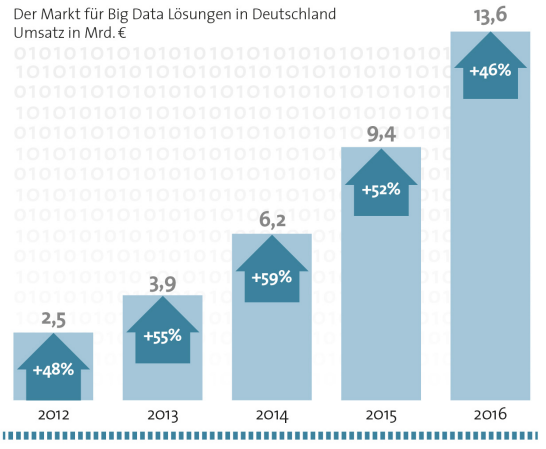
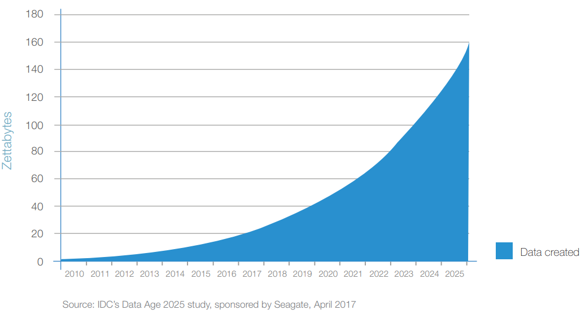
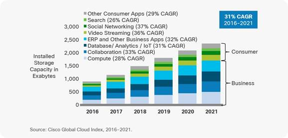
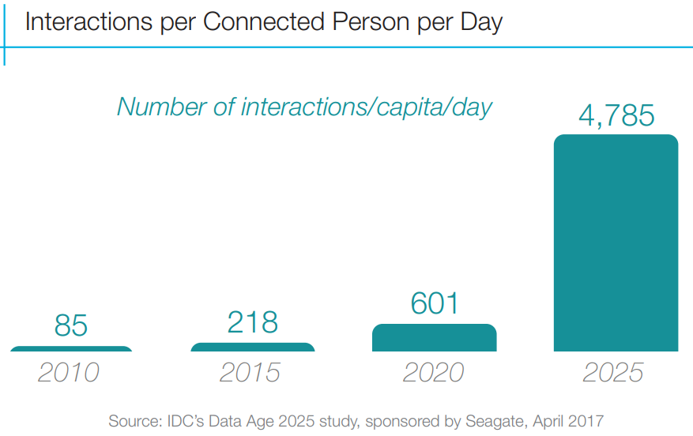
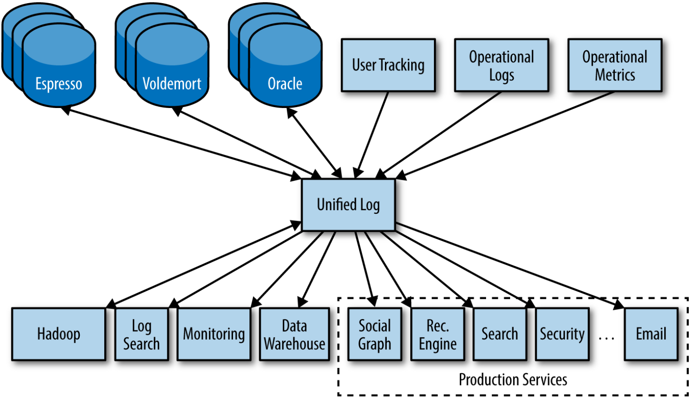
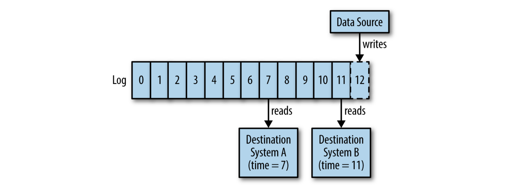
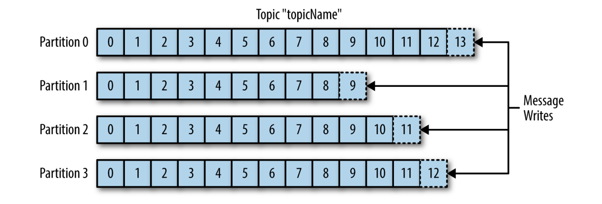
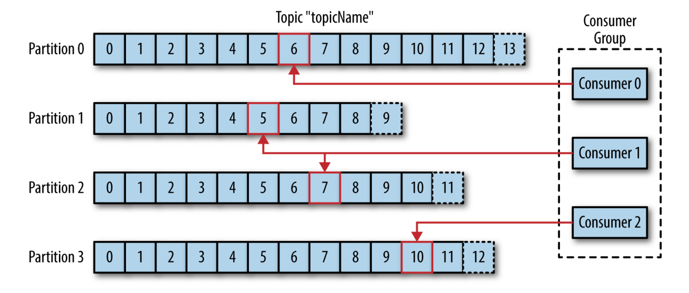
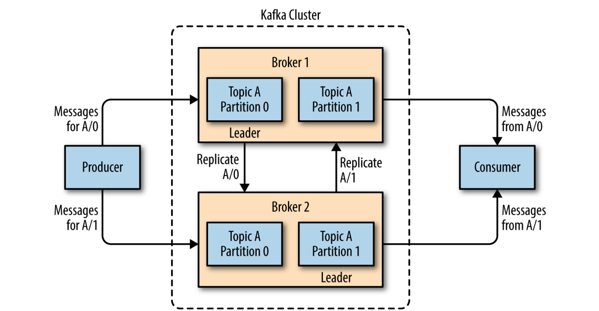

# Streaming Architectures

## "Sitting"-BigData?
Um möglichen Verwirrungen entgegenzuwirken, soll vorab direkt auf einen wichtigen Punkt hingewiesen werden: beim Lesen von "Streaming Architectures" vermag der geneigte Internet-Nutzer an On-Demand-Mediendienste in den Reihen von Spotify, Youtube und Weiteren denken. Diese Content Delivery Networks "streamen" zwar, haben aber mit dem Fokus dieses Kapitels nur nebensächlich zutun. Die Ausarbeitung thematisiert einen neuen Ansatz der skalierbaren Softwarearchitektur, der aber durchaus als Antwort auf die Bedürfnisse der genannten Plattformen interpretiert werden kann. Der gemeinsame Nenner beider Begebenheiten ist ein altbekanntes Buzzword: BigData. Ein kurzer Einblick in die (gewagte) Definition und Entwicklung des BigData-Trends zeigt, auf welche Probleme die Streamingarchitektur eine Antwort sein soll. Dabei sind zwei Aspekte von Bedeutung: Datenwachstum und Infrastrukturwachstum.

### Datenwachstum
BigData wurde schon zu Anfang der 2010er zum Imperativ für kompetitive Technologie-Unternehmungen. Studien zeigten, dass Organisationen, die analytics-getriebene Vorsprünge aktiv durch Investitionen verfolgten, mit mehr als doppelt so hoher Wahrscheinlichkeit ihre Konkurrenz signifikant hinter sich ließen[ZIKO13]. Dementsprechend ist es nachvollziehbar, dass BigData als Schirmherr analytischer IT-Infrastrukturen einen solchen "buzz" entwickelte. Dessen Marktvolumen konnte ein stetiges, nicht unerhebliches Wachstum verzeichnen:

BigData Marktwachstum in Deutschland. Quelle: https://proteus-solutions.de/~Unternehmen/News-PermaLink.asp?PS=tM.F04!sM.NI41!Article.961265

IBM nennt als einer der Branchengiganten Eigenschaften, die BigData greifbarer machen sollen: Volumen, Vielfältigkeit und Geschwindigkeit[ZIKO13]. Diese Deskriptoren bilden die Brücke zwischen Marktwachstum und technischen Anforderungen. Volumen ist die offensichtliche Eigenschaft und beschreibt das Anfallen von Daten in einem Maße, welches die Entwicklung besonderer Umgangsstrategien vorschreibt. Mit Vielfältigkeit wird aufgenommen, dass Daten strukturiert, unstruktiert und über die Zeit restrukturierend mit beliebigen Typen auftreten. Dass dies in einer enormen Geschwindigkeit stattfindet, stellt die größte Herausforderung an IT-Infrastrukturen und Ingenieure. Das Ziel, diese Datenüberfülle analytisch zu untersuchen um Wissen zu generieren, hat zur Entwicklung hochskalierbarer Persistierungsstrategien beigetragen. Es wird also das Mantra verfolgt, alle anfallenden Daten zu speichern, ganz im Sinne des plakativen Ausspruchs "Daten seien das Gold des 21. Jahrhunderts" und um keine Chance eines kompetitiven Vorteils außer Acht zu lassen. Verlorene Informationen werden wie verlorener Gewinn wahrgenommen. Mit diesem Ansatz entstanden Data Lakes – Systeme, die als "Datengrab" dienen um einen historisch vollumfänglichen Zugang für Analytiker zu garantieren. Beispielsweise bildet das Hadoop File System die Basis eines solchen Data Lakes, in den alle Informationen effizient und skalierbar einlaufen sollen.

Data Lake Visualisierung. Quelle: https://www.pmone.com/data-lake/

Diese Strategie hat sich über das letzte Jahrzehnt bewährt. Es schien eine valide Methode zu sein, Daten massiv anzusammeln und dann bei Bedarf Analysen zu unterziehen – auch Batch Processing genannt. Allerdings muss bedacht werden, mit welcher Geschwindigkeit Data Lakes zukünftig wachsen müssen. Als sie sich im Verlauf der letzten Dekade hinter der IT von Unternehmen etablierten, wurde die Menge der jährlich weltweit produzierten Daten noch mit unter 5 ZT (1 Zettabyte = 1.000.000.000 Terabyte) beziffert. Der bekannte Hersteller für Speicherlösungen Seagate prognostiziert das weltweite Datenaufkommen mit 160 ZT pro Jahr bis 2025:

Exponentielles Wachstum der global erzeugten Datenmenge. Entnommen aus <a>[[REIN17]](#ref_rein17)</a>

Die globale Datensphäre wächst also exponentiell schnell und verdoppelt ihre Größe zirka alle zwei Jahre. Cisco als Unternehmen und Experte für Datacenter-Lösungen prognostiziert demgegenüber die Rate, mit der die weltweit zur Verfügung stehende Speicherkapazität wächst, als linearen Trend:

Lineare Prognose des weltweit verfügbaren Speicherplatzes. Quelle: https://www.cisco.com/c/en/us/solutions/collateral/service-provider/global-cloud-index-gci/white-paper-c11-738085.html#_Toc503317524

Zusätzlich wird erwartet, dass das Internet-of-Things die Geschwindigkeit der Datenerzeugung stark erhöhen wird. Die täglichen per Automation immer impliziteren Interaktionen des Nutzers mit Online-Diensten sollen sich mehr als verzehnfachen:

Prognose der Menge täglicher Nutzerinteraktionen. Entnommen aus <a>[[REIN17]](#ref_rein17)</a>

Diese Beobachtungen werfen die Frage auf, ob Data Lakes wirklich eine nachhaltige Strategie darstellen können. Sie hatten zu ihrer Entstehungszeit eine Daseinsberechtigung, die aber in der Zukunft in ein skeptisches Licht rückt. Dabei spielt es keine Rolle, ob die zugrundeliegende Hardware im Unternehmen vor Ort oder in der vermeintlich skalierbaren Cloud untergebracht ist. Beide Umgebungen sind von den genannten Problemen betroffen. Die IT-Branche sieht sich also mit dem Risiko konfrontiert, dass die Data Lakes ohne proaktive Maßnahmen wortwörtlich "überlaufen". Auf die reine Kapazitätsskalierbarkeit der Systeme kann sich augenscheinlich nicht mehr verlassen werden.

### Infrastrukturwachstum
Erschwerend kommt zu den genannten Aspekten ein aus Sicht der IT fundamentales Ingenieursproblem hinzu: Data Lakes sind in den seltensten Fällen eine One-Solution-Serves-All Lösung. Unternehmen, die ihren kompetitiven Vorteil durch analytische, informationszentrische Dienste erwirtschaften, sind oft schnellwachsend. Das bedeutet für deren IT-Landschaft einen stetigen Veränderungsprozess mit sehr kurzen Iterationen zwischen Systemerweiterungen und neuen Serviceleistungen. Trotz guter Planung kann dies zu heterogenen Umgebungen führen[KREP14]. Insbesondere dann, wenn der Datenfluss persistiert und analysiert wird, werden Systeme gekoppelt, denen sehr unterschiedliche Bedürfnisse und Ziele zugrunde liegen. Beispielsweise Dokumenten-Storages für unstrukturierte User-Inhalte, Recommendation-Engines, Ad-Serving-Systems, Newsfeed-Engines, Graph-Datenbanken für Profilverknüpfungen, Safety-/Security-Monitoring, OLAP Query-Engines und beliebige weitere Dienste sind denkbar, die mit der Zeit hinzugefügt werden. All diese Komponenten und Module stehen in unterschiedlichem Umfang in Verbindung und erzeugen miteinander Kommunikationsdaten, die selbst wiederum von meta-analytischem Interesse sein können:

Beispiel einer vollvernetzten Infrastruktur. Entnommen aus <a>[[KREP14]](#ref_krep14)</a>

Zu beachten ist, dass Daten meist in beiden Richtungen fließen und so bei Vollvernetzung der Dienste O(N^2) Datenpipelines entstehen können[KREP14]. Entwicklung, Pflege und Wartung dieser Kommunikationslandschaft sind offensichtlich unannehmbare Hürden wenn das System mit dem Erfolg von BigData wachsen muss. Instabilitäten sind dann nicht mehr zu vermeiden, da selbst die beste Dokumentation nicht abbilden kann, welche Folgen die Anpassung oder Erweiterung einer Schnittstelle für das Gesamtsystem bedeutet. Wenn sich die Eigenschaften der Datenerzeugung oder -verarbeitung einer Schnittstelle verändern sollten, müssen alle damit verknüpften Datapipelines angepasst werden.
 
Für betroffene Unternehmen ist es also erstrebenswert, eine Plattform einzusetzen, die sowohl den besonderen Ansprüchen an die infrastrukturelle Erweiterbarkeit genügt, als auch eine Antwort auf analytische Ziele liefert, also Einsicht in alle anfallenden Informationsereignisse des gesamten Systems garantiert ohne Nachteil gegenüber dem Data Lake-Ansatz, der gemessen an seiner enormen Abhängigkeit von Speicherkapazitäten kritisch betrachtet werden muss.

Im Idealfall ergibt sich eine Lösung, die alle Komponenten vollverknüpft, Schnittstellen so implementiert, dass sie sich ohne Anpassungen an ihren Komplementären verändern können, gleichzeitig von Kapazitätslimits der Persistierung entkoppelt ist und neue Komponenten in beliebigem Umfang aufnimmt. Ein solches Daten-Repository im Zentrum einer Stern-Topologie würde für die perfekte Komponentenisolation und Datenintegration in einem einzigen System sorgen (siehe nachstehende Illustration).

Lösung der Vollvernetzung durch eine Stern-Topologie. Entnommen aus <a>[[KREP14]](#ref_krep14)</a>

Dass sich diese konfliktären Ziele vereinigen lassen und eine gute Balance im Sinne des CAP-Theorems bilden können[KREP14], soll die vorliegende Ausarbeitung transportieren. Dabei wird auf eine Architektur eingegangen, die Eigenschaften von Database Management Systemen und Data Stream Management Systemen mit verteilten Kommunikationsprotokollen in ein neuartiges, hochskalierbares Infrastrukturmuster übersetzt.  

## Was bedeutet "Streaming Architecture"?
Im vorherigen Kapitel wurden Data Lakes mit Batch Processing assoziiert, also dem gestaffelten Verarbeiten von Daten in „Häppchen“. Beispielsweise eine analytische Transformation der Tagesgeschäftsdaten in einem Unternehmen durch nächtlich automatisierte Job-Scheduler. Demgegenüber steht das Stream Processing, welches offensichtlich ein zentrales Element der Streaming Architektur darstellt. Dieser Abschnitt soll das Umdenken von punktueller zu kontinuierlicher Verarbeitung motivieren.

Die Realität schreitet dauerhaft voran und setzt sich aus aufeinander folgenden Ereignissen zusammen. In der Vergangenheit haben wir an den Schnittstellen zwischen Echtwelt und IT Diskretisierungsmaßnahmen vorgenommen, um den Fluss der Ereignisse zu quantifizieren. Unsere IT-Systeme arbeiteten also mit Ausschnitten, obwohl dies die Realität eher geistlos wiederspiegelt. Batches entstanden als kumulierte Projektion des potentiell unendlichen Datenflusses, wenngleich die kontinuierliche Verarbeitung viel natürlicher erscheint. Dieser Umstand ist selbstverständlich nicht auf Unvermögen zurückzuführen, sondern eine erwartete Antwort auf die Fähigkeiten der zur Verfügung stehenden Technologien[DUNN16]. Mit steigender Performance von Hard- und Software wandelt sich nun auch die Art der Datenverarbeitungsparadigmen. Der erste Schritt war dabei Microbatching - die Verarbeitung in sehr kleinen Ausschnitten für schnellere Ergebnisse. Zur Umsetzung von Stream Processing im Sinne der Streaming Architekturen wird nun die Weiterentwicklung zur Echtzeitverarbeitung gewagt. Ereignisse werden also nicht mehr gesammelt, sondern sofort beim Auftreten interpretiert und weiterverarbeitet. Mit den im vorherigen Kapitel prognostizierten Datenvolumina scheint die Echtzeitanforderung allerdings utopisch.  Die neuesten Evolutionen der hochperformanten Datenverarbeitung machen aber Stream Processing nicht nur möglich, sondern können auch das Problem der überlaufenden Data Lakes lösen. Wenn alle Daten in Echtzeit verarbeitet und analysiert werden können, müssen nicht mehr zwingend alle Informationen gespeichert werden. Lediglich komplexeres, abstraktes Wissen über alle parallelen Datenströme wird Kandidat für die Persistierung. Das bisherige Datengrab ändert dann seine Rolle zu einer Art "Daten-Goldlager" mit kalkulierbarer Größe dessen Inhalt sich auf tatsächliche Wertigkeiten konzentriert. Gleichzeitig werden Datenpipelines zwischen internen Systemkomponenten ebenfalls als Strom interpretierbar. Es existiert dann keine Unterscheidung mehr zwischen Datenflüssen, die tatsächlich den Sinn der Rohdatentransmission erfüllen, und Folgen von Steuerinformationen, denn beide sind abstrahiert bloß nacheinander fließende Ereignisse. Stream Processing differenziert also nicht mehr. Es gibt nur noch Datenströme, egal ob sie Byteblöcke, Queries oder Sonstiges enthalten. Mit dieser generalisierenden Sichtweise lässt sich nun die Streaming Architektur definieren. In ihr erfolgen alle Kommunikationen, ob zu Echtweltschnittstellen, Systemkomponenten oder Legacy-Systemen, in Form von Real-Time Streams. Die Architektur ist dabei in der Lage, die Menge und Geschwindigkeit der Ströme beliebig zu skalieren. Dieser neue Engineering-Ansatz macht das unendliche Wachstum der Data Lakes unnötig indem stattdessen die Nutzung der Daten selbst skaliert wird - der eigentliche Zweck der Data Lakes. Wenn die Softwarearchitektur informationszentrisch arbeitet und in der Lage ist, analytische Mehrwerte zu generieren, ohne dass eine Zwischenspeicherung erfolgen muss, wird die vollumfängliche Speicherung hinfällig. Als gute Analogie kann man sich vorstellen, wie Goldsucher am Grund eines Baches nach Rohgold schürfen. Es scheint offensichtlich unsinnig das gesamte fließende Sediment inklusive Steinen, Pflanzenmaterial und Bergwasser in einen riesigen Tank umzuleiten um später darin zu suchen. Es ist deutlich effizienter und ressourcenschonender, direkt im fließenden Gewässer zu arbeiten und das vorbeilaufende Sediment zu filtern bis ein Rohgoldnugget hängen bleibt – wie es in der Tat auch getan wird. Die BigData-Infrastrukturen sind nun an einem Punkt, an dem die Idee der Goldschürfer mit der Streaming Architektur in das Software-Engineering aufgenommen wurde. Eine Open-Source Realisierung dieser wird durch Apache Kafka bereitgestellt.

##  Apache Kafka - Stream Repository
Im Gegensatz zu Lösungen wie IBM Websphere MQ, Java Messaging Service oder vergleichbaren Enterprise Messaging Systemen, ist Kafka eine javabasierte, verteilte Message Queue, deren primärer Design Constraint in extremer Skalierbarkeit und Bandbreite begründet ist[KREP11] und nicht nur den reinen Datenaustausch garantiert, sondern auch die nötigen infrastrukturellen Voraussetzungen schafft, um mit den in Kafka strömenden Daten analytische Transformationen auszuführen. Der Fokus auf "Data Ingestion" im BigData-Bereich ist der Vorteil zu generischen Publish-Subscribe-Patterns, die in diesem Kontext nicht die notwendigen Bandbreiten liefern könnten ohne die Consumer an ihre Performancegrenzen zu bringen. Wie eine solche Streaming Architektur technisch umgesetzt werden kann, lässt sich am Beispiel Kafkas gut analysieren und ist der Inhalt der folgenden Abschnitte.

### Die Datenstruktur
Es wurde nun betont, dass Datenströme den Kern der Streaming Architektur darstellen. Diese müssen informationstechnisch mit einer Datenstruktur abgebildet werden, welche die abstrakten Eigenschaften strömender Daten teilt[SHAP17]: 

Datenströme sind geordnet: Es existiert ein klares Verständnis darüber, welches Event vor oder nach anderen Events auftritt. Ströme sind also stärker mit Tupeln statt Mengen assoziiert. Zwei Ströme, die identische Events in unterschiedlicher Ordnung enthalten, sind verschieden. Hier liegt ein wichtiger Unterschied zu Datenbanktabellen, die per Definition ungeordnet sind (Anmerkung: Der "GROUP BY"-Befehl ist nicht teil des relationalen Modells).

Data Records sind unveränderbar: Aufgetretene Events gehen in die Systemhistorie ein und können nicht mehr angepasst werden. Ist ihr Ergebnis zu revidieren, dann erfolgt ein weiteres, inverses Event. Dies ist vergleichbar mit DBMS-Transaktionen mit dem Unterschied, dass in einer Datenbank nicht die Geschichte der Transaktionen gespeichert wird, sondern ihr kumulatives Ergebnis in Form eines updatebaren Tabelleneintrags – vorausgesetzt die Transaktion enthält keinen DELETE-Befehl nach dessen Ausführung die historische Information über die Existenz des Eintrags verloren geht.

Eventströme sind wiederholbar: Man kann sich gut nicht-wiederholbare Streams vorstellen (zum Beispiel eine Folge von TCP-Paketen auf einem Socket), aber die Geschäftslogik höherer Ordnung profitiert davon, die Vergangenheit der Events erneut erleben zu können. Im Falle von Fehlern, Systemerweiterungen, Monitorings usw. können einzelne Komponenten einfach auf einen älteren Zeitpunkt "zurückgespult" werden um dann den aktuellen, integren Zustand durch erneutes Abspielen der Vergangenheit zu erreichen. Diese temporale Entkopplung von Produzent und Konsument hat einen massiven Vorteil: Data Ingestion wird nicht durch die Performance der Consumer beschränkt.

Die entsprechende Datenstruktur ist also ein Event-Protokoll äquivalent zu einem commit log, einer unveränderbaren, ausschließlich erweiterbaren Sequenz temporal geordneter Data Records[KREP14] wie in der nachfolgenden Grafik dargestellt (durchaus vergleichbar mit einem Ledger im Sinne der Blockchain, allerdings mit dem Fokus auf Performance statt Sicherheit). In Kafka werden Streams durch solche Logs realisiert.

Darstellung eines Logs. Entnommen aus <a>[[KREP14]](#ref_krep14)</a>

Jedes Rechteck stellt einen Eintrag im Log dar, also die Folge der eintreffenden Events. Da das Log durch die Sequenz der Eintragsnummern sortiert ist, wird es von links nach rechts gelesen. Die Eintragsnummer entspricht dem eindeutigen Identifikator des Eintrags und dessen Inhalt. Events sind also eine Kombination aus key und value. Values können in dieser Interpretation beliebig sein. Binäre Blobs sind genauso möglich wie strukturierte JSON-Strings (Anmerkung: Auf die De-/Serialisierung von values wird später genauer eingegangen).

Die sequentielle Ordnung der Keys ist an ihr zeitliches erscheinen gebunden. Niedrige Keys sind vor höheren Keys aufgetreten. Dieses Verständnis des Keys als Zeitstempel hat den Vorteil der Entkopplung von physischen Uhren.

Die Idee der Log-Struktur ist sehr simpel und auf den ersten Blick nicht sehr unterschiedlich zu einer zeitlich geordneten Datei oder Tabelle. Es ist wichtig das Log als abstrakte Datenstruktur zu verstehen, welche speichert was wann passiert ist, nicht als konkreten Speicherbereich. So löst das Log ein Problem verteilter Systeme: Wenn zwei identische, deterministische Prozesse im gleichen Zustand beginnen und die gleichen Eingaben in der gleichen Reihenfolge erhalten, produzieren sie die gleichen Ausgaben und enden im gleichen Zustand[KREP14]. Im Distributed Systems Engineering ist diese Einsicht nicht neu, aber die Implikationen des einfachen Log-Patterns sind für Enterprise Architekturen bedeutend: Der interne Zustand von Komponenten kann durch eine einzige Zahl beschrieben werden. Die Sequenznummer des höchsten Eintrags, der von einer Komponente auf einem Log verarbeitet wurde, lässt dessen Zustand deterministisch nachvollziehen. So wird ein diskretes, event-basiertes Verständnis der Zeit geschaffen und erlaubt komponentenübergreifende Vergleichbarkeit bei vollständiger Entkopplung von schwer synchronisierbaren, lokalen, physischen Uhren.

### Datenfluss
Wenn jede logische Datenquelle mit seinem eigenen Log definiert wird, kann jede an der Datenquelle interessierte Komponente die in das Log geschriebenen Events in seiner eigenen Geschwindigkeit lesen, intern verarbeiten und seine Position auf dem Log um einen Schritt verschieben. Diese spezielle Form des Publish-Subscribe-Patterns überlässt es dem Konsumenten seinen Datenabruf zu steuern. Der Produzent muss nicht auf die Verarbeitung warten, wie es die nachstehende Grafik zeigt.

Das Log als Publish-Subscribe-Pattern. Der Publisher fügt seinem Log neue Events hinzu und der Subscriber hält einen Pointer auf seine aktuelle Position um unabhängig Lesen zu können. Entnommen aus <a>[[KREP14]](#ref_krep14)</a>

Ein Log kann also asynchrones Verhalten ermöglichen und braucht selbst kein Wissen über existierende Konsumenten, genauso wenig wie der Produzent. Umgekehrt muss der Konsument nicht wissen, wo oder wie das Event erzeugt wurde. Logs sind nicht nur die ideale Datenstruktur um Streams abzubilden, sie liefern auch die im ersten Kapitel beschriebene Isolation von kommunizierenden Systemen.

### Architektur
Es muss betont werden, dass die reine Separation von Produzent und Konsument nicht ausreicht. Wie bereits angemerkt ist die Skalierbarkeit der Idee von größter Bedeutung. Die Nutzung eines Logs als universalen Mechanismus der Daten- und Komponentenintegration bleibt nur eine elegante Fantasie, wenn das Log nicht schnell, günstig und skalierbar genug betrieben werden kann um in dieser Domain praktikabel zu sein[KREP14]. Verteilte Logs scheinen auf den ersten Blick eher schwerfällig (Vergleich Blockchain), aber mit einer durchdachten Implementierung, fokussiert auf die Aufzeichnung großer Datenströme, können durchaus beeindruckende Geschwindigkeiten erreicht werden. In Kafka wird dies durch die Partitionierung des Logs umgesetzt:

Horizontale Skalierung des Logs durch Partitionierung. Entnommen aus <a>[[SHAP17]](#ref_shap17)</a>

Kafka organisiert Events (auch Messages genannt) in Topics. Topics sind vergleichbar mit Tabellen einer Datenbank oder Ordnern in einem Dateisystem. Diese Topics werden nun partitioniert. Jede Partition ist ein eigenes geordnetes Log. Hier ist zu beachten, dass es zwischen einzelnen Partitionen keine globale Ordnung gibt, außer der Produzent würde eine solche Ordnung durch das Hinzufügen entsprechender Daten forcieren, zum Beispiel mit einem Zeitstempel. Dann obliegt dessen Interpretation aber dem Entwickler. Bei der Strukturierung von Topics muss dieser Umstand also berücksichtigt werden. Topics sollten so definiert werden, dass die Reihenfolge von Ereignissen in einem Topic nicht mit einer absoluten Ordnungsgarantie verknüpft sein muss. Ist dies gefordert, sollte auf Partitionierung verzichtet oder stattdessen analysiert werden, ob der Split auf mehrere Topics, die in sich wieder partitioniert werden könnten, möglich ist. Sind diese Eigenheiten bedacht worden, wächst die Bandbreite linear mit der Größe des Kafka Clusters[KREP14]. Kafka kann Partitionen automatisch über mehrere Server streuen, wodurch ein Topic horizontal skaliert. 

Per default bevorzugt ein Kafka-Producer keine Partition und verteilt seine Messages gleichmäßig über alle Partitionen eines Topics. Ebenso lesen Kafka-Consumer von allen Partitionen eines Topics und tracken dabei, welche Events sie bereits konsumiert haben, indem sie für jede Partition das sogenannten Offset speichern – eine Metainformation, die kontinuierlich von Kafka mit jeder gespeicherten Nachricht erhöht wird (siehe Integer "time" im Abschnitt Datenfluss). Durch die Vorhaltung des Offsets im ZooKeeper (später genauer erklärt) können Consumer stoppen und neustarten, ohne dass ihr Zustand inkonsistent wird oder das System davon beeinflusst werden würde. Diese Selbstorganisation auf Seite des Consumers erlaubt die Bündelung in Gruppen. Kafka-Consumer können so zusammengefasst werden, dass sie die Verarbeitung von Events eines partitionierten Topics automatisch untereinander aufteilen:

Consumer-Group, die ein partitioniertes Topic verarbeitet. Entnommen aus <a>[[SHAP17]](#ref_shap17)</a>

Auf diese Weise kann auch die Verarbeitung eines Stroms horizontal skaliert werden. Zusätzlich erlaubt der Ansatz, dass im Falle des Ausfalls eines Konsumenten die anderen der Gruppe die Verarbeitung der Partitionen eines Topics neu balancieren können um den Ausfall aufzufangen.

### Broker und Cluster
Einzelne Kafka-Server werden Broker genannt. Sie empfangen Nachrichten von Produzenten, berechnen Offset-Werte und persistieren Values auf dem Speichermedium. Für Konsumenten stellen sie den Zugriff auf gespeicherte Events bereit. Broker sind in der Lage tausende Partitionen und mehrere Millionen Anfragen pro Sekunde zu managen[SHAP17], natürlich in Abhängigkeit der darunterliegenden Hardware. In der Regel gilt für Kafka aber der Durchsatz der Netzwerkanbindung als obere Leistungsgrenze.

Die Broker selbst sind ebenfalls skalierbar konzipiert. Sie können als Teil eines Clusters auftreten. In einem Cluster wird automatisch ein Broker als Controller gewählt. Er regelt die Verteilung von Partitionen auf die einzelnen Broker und beobachtet, ob alle Broker korrekt arbeiten. Pro Partition gilt ein Broker als Leader. Wird diese Partition mehreren Brokern zugewiesen, wird sie automatisch vom Leader gespiegelt für den Fall eines Ausfalls. Dann wird automatisch ein neuer Leader zugewiesen. Producer und Consumer interagieren immer nur mit dem Leader einer Partition, welcher über die Verarbeitung entscheidet. Das beschriebene Konstrukt ist in nachstehender Grafik visualisiert:

Replikation in einem Broker-Cluster. Entnommen aus <a>[[SHAP17]](#ref_shap17)</a>

Kafka hält Daten nur für eine begrenzte Zeit vor. Sie wird limitiert durch das Alter der Events oder die Größe eines Topics. In der Standardkonfiguration werden Daten nach 7 Tagen fallen gelassen, unabhängig davon ob sie konsumiert wurden oder nicht. Die Retention-Policy kann für jedes Topic individuell festgelegt werden. Hier liegt die wichtige Verknüpfung zu den Anmerkungen des ersten Kapitels. Daten sollten nur so lange gehalten werden, wie sie auch wirklich nützlich sind. Das heißt entweder wurden sie konsumiert, transformiert oder anderweitig persistiert. 

## Kafka Peripherals - Confluent Platform

### Apache ZooKeeper - Distributed Configuration Management

### (De-)Serialisierung

#### Apache Avro

#### Confluent Schema Registry

#### Schema Evolution

### Kafka Connect

## Stream Processing

### Kafka Streams API

#### Arbeitsweise

#### Loadbalancing

### KSQL

## Quellen

<a name="ref_dunn16">[DUNN16]</a>: Ted Dunning & Ellen Friedman. 2016. Streaming Architecture. New Designs Using Apache Kafka and MapR Streams. O'Reilly Media, Inc..

<a name="ref_krep11">[KREP11]</a>: Kreps, Jay, Neha Narkhede and Jun Rao. “Kafka: a Distributed Messaging System for Log Processing.” (2011).

<a name="ref_krep14">[KREP14]</a>: Jay Kreps. 2014. I Heart Logs. Event Data, Stream Processing, and Data Integration. O'Reilly Media, Inc..

<a name="ref_rein17">[REIN17]</a>: Reinsel, D., J. Gantz, and J. Rydning. "Data Age 2025: The Evolution of Data to Life-Critical. Don't Focus on Big Data; Focus on the Data That's Big." IDC, Seagate, April (2017).

<a name="ref_shap17">[SHAP7]</a>: Gwen Shapira, Neha Narkhede & Todd Palino. 2017. Kafka: The Definitive Guide. Real-Time Data and Stream Processing at Scale. O'Reilly Media, Inc..

<a name="ref_ziko13">[ZIKO13]</a>: Zikopoulos, P., Deroos, D., Parasuraman, K., Deutsch, T., Corrigan, D., & Giles, J. (2013). Harness the power of big data: The IBM big data platform. New York, NY: McGraw-Hill.